# EC2 Instance Storage

- [EC2 Instance Storage](#ec2-instance-storage)
  - [EBS Volumes](#ebs-volumes)
    - [What's an EBS Volume?](#whats-an-ebs-volume)
    - [EBS Volume](#ebs-volume)
    - [EBS – Delete on Termination Attribute](#ebs--delete-on-termination-attribute)
    - [EBS Snapshots](#ebs-snapshots)
    - [EBS Snapshots Features](#ebs-snapshots-features)
  - [AMI Overview](#ami-overview)
    - [AMI Process (from an EC2 instance)](#ami-process-from-an-ec2-instance)
  - [EC2 Image Builder](#ec2-image-builder)
  - [EC2 Instance Store](#ec2-instance-store)
    - [Local EC2 Instance Store](#local-ec2-instance-store)
  - [EFS: Elastic File System](#efs-elastic-file-system)
  - [EBS vs EFS](#ebs-vs-efs)
  - [EFS Infrequent Access (EFS-IA)](#efs-infrequent-access-efs-ia)
  - [Shared Responsibility Model for EC2 Storage](#shared-responsibility-model-for-ec2-storage)
  - [Amazon FSx – Overview](#amazon-fsx--overview)
    - [Amazon FSx for Windows File Server](#amazon-fsx-for-windows-file-server)
    - [Amazon FSx for Lustre](#amazon-fsx-for-lustre)
  - [EC2 Instance Storage Summary](#ec2-instance-storage-summary)

## EBS Volumes

- AWS official Doc. <https://docs.aws.amazon.com/ebs/latest/userguide/ebs-volumes.html>

### What's an EBS Volume?

- An EBS (Elastic Block Store) Volume is a network drive you can attach
to your instances while they run
- It allows your instances to persist data, even after their termination. We can recreate an instance and mount to the same EBS Volume from before and we will get back our data.
- **They can only be mounted to one instance at a time (at the CCP level)**
- They are bound to **a specific availability zone**
- **Analogy:** Think of them as a "network USB stick". it's a USB stick that you can take from a computer and put it in another computer but not physically as it is attached through the network.
- **Free tier:** 30 GB of free EBS storage of type General Purpose (SSD) or Magnetic per month

### EBS Volume

- It's a network drive (i.e. not a physical drive)
  - It uses the network to communicate the instance, which means there might be a bit of latency
  - It can be detached from an EC2 instance and attached to another one quickly becasue they are a network drive
- It's locked to an Availability Zone (AZ)
  - An EBS Volume in us-east-1a cannot be attached to us-east-1b
  - To move a volume across different AZs, you first need to snapshot it
- Have a provisioned capacity (size in GBs, and IOPS) in advance. You need to say how many GBs you want in advance and the IOPS, which is I/O operations per seconds, and you're basically defining how you want your EBS volumes to perform.
  - You get billed for all the provisioned capacity
  - You can increase the capacity of the drive over time if you want to have a better performance or more size.
- As it is evident from the below diagram, we cannot attach the same EBS volume to two EC2 instances at a time at the CCP level. 
- However, it is very possible to have two EBS volumes attached to one EC2 instance. Think of it as two network USB sticks into one machine.
- EBS volumes are linked to an availability zone. If you want EBS volumes in other AZs then in that case you need to create EBS volumes in the other AZ.
- It is possible to create an EBS Volume and leave them unattached and can be attached on demand.

  

### EBS – Delete on Termination Attribute

  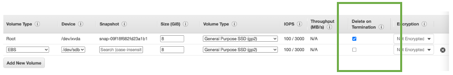

- Controls whether the EBS volume is automatically deleted when the associated EC2 instance is terminated
  - By default, the root EBS volume is deleted (attribute enabled)
  - By default, any other attached EBS volume is not deleted (attribute disabled)
- This can be controlled by the AWS console / AWS CLI
- **Use case: preserve root volume when instance is terminated**

### EBS Snapshots

- Make a backup (snapshot) of your EBS volume at a point in time. You will be able to back up the state of it and even if the EBS Volume is terminated later on, you could restore it from that backup
- Not necessary to detach volume from an EC2 intance to do snapshot, but recommended for data integrity purposes
- Can copy snapshots across AZ or Region
- The EBS Volume is attached to your EC2 instance in region, say us-east-1a, and then we would snapshot it. Now, the EBS Snapshot exist in your region and that EBS Volume can be used to restore a new EBS Volume in another availability zone, say us-east-1b

  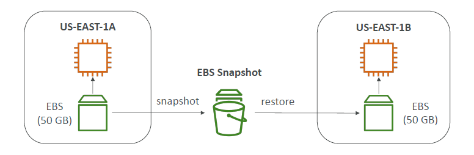

### EBS Snapshots Features

- **EBS Snapshot Archive**
  - Move a Snapshot to an "archive tier" that is 75% cheaper
  - Takes within 24 to 72 hours for restoring the archive
  
  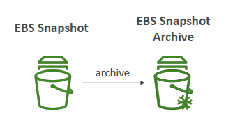

- **Recycle Bin for EBS Snapshots**
  - Setup rules to retain deleted snapshots so you can recover them after an accidental deletion
  - Specify retention (from 1 day to 1 year)

  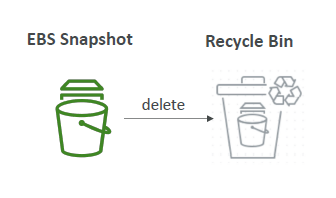

## AMI Overview

- AMI = Amazon Machine Image
- AMI is what powers our EC2 instances
- AMI are a **customization** of an EC2 instance
  - In it you may add your own software, configuration, operating system, monitoring...
  - If we create your own AMI, we are going to get a faster boot / configuration time because all your software is pre-packaged through the AMI
- AMI are built for a **specific region** (and can be copied across regions)
- You can launch EC2 instances from:
  - **A Public AMI:** AWS provided
  - **Your own AMI:** you make and maintain them yourself
  - **An AWS Marketplace AMI:** an AMI someone else made (and potentially sells)

### AMI Process (from an EC2 instance)

- Start an EC2 instance and customize it by installing some software
- Stop the instance (for data integrity)
- Build an AMI – this will also create EBS snapshots
- Launch instances from other AMIs

  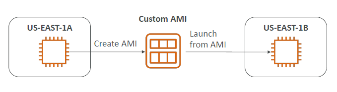

## EC2 Image Builder

- Used to automate the creation of Virtual Machines or container images
- => Using EC2 Image Builder, you will be able to automate the creation, maintain, validate and test **AMIs for EC2 instances**
- When EC2 Image Builder is run it is going to create an EC2 instance called a Builder EC2 instance, which is going to build the components and customize the software, for example, install Java, update the CLI, update the software system, install firewalls, etc..
- Once this is done, then an AMI is going to be created out of that EC2 instance, but all of this is obviously automated.
- We want to validate the new AMI created. So EC2 Image Builder will automatically create a test EC2 instance from that AMI, runs a bunch of tests defined in advance.
- Once the AMI is tested, it can be distributed to multiple regions allowing your application and your workflow to be truly global even though EC2 Image Builder is a regional service.

  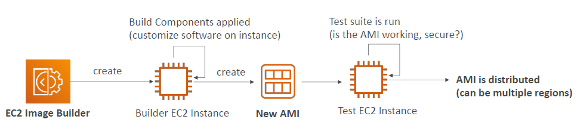

- Can be run on a schedule (weekly, whenever packages are updated, etc…)
- Free service (only pay for the underlying resources)

## EC2 Instance Store

- EBS volumes are **network drives** with good but "limited" performance
- If you need a high-performance hardware disk attached onto your real hardware server (EC2 instance), then use EC2 Instance Store
- Better I/O performance, better throughput.
- But the caveat is when you stop your EC2 Instance having an Instance Store lose, then the storage will be lost. Therefore, it is called an ephemeral storage. Meaning EC2 Instance Store cannot be used as a durable long term place to store your data
- **Use Case:** Good for buffer / cache / scratch data / temporary content
- In case the underlying server fails, then you will risk to have a data loss because the hardware attached to the EC2 instance will fail as well.
- Hence backups and replication will be your responsibility

### Local EC2 Instance Store

- As you can see the read IOPS and the write IOPS which correspond to how many I/O operations we can do per second, then you can see that some of these random read IOPS and write IOPS can reach 3.3 million or 1.4 million for the most performant one.
- To put this comparison with EBS Volume of type GP2 for example, you can reach 32000 IOPS which when compared to EC2 Instance Store is very less.

  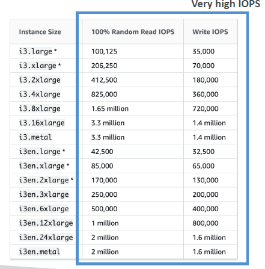

## EFS: Elastic File System

- This is the third type of storage that you can attach to an EC2 instance
- It is a managed NFS (network file system) that **can be mounted on 100s of EC2 at a time**. That makes it a shared network file system
- EFS only works with **Linux** EC2 instances in **multi-AZ**. So it is possible for an instance in one AZ to be attaching the same EFS Volume as the volume in another AZ
- Highly available, scalable, expensive (3x gp2), pay per use, no capacity planning (if you store 20 GBs of data onto your EFS drive then you are only going to pay for these 20 GBs)

  

## EBS vs EFS

- EBS - Say we had EC2 instance in one AZ and another in another EC2 instance in another, then EBS volume can only be attached to one EC2 instance in one specific AZ and EBS Volumes are bound to a specific AZs. To move from one AZ to another, we could create a snapshot, and then restore that snapshot into a new AZ which is a copy (this would not be an in-sync replica)
- EFS - This is a network file system (NFS) that means whatever is on the EFS drive is shared by everything that is mounted to it. Say, we have many instances in AZ1 and many instances in AZ2. At the same time, all these instances can mount the same EFS drive using a mount target, and they will all see the same files making it a shared file system 

  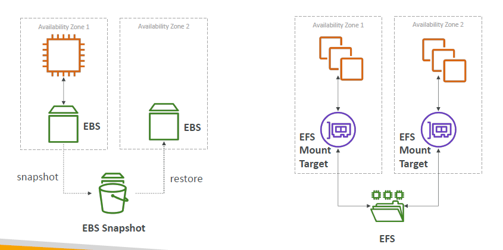

## EFS Infrequent Access (EFS-IA)

- This **storage class** is cost-optimized for files not accessed every day
- Up to 92% lower cost compared to EFS Standard
- EFS will automatically move your files to EFS-IA based on the last time they were accessed
- Enable EFS-IA with a Lifecycle Policy
- **Example:** Assume we have three files in EFS Standard. Say, fourth file in EBS Standard has not been accessed (read or write) for 60 days. Based on the life-cycle policy defined, and you enable EFS-IA, then you are telling it to be moved to EFS-IA storage class which can save you some cost. Next time you access that file, it would be put back into EFS standard storage class
- This is transparent to the applications accessing EFS and the application need not know from where the file is read.

  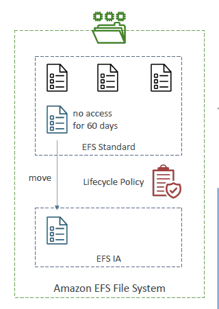

## Shared Responsibility Model for EC2 Storage

| **AWS Responsibilities** | **User Responsibilities** |
| ------------------------ | ------------------------- |
| Ensure durability and availability of EBS and EFS storage | Back up data via snapshots, EFS replication, etc. |
| Data replication within the AZ for EBS volumes | Manage access and encryption of storage resources |
| Provide encryption capabilities (KMS integration) | Apply encryption for sensitive data at rest |
| Replacing faulty hardware | Responsibility of any data on the drives |

## Amazon FSx – Overview

- Launch 3rd party high-performance file systems on AWS
- Fully managed service providing file systems optimized for different workloads.
  - FSx for Windows File Server
  - FSx for Lustre
  - FSx for NetApp ONTAP

### Amazon FSx for Windows File Server

- A fully managed, highly reliable, and scalable **Windows native** shared file system
- Built on **Windows File Server**
- Supports **SMB (Server Message Block) protocol** & **Windows NTFS (New Technology File System)**
- Integrated with Microsoft Active Directory
- Can be accessed from AWS or your on-premise infrastructure

  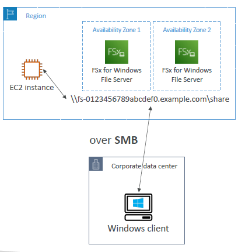

### Amazon FSx for Lustre

- A fully managed, high-performance, scalable file storage for **High Performance Computing (HPC)**
- The name Lustre is derived from "Linux" and "cluster"
- Machine Learning, Analytics, Video Processing, Financial Modeling, ...
- Scales up to 100s GB/s, millions of IOPS, sub-ms latencies

  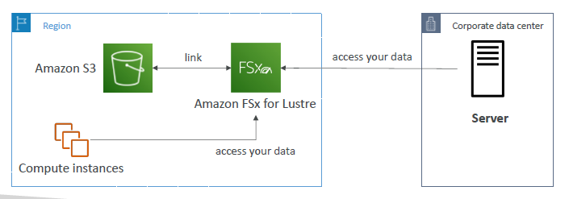

## EC2 Instance Storage Summary

- **EBS volumes:**
  - network drives attached to one EC2 instance at a time
  - Mapped to an Availability Zones
  - Can use EBS Snapshots for backups / transferring EBS volumes across AZ
- **AMI:** create ready-to-use EC2 instances with our customizations
- **EC2 Image Builder:** automatically build, test and distribute AMIs
- **EC2 Instance Store:**
  - High performance hardware disk attached to our EC2 instance
  - Lost if our instance is stopped / terminated
- **EFS:** network file system, can be attached to 100s of instances in a region
- **EFS-IA:** cost-optimized storage class for infrequent accessed files
- **FSx for Windows:** Network File System for Windows servers
- **FSx for Lustre:** High Performance Computing Linux file system
