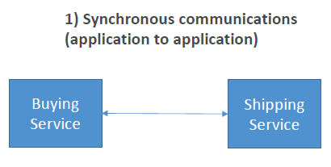
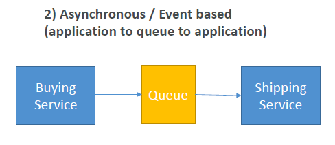
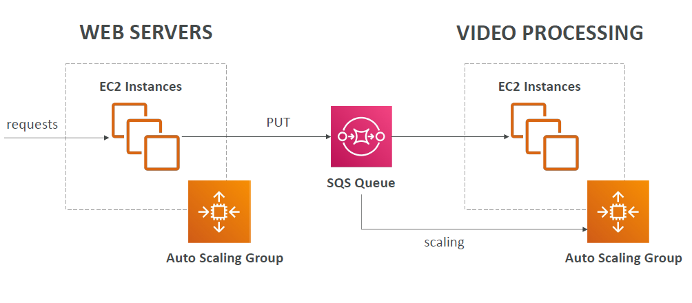
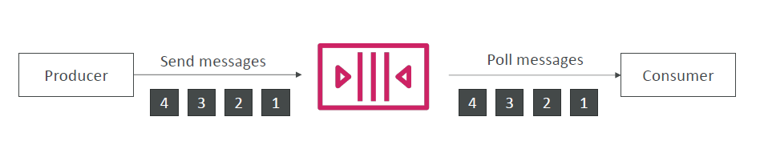
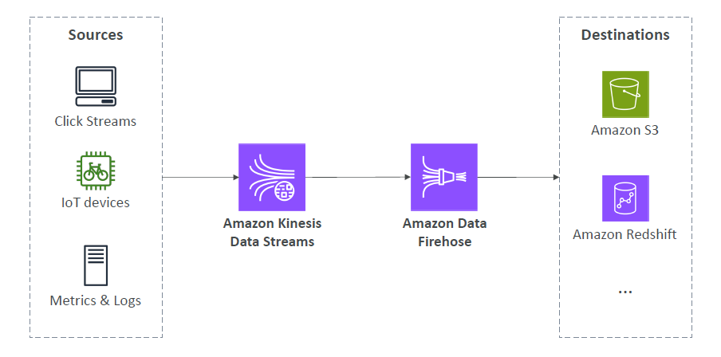
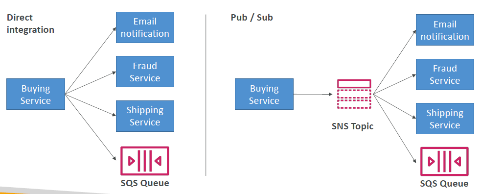
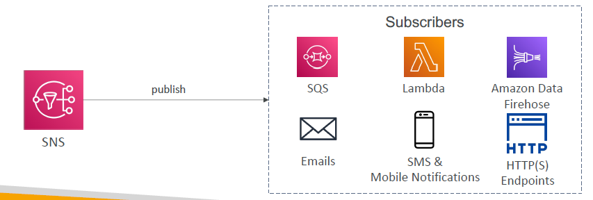

# Cloud Integration

- [Cloud Integration](#cloud-integration)
  - [Section Introduction](#section-introduction)
  - [Amazon SQS - Simple Queue Service](#amazon-sqs---simple-queue-service)
    - [SQS to decouple between application tiers](#sqs-to-decouple-between-application-tiers)
    - [Amazon SQS - FIFO Queue](#amazon-sqs---fifo-queue)
  - [Amazon Kinesis](#amazon-kinesis)
  - [Amazon SNS](#amazon-sns)
  - [Amazon MQ](#amazon-mq)
  - [Integration - Summary](#integration---summary)

## Section Introduction

- When we start deploying multiple applications, they will inevitably need to communicate with one another
- There are two patterns to make applications communicate
  
  1. **Synchronous communications (application to application)** 
  
  
  
  - For example, you have created a service to buy something and then you need to talk to a service that ships what has been bought. Therefore, you want to integrate the buying service and the shipping service synchronously because they talk directly to one another

  2. **Asynchronous / Event based (application to queue to application)** 
  
  
  
  - Also called Event Based, for example, when we have a queue to talk to. Our buying service this time anytime something is bought, will put an order in a queue and the shipping service will be read from a queue to get the orders. As you can see, the buying service and the shipping service are not directly integrated with one another. They are decoupled because there is a queue in between to talk to. This allows us to get some nice integration patterns

- Synchronous applications can be problematic:
  - What if there are sudden spikes of traffic?
  - What if you need to suddenly encode 1000 videos but usually it is 10?
- In these cases the service in question may get overwhelmed and you may get an issue to encode these 1000 videos and things may fail
- In that case, it's better to **decouple** your applications:
  - using SQS: queue model
  - using SNS: pub/sub model
  - using Kinesis: real-time data streaming model
- These services once decoupled can scale independently from our application!

## Amazon SQS - Simple Queue Service

- **What's a queue?**
  - Say, we are creating an SQS queue
  - What we enable us to do is to have producers send messages into that queue
  - Then it could be one producer, but it could be as well, multiple producers
  - Then once the messages are stored in the queue, then they could be read by consumers who will be polling the queue, means requesting messages from the queue. It could be one consumer, or multiple consumers. 
  - In this example, once the consumer poll messages they will share the work. Each consumer will get different messages and when they are done processing a message, for example, process a video, they will delete the message from the queue and it will be gone
  - In this mechanism, we have the producers sending messages into the queue, they are decoupled from the consumer reading the message from the queue and processing them at different speed
- Oldest AWS offering (over 10 years old)
- Fully managed service (~serverless), use to **decouple** applications
- Scales from 1 message per second to 10,000s per second
- Default retention of messages: **4 days, maximum of 14 days**
- No limit to how many messages can be in the queue
- Messages are deleted after they're read by consumers
- Low latency (<10 ms on publish and receive)
- Consumers share the work to read messages & scale horizontally

### SQS to decouple between application tiers

- Here is a classic solution architecture

  

- We have a web server taking requests may be through an ALB. They are served through EC2 instances in an ASG
- Say, our users want us to process some videos. Instead of sending them directly to our video application, we can instead insert messages into an SQS queue, and then we will have a video processing layer made of an ASG with EC2 instances and these instances will be reading from an SQS queue and processing our videos
- The cool thing about this is, we can scale the second ASG independently from the first one, which we call as decoupling. And on top of it, the scaling can happen based on how many messages there are in the SQS queue
- This will give us the best cost efficiency and scaling concerns

### Amazon SQS - FIFO Queue

- FIFO = First In First Out (ordering of messages in the queue) and that corresponds to the ordering of the messages within the queue

  

- If you have a producer sending messages in a specific order such as 1, 2, 3, and 4, then the consumer will also read these messages in order
- When you have a normal SQS queue consumers can read messages altogether and they could be in different orders 
- But with Amazon SQS FIFO queues, the messages are processed in order by the consumer

## Amazon Kinesis

- For the exam: **Kinesis = real-time big data streaming**
- **Managed service to collect, process, and analyze real-time streaming data at any scale**
- Too detailed for the Cloud Practitioner exam but good to know:
  - **Amazon Kinesis Data Streams:** low latency streaming to ingest data at scale from hundreds of thousands of sources
  - **Amazon Kinesis Data Firehose:** 
    - load streams of data from Kinesis Data Streams into target destinations such as S3, Redshift, ElasticSearch, etc...
  
    

    - To understand the above diagram, you have data sources and they are going to be what we call fast data sources, meaning data that gets created in real time, for example, when people click on your website or when you have a device that is connected to the internet or when you have metrics or logs on an application server.
    - All these data points can be sent into Amazon Kinesis Data Streams and analyzed.
    - Then if you want to you can also use Amazon Kinesis Data Firehose to send them into destinations such as your S3 buckets, Redshift DB and so on

  - **Amazon Kinesis Data Analytics:** perform real-time analytics on streams using SQL
  - **Amazon Kinesis Video Streams:** monitor real-time video streams for analytics or ML

## Amazon SNS

- This is the second way how we can decouple our application using Amazon SNS
- What if you want to send one message to many receivers?
  
  

  - We can go the route of direct integration. For example, having a buying service sending an email notification, then talking to a fraud service, talking to a shipping service, and talking to the SQS Queue
  - This would be quite complicated because we need to write four direct integrations
  - Instead, we could use something called a Pub/Sub type of integration in which we have an SNS topic
  - Then the buying service will be sending a message to SNS Topic. The topic would be smart enough to automatically send a notification via email, to the fraud service, to the shipping service, and even to an SQS Queue. This is the premise of SNS

- SNS stands for Simple Notificaton Service
- It is a notification service provided as part of Amazon Web Services since 2010. It provides a low-cost infrastructure for mass delivery of messages, predominantly to mobile users.
- The "event publishers" will only send messages to one SNS topic
- You can have as many "event subscribers" as you want to listen to the SNS topic notifications
- Each subscriber to the topic **will get all the messages** which is different from SQS where the consumers were sharing the messages
- In this example, each subscriber to the topic will get all the messages sent to the SNS topic
- Each SNS Topic can have more than 12 million subscriptions. Also we have a soft limit of 100,000 topics limit for each account

  

- SNS has many destinations and it can publish to many subscribers 
- From AWS target service SNS, we have Amazon SQS, AWS Lambda, and Amazon Data Firehose
- But we can also send emails directly from SNS, we can send SMS and mobile notifications. Finally, we can send data directly into a HTTP or HTTPS endpoints 

## Amazon MQ

- We know about SQS and SNS and they are "cloud-native" services because they are using proprietary protocols from AWS and they use their own sets of API
- But if you are running traditional applications from on-premise you may use open protocols such as: MQTT, AMQP, STOMP, Openwire, WSS
- And **when you are migrating you application to the cloud**, you may not want to re-engineer your application to use SQS and SNS protocols or APIs, instead you want to use the traditional protocols you used to such as: MQTT, AMQP, STOMP, Openwire, WSS. For this, we can use **Amazon MQ**
- **Amazon MQ is a managed message broker for two technologies, RabbitMQ and ActiveMQ**
- RabbitMQ and ActiveMQ are on-premises technologies that provide you access to the open protocols mentioned above. Then we can get a managed brokers of these protocols on the cloud thanks to Amazon MQ
- Amazon MQ doesn't "scale" as much as SQS / SNS (which have sort of like infiinite scaling)
- Amazon MQ runs on a dedicated machine (not serverless), you may have server issues. So you can run multi-AZ setup with a failover if you want to be highly available
- Amazon MQ comes with both a queue feature (which looks like SQS) and topic features (which looks like SNS) as part of a single broker
- **Amazon MQ is going to be used only and only if a company is migrating to the cloud and needs to use one of these open protocols such as: MQTT, AMQP, STOMP, Openwire, WSS**. Otherwise you should use SQS and SNS because they scale a lot better and they are way more integrated with Amazon Web Services than Amazon MQ

## Integration - Summary

- SQS:
  - Queue service in AWS
  - Multiple Producers, messages are kept up to 14 days
  - Multiple Consumers share the read and delete messages when done
  - Used to decouple applications in AWS
- SNS:
  - Notification service in AWS
  - Subscribers: Email, Lambda, SQS, HTTP, Mobile…
  - Multiple Subscribers, send all messages to all of them
  - No message retention
- Kinesis: real-time data streaming, persistence and analysis
- Amazon MQ: managed message broker for ActiveMQ and RabbitMQ in the cloud (MQTT, AMQP protocols)
