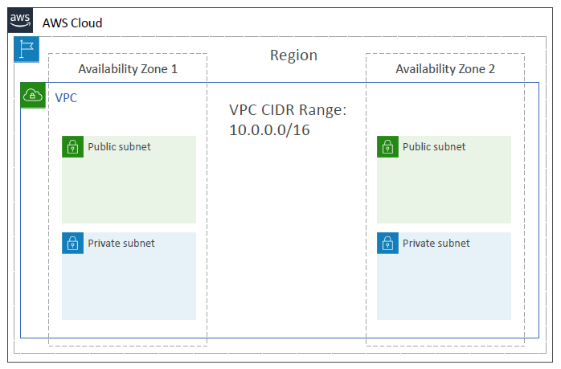
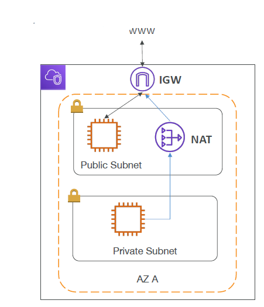
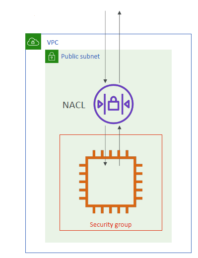
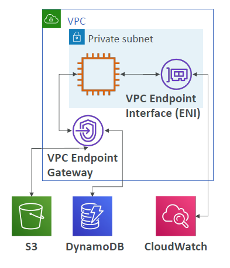
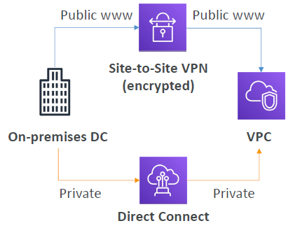
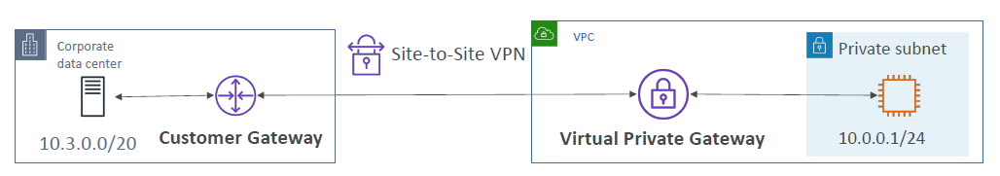
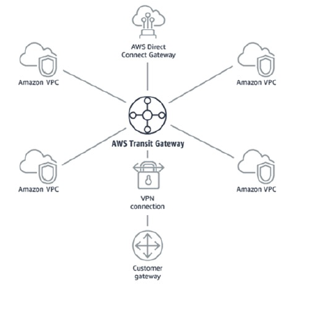

# VPC

- [VPC](#vpc)
  - [VPC – Crash Course](#vpc--crash-course)
  - [IP Addresses in AWS](#ip-addresses-in-aws)
  - [VPC \& Subnets Primer](#vpc--subnets-primer)
  - [VPC Diagram](#vpc-diagram)
  - [Internet Gateway (IGW) and NAT Gateways](#internet-gateway-igw-and-nat-gateways)
  - [Network ACL \& Security Groups](#network-acl--security-groups)
    - [Network ACLs vs Security Groups](#network-acls-vs-security-groups)
  - [VPC Flow Logs](#vpc-flow-logs)
  - [VPC Peering](#vpc-peering)
  - [VPC Endpoints](#vpc-endpoints)
  - [AWS PrivateLink (Also from VPC Endpoint Services family)](#aws-privatelink-also-from-vpc-endpoint-services-family)
  - [Site-to-Site VPN \& Direct Connect](#site-to-site-vpn--direct-connect)
  - [Site-to-Site VPN](#site-to-site-vpn)
  - [AWS Client VPN](#aws-client-vpn)
  - [Network topologies can become complicated](#network-topologies-can-become-complicated)
  - [Transit Gateway](#transit-gateway)
  - [VPC Closing Comments](#vpc-closing-comments)

## VPC – Crash Course

- VPC is something you should know in depth for the AWS Certified Solutions Architect Associate & AWS Certified SysOps Administrator
- **At the AWS Certified Cloud Practitioner Level, you should know about:**
  - VPC, Subnets, Internet Gateways & NAT Gateways
  - Security Groups, Network ACL (NACL), VPC Flow Logs
  - VPC Peering, VPC Endpoints
  - Site to Site VPN & Direct Connect
  - Transit Gateway
- I will just give you an overview, less than 1 or 2 questions at your exam.
- We'll have a look at the “default VPC” (created by default by AWS for you)
- There is a summary lecture at the end. It's okay if you don't understand it all

## IP Addresses in AWS

- **IPv4 – Internet Protocol version 4** (4.3 Billion Addresses)
  - **Public IPv4** – can be used on the Internet and that allows whatever is the IP to be publicly reachable from anywhere
  - When you create an EC2 instance, it gets a public IPv4 and what happens is you get a new public IP address every time you stop and start an EC2 instance (**default**)
  - **Private IPv4** – this can only be used on a private networks (LAN) such as internal AWS networking (e.g., 192.168.1.1)
  - Private IPv4 is fixed for EC2 Instances for lifetime even if you start/stop them
- **Elastic IP** – allows you to attach a fixed public IPv4 address to EC2 instance. But if you leave the instance stopped for a long time, then this elastic IP is used for nothing
- **Note: every single public IPv4 on AWS will be charged $0.005 per hour (including EIP)**
  - Free Tier: 750 hours usage per month
- **IPv6 – Internet Protocol version 6 (3.4 × 10^38" Addresses)**
  - Every IP address is public in AWS (no private range)
  - Example: 2001:db8:3333:4444:cccc:dddd:eeee:ffff
  - Free in AWS

## VPC & Subnets Primer

  

- **VPC -Virtual Private Cloud:** private network to deploy your resources in and a VPC is linked to a specific region. So, if you have a multiple regions in AWS means you have multiple VPCs
- Within a VPC, we have subnets. **Subnets** are part of your VPC and it allows you to partition your network inside your VPC. A Subnet is associated with an Availability Zone
- A **public subnet** is a subnet that is accessible from the internet
- A **private subnet** is a subnet that is not accessible from the internet
- To define access to the internet and access between the subnets, so that the resources can communicate, we need to use **Route Tables**
- **What do you put in a public subnet?** - We created EC2 instances in a public subnet, but also you can put, for example, a load balancer. In a private subnet, which we don't have when we have a default VPC, for example, you could place your database, because they don't need access to the internet, and therefore they are going to be more secure

## VPC Diagram

  

- Here is how it looks. You have the cloud of AWS, you have Regions, and within a Region, you have a VPC. A VPC will have its CIDR range which is a range of IP addresses that is allowed within your VPC. Then the VPC can go across two or three Availability Zones. Here AZ1 contains a public subnet and a private subnet. AZ2 also contains a public subnet and a private subnet. In this example, we have two AZs, one VPC, four subnets - two of them public, and two of them private. We can launch EC2 instances in each of these subnets

## Internet Gateway (IGW) and NAT Gateways

  

- **Finally, how do we define access to the internet for these subnets?** - If you look at the same example, say we had an EC2 instance in a public subnet, for it to be able to access the internet, we need to create what's called an Internet Gateway
- **Internet Gateways** helps our VPC instances connect directly to the internet
- VPC will be having the Internet Gateway
- Public Subnets will have a route table to the internet gateway, to be able to access the internet
- As soon as we have an internet gateway, and a route to the internet gateway, that makes the subnet a public subnet
- Now, if you have an instance in a private subnet, it is not going to be accessible from the internet, but you may want to give it an access to the internet, for example, to get updates for your operating system or to download files
- For this, we can create a **NAT Gateway**, which is **managed by AWS**, or a **NAT Instance**, which is **self-managed**, and that will allow your instances in your private subnet to access the internet while remaining private
- So concretely, we create a NAT Gateway or NAT Instance in our public subnet, and we create a route from the private subnet to the NAT Gateway, and from the NAT Gateway to the Internet Gateway. This will allow your private subnets to get internet connectivity

## Network ACL & Security Groups

  

- **NACL (Network ACL)**
  - If you look at EC2 instances in a public subnet, and the first line of defense for our EC2 instance is a NACL or a Network ACL which is a firewall which **controls traffic to and from the Subnet**
  - They have both ALLOW and DENY rules
  - They are attached at the **Subnet** level
  - These rules only include IP addresses
  - If you see the diagram, a NACL will be filtering traffic in and out of the subnet before it reaches our EC2 instance
- **Security Groups**
  - The second line of defense we have is Security Groups and this is a firewall that **controls traffic to and from EC2 Instances**
  - They can have only ALLOW rules
  - They are at the **EC2 instance level**
  - Finally, they can reference either IP addresses and other security groups
  - In this example, we have Security Groups around your EC2 instance, and that controls the traffic going in and out of your EC2 instance

### Network ACLs vs Security Groups

| Security Group | Network ACL |
| -------------- | ----------- |
| Operates at the instance level | Operates at the subnet level |
| Supports allow rules only | Supports allow rules and deny rules |
| Is stateful: Return traffic is automatically allowed, regardless of any rules | Is stateless: Return traffic must be explicitly allowed by rules |
| We evaluate all rules before deciding whether to allow traffic | We process rules in number order when deciding whether to allow traffic |
| Applies to an instance only if someone specifies the security group when launching the instance, or associates the security group with the instance later on | Automatically applies to all instances in the subnets it's associated with (therefore, you don't have to rely on users to specify the security group) |

<https://docs.aws.amazon.com/vpc/latest/userguide/VPC_Security.html>

## VPC Flow Logs

- VPC Flow Logs are a log of all the IP traffic going through your interfaces:
  - **VPC** Flow Logs
  - **Subnet** Flow Logs
  - **Elastic Network Interface (ENI)** Flow Logs to see the traffic going in and out of your EC2 instances for example
- By enabling the flowlog, you can monitor & troubleshoot connectivity issues. Example:
  - if a subnet cannot connect to the internet
  - If a subnet cannot connect to another subnet
  - If the internet cannot connect to a subnet
- Captures network information from AWS managed interfaces too: Elastic Load Balancers, ElastiCache, RDS, Aurora, etc...
- VPC Flow logs data can go to S3, CloudWatch Logs, and Amazon Data Firehose

## VPC Peering

- This is to connect two VPC, privately using AWS' private network
- And make them behave as if they were part from the same network

  

- For example, we have VPC A and VPC B and we can peer them together and as soon as it is done, they will have the same network or behave as if they were in the same network
- For this, you need to make sure that we do not have overlapping CIDR (IP address range)
- VPC Peering connection is **not transitive** (must be established for each VPC that need to communicate with one another)

## VPC Endpoints

- All the AWS services, we saw so far are public. That means when we connect to them, we are connecting to them publicly
- But if we use VPC Endpoints, we can connect to these AWS Services using a private network instead of using the public internet network
- Why? Because this will give you a enhanced security because you are not going over the public internet and lower latency to access AWS services because you do not access the services through network hops

  

- **VPC Endpoint Gateway:**
  - For example, we have a VPC, a private subnet and an EC2 instance in that private subnet and say we want to connect to Amazon S3 or DynamoDB. For this, you create a VPC Endpoint of type Gateway **(VPC Endpoint Gateway is for Amazon S3 & DynamoDB only)** and using this EC2 instance, you can connect through the gateway into Amazon S3 and DynamoDB, but privately.
- **VPC Endpoint Interface:**
  - The other type of endpoint you have is a **VPC Endpoint Interface** which is to connect to any other services on AWS including Amazon S3 & DynamoDB. For example, you wanted to push a custom metric from your EC2 instance onto CloudWatch. For this, we will have VPC Endpoint Interface then, the EC2 instance will connect to VPC Endpoint Interface to connect to CloudWatch

## AWS PrivateLink (Also from VPC Endpoint Services family)

- Say, you have a service that you run within AWS, or say there is a vendor on the Marketplace, and they run a service on their own account within their own VPC. They want to expose a service to customers of AWS in a most secure and scalable way. To 1000s of VPCs, they need to have a private access to that service to establish a connectivity
- You could use VPC peering, but that does not scale, and it is not very secure. What you want is something else and that something else is called a AWS PrivateLink
- So PrivateLink allows you to connect a service running within your VPC to other VPCs directly and privately. It does not require VPC Peering or Internet Gateway, or NAT or Route Tables or anything like that because it is on the private network

  

- Say, for example, you are talking to a vendor on the AWS Marketplace, and they run an application service in their own VPC which you want to use. You want to have an access to it from your own VPC, your own accounts with your own consumer application. In that case, you are going to ask your vendor to do a PrivateLink. On their end, they will have to create a Network Load Balancer (Service VPC) to expose that service. On your end, you will create an Elastic Network Interface (ENI - Customer VPC), then you will establish a PrivateLink between the two so that you have a private access to their Network Load Balancer and therefore to their service. 
- All the internet traffic is actually not going to go through the public internet, but it is actually going to go through your private network. Therefore all communications will remain private and for every new customer that third party will need, all they will have to do is create a new PrivateLink for their customers, which is very easy to manage and way more scalable

## Site-to-Site VPN & Direct Connect

  

- Say, you have an on-premises data center, and you want to connect it to the cloud, to your VPC
- For this, you have **two options**:
  - **Site-to-Site VPN**
    - This is to connect your on-premises VPN to AWS
    - What is a VPN? - It is a connection between your on-premises data center and a VPC that is going to be encrypted and that goes over the public internet
    - From the diagram it looks like this, your on-premises data center will connect to your VPC through the public internet, and then it will be enrypted so no one else can access the communication. This is good as it can be set up very quickly. In about 5 minutes, you can have a connection between your data center and AWS. But it goes over the public internet, so you may have some limited bandwidth and you may have some security concerned even though it is obviously encrypted
  - **Direct Connect (DX)**
    - The other option is to use Direct Connect or DX
    - Direct Connect is to establish a natural physical connection between your on-premises data center and AWS
    - The connection is private, secure and fast
    - Goes over a private network
    - This is going to be a lot more expensive because you have to do a physical connection betweem yourself and a direct connect partner into AWS
    - This will take at least a month to establish this. But it is going to be more private and obviously faster and more reliable

## Site-to-Site VPN

  

- It is to connect your corporate data center to your VPC. For example, an EC2 instances running in your private subnet. To establish a Site-to-Site VPN, we need on-premises a **Customer Gateway (CGW)** (remember at the exam).
- On the AWS side, you need a **Virtual Private Gateway (VGW)**
- Once the two things are provisioned and created, then you can connect them together using a Site-to-Site VPN. This is how a Site-to-Site VPN is implemented over the public internet
- **Going into the exam, Customer Gateway (CGW) and Virtual Private Gateway (VGW) are needed to establish a Site-to-Site VPN**

## AWS Client VPN
 
- If you have your computer and you want to privately connect into your AWS VPC. Therefore you will leverage the Client VPN to establish a connection using OpenVPN to your private network in AWS or on-premises
- Why do you want to do so? Well, for example, say you have deployed EC2 instances in private VPC and you want to access them using a private IP then that will be difficult if you do not have a VPN. If you have a VPN, it is super easy. Once the VPN connection is established, you will be able to access your EC2 instances using their private IP just as if you were in the VPC network yourself

  

- From the diagram, your VPC is right here and then your client's VPN is installed on your computer
- You will establish the VPN connection over the **public internet**. Then you will be connected just as if you were connected privately into your VPC
- And if your VPC is established a Site-to-Site VPN connection to your on-premises data center then your computer will also be able to access your servers privately on your on-premises data center. That's pretty magical, but that works

## Network topologies can become complicated

  

- If you have a serious infrastructrue on AWS, youe network topology can become quite complicated. To solve this mess, there has been a new service created which is called the Transit Gateway 

## Transit Gateway

- **The Transit Gateway is to have a transitive peering connection between thousands of VPC and your own on-premises system with a hub-and-spoke (star) connection**

  

- You have VPC Transit Gateway in the middle, and all your Amazon VPC, your Direct Connect Gateway, as well as your VPN connections are connected through the Transit Gateway. You don't need to peer the VPC with one another, you don't need to have different connections and routes between each of them and Direct Connect and Site-to-Site VPN.
- All of this done within one single gateway to provide this functionality
- Works with Amazon VPCs, Direct Connect Gateways, VPN connections
- In the Exam, if you see a way to connect to hundreds or thousands of VPCs together, with as well your on-premises infrastructure, think no more than the Transit Gateway

## VPC Closing Comments

- **VPC** – Virtual Private Cloud
- **Subnets** – Tied to an AZ, network partition of the VPC
- **Internet Gateway** – at the VPC level, provide Internet Access
- **NAT Gateway / Instances** – give internet access to private subnets
- **NACL** – Stateless, subnet rules for inbound and outbound
- **Security Groups** – Stateful, operate at the EC2 instance level or ENI
- **VPC Peering** – Connect two VPC with non overlapping IP ranges, nontransitive
- **Elastic IP** –fixed public IPv4, ongoing cost if not in-use VPC Endpoints
- **VPC Endpoints** – Provide private access to AWS Services within VPC
- **PrivateLink** – Privately connect to a service in a 3rd party VPC
- **VPC Flow Logs** – network traffic logs
- **Site to Site VPN** – VPN over public internet between on-premises DC and AWS
- **Client VPN** – OpenVPN connection from your computer into your VPC
- **Direct Connect** – direct private connection to AWS
- **Transit Gateway** – Connect thousands of VPCs, on-premises network, Site-to-Site VPN, Direct Connect and so on, together
