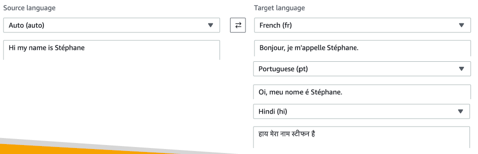
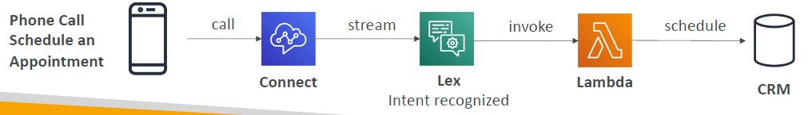
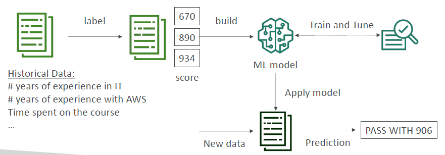
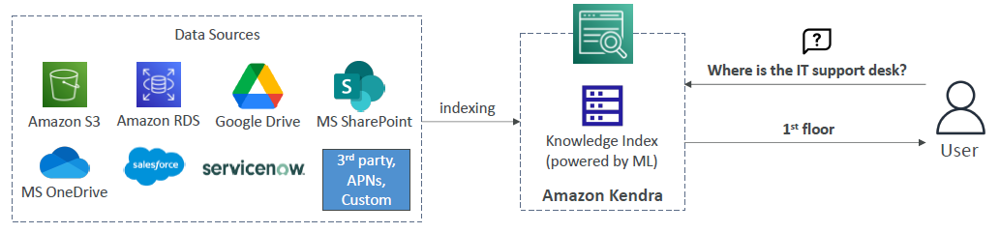
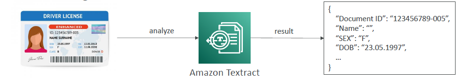

# Machine Learning

- [Machine Learning](#machine-learning)
  - [Amazon Rekognition](#amazon-rekognition)
  - [Amazon Transcribe](#amazon-transcribe)
  - [Amazon Polly](#amazon-polly)
  - [Amazon Translate](#amazon-translate)
  - [Amazon Lex \& Connect](#amazon-lex--connect)
    - [Amazon Lex: (same technology that powers Alexa)](#amazon-lex-same-technology-that-powers-alexa)
    - [Amazon Connect](#amazon-connect)
  - [Amazon Comprehend](#amazon-comprehend)
  - [Amazon SageMaker](#amazon-sagemaker)
  - [Amazon Kendra](#amazon-kendra)
  - [Amazon Personalize](#amazon-personalize)
  - [Amazon Textract](#amazon-textract)
  - [Summary](#summary)

## Amazon Rekognition

- It is used to recognize objects, people, text, and scenes in images and videos using ML
- You can do facial analysis and facial search for user verification and people counting
- With this you can create a database of familiar faces or compare against celebrities
- Use cases:
  - Labeling
  - Content Moderation
  - Text Detection
  - Face Detection and Analysis (gender, age range, emotions)
  - Face Search and Verification
  - Celebrity Recognition
  - Pathing (Ex: for sports game analysis)
- More info: [Amazon Rekognition](https://aws.amazon.com/rekognition/)

## Amazon Transcribe

- It automatically converts speech to text
- It uses the deep learning process called **Automatic Speech Recognition** (ASR) to convert speech to text quickly and accurately
- A feature to know is: **you can automatically remove any Personally Identifiable Information (PII) using Redaction**. That means if you have someone's age or name or SSN etc.. it can be automatically removed
- Also, it **supports Automatic Language Identification for multilingual audio**. If you have some French, some English, some Spanish, Transcribe is smart enough to recognize all of those
- Use cases:
  - Transcribing customer service calls
  - Automating closed captioning and subtitling
  - Generating metadata for media assets for searchable archives

## Amazon Polly

- Polly is the opposite of Transcribe
- Polly turns text into lifelike speech using deep learning
- This allows you to create applications that talk

## Amazon Translate

  

- Translate is a natural and accurate **language translation**
- Amazon Translate allows you to **localize content** - such as websites and applications - for **international users**, and to easily translate large volumes of text efficiently.

## Amazon Lex & Connect

### Amazon Lex: (same technology that powers Alexa)

- With Amazon Lex you will get **Automatic Speech Recognition** (ASR) to convert speech to text
- Amazon Lex understands the intent of text, callers by doing Natural Language understanding
- Amazon Lex helps build chatbots and call center bots

### Amazon Connect

- Amazon Connect is a way to build a **virutal contact center**
- It is a cloud-based virtual contact center that allows you to receive calls and creates contact flows
- It can integrate with CRM systems or AWS services
- The cool thing about Amazon Connect versus traditional offering is that there is no upfront payment. It is about 80% cheaper than traditional contact center solutions

  

- The whole flow of building a smart contact center is you, for example, have a phone call to schedule an appointment that is made into a number that is defined by Amazon Connect, so they call Amazon Connect. 
- Lex is streaming all the information from this call and understand the intent of the phone call, and therefore it will invoke the right Lambda function, and that Lambda function can be very smart and say, "Hey, someone has said to schedule a meeting tomorrow with Tom at 3 PM." So you will go into the CRM and schedule that meeting by writing some code

## Amazon Comprehend

- Comprehend is to comprehend stuff, so it is for **Natural Language Processing or NLP**
- It is fully managed and serverless service
- It will use machine learning to find insights and relationships in text
- **Key features:**
  - it can identify language of the text
  - it can extract key phrases, places, people, brands, or events
  - it can determines sentiment of the text
  - it can analyze text using tokenization and parts of speech
  - it can organize a collection of text files by topic
- It is all about getting a lot of data in and Comprehend will do the rest to try and understand the meaning of that data
- It takes text or unstructured data and structures it around these features
- **Key uses:**
  - Analyzing customer interactions - a bunch of customers sending you emails and you want to understand on an overall based on your support service what leads to a positive or negative experiences from your customers. Later you can have business insights to improve your business
  - Create and group articles by topics that Comprehend will uncover

## Amazon SageMaker

- It is a fully managed service for developers and data scientists to build ML models
- When you want to build this kind of processes to build a machine learning model, you have to do a bunch of steps and these are quite difficult to do in one place. Plus you need to provision some servers to perform these computations to create these models, and that can be cumbersome as well. This is where SageMaker comes in and helps you all along the process

  

- Machine learning process (simplified): predicting your exam score. Say, you are a developer or a data scientist and you will gather all your data from the actual performance of all your students, say 10 thousand students saying how much experience in IT they had, how many years of experience in AWS they had, how much time they spent on the course, how many practice exams they did, etc.. etc.,
- Next, we are going to label the data. Meaning you need to say which columns corresponds to what, and also you need to give some kind of exam scores. Based on the data that I have gathered I can predict what the score will be
- Next we need to build the machine learning model, which is how I can predict these scores from the historical data
- Next you have to train the model and tune it and this is another part which is quite difficult to do, which is how to refine my model over time to better fit my data and my outputs
- Now, after all the labeling, building, training and tuning you have a machine learning model which you need to use. This is called deploying machine learning models. We get new data coming in, for example, you are the new student, and you are going to survey asking questions. Based on the data coming in, I will apply the machine learning model that I have created from before. The machine learning model will finally say, **"Based on the given data, I am going to predict that this student will pass with a score of 906"**. This whole process can be all done within SageMaker

## Amazon Kendra

- Fully managed **document search service** powered by ML
- Extracts answers from various document types (text, PDF, HTML, PowerPoint, MS Word, FAQs)

  

- The documents may be coming in from a lot of data sources and they are going to be indexed by Amazon Kendra which is going to build internally a knowledge index powered by ML
- From an end-user perspective, we get a natural language search capabilities
- Suppose if a user asks **"where is the IT support desk"** into Kendra, then it can reply **"First Floor"** due to the fact that Kendra knows from all the resources that it took. 
- You can also do a normal search
- It will also learn from user interactions and feedback to promote preferred search results which is called as incremental learning
- Finally, you can fine tune the search results. 

## Amazon Personalize

- Fully managed ML service to build apps with real-time personalized recommendations
- Key uses:
  - Personalized product recommendations/Re-Ranking
  - Customized direct marketing
  - For example, a user has bought a lot of gardening tools, and you want to provide recommendations on the next one to buy based on a personalized service
- Same technology **used by amazon.com** where after buying a few products you will start get recommended products as your potential next buy from the same category or from a completely different categories based on how you have been searching, buying, and user interests
- Personalize is how you access this from within AWS. You read your input data from Amazon S3 bucket, could be user interact data. Also, you can use Amazon Personalize API to have real-time data integration into the Amazon Personalize Service. This will then expose a customized personalized API for your websites and applications, you mobile applications, also you can send SMS or emails for personalization as well
- It takes days, not months, to build this model. You do not need to build, train and deploy ML solutions and use this bundled as is
- Use Cases: retail stores, media and entertainment
- From exam perspective, anytime you see an ML service to build recommendations and personalized recommendations, think of Amazon Personalize

## Amazon Textract

- Automatically extracts text, handwriting, and data from any scanned documents using AI and ML

  

- We have, for example, a driver license, we upload it into Amazon Textract, automatically it will be analyzed , and the results will be given to you as a data file, from which you will be able to extract date of birth, document ID, and so on
- You can extract any data even from forms and tables, and you can read PDFs, images, and so on
- Key uses:
  - Financial Services (for invoices, financial reports)
  - Healthcare (for medical records, insurance claims)
  - Public Sector (for tax forms, ID documents, passports)

## Summary

- **Rekognition**: Face detection, labeling, celebrity recognition
- **Transcribe**: Audio to text (e.g., subtitles)
- **Polly**: Text to audio
- **Translate**: Language translation
- **Lex**: Build conversational bots (chatbots)
- **Connect**: Cloud contact center
- **Comprehend**: Natural language processing
- **SageMaker**: Machine learning for developers and data scientists
- **Forecast**: Accurate forecasts
- **Kendra**: ML-powered search engine
- **Personalize**: Real-time personalized recommendations
- **Textract**: Detect text and data in documents
