# Account Management, Billing & Support

- [Account Management, Billing \& Support](#account-management-billing--support)
  - [AWS Organizations](#aws-organizations)
  - [Multi Account Strategies](#multi-account-strategies)
  - [Organizational Units (OU) - Examples](#organizational-units-ou---examples)
  - [AWS Organization](#aws-organization)
  - [Service Control Policies (SCP)](#service-control-policies-scp)
    - [SCP Examples - Blacklist and Whitelist strategies](#scp-examples---blacklist-and-whitelist-strategies)
  - [AWS Organization - Consolidated Billing](#aws-organization---consolidated-billing)
  - [AWS Control Tower](#aws-control-tower)
  - [AWS Resource Access Manager (AWS RAM)](#aws-resource-access-manager-aws-ram)
  - [AWS Service Catalog](#aws-service-catalog)
    - [Service Catalog Diagram](#service-catalog-diagram)
  - [Pricing Models in AWS](#pricing-models-in-aws)
  - [Free services \& free tier in AWS](#free-services--free-tier-in-aws)
  - [Compute Pricing](#compute-pricing)
    - [EC2](#ec2)
    - [Lambda \& ECS](#lambda--ecs)
  - [Storage Pricing](#storage-pricing)
    - [S3](#s3)
    - [EBS](#ebs)
  - [Database Pricing - RDS](#database-pricing---rds)
  - [Content Delivery - CloudFront](#content-delivery---cloudfront)
  - [Networking Costs in AWS per GB - Simplified](#networking-costs-in-aws-per-gb---simplified)
  - [Savings Plan](#savings-plan)
  - [AWS Compute Optimizer](#aws-compute-optimizer)
  - [Billing and Costing Tools](#billing-and-costing-tools)
  - [AWS Pricing Calculator](#aws-pricing-calculator)
  - [AWS Billing Dashboard](#aws-billing-dashboard)
  - [AWS Free Tier Dashboard](#aws-free-tier-dashboard)
  - [Cost Allocation Tags](#cost-allocation-tags)
  - [Tagging and Resource Groups](#tagging-and-resource-groups)
  - [Cost and Usage Reports](#cost-and-usage-reports)
  - [Cost Explorer](#cost-explorer)
  - [Billing Alarms in CloudWatch](#billing-alarms-in-cloudwatch)
  - [AWS Budgets](#aws-budgets)
  - [AWS Cost Anomaly Detection](#aws-cost-anomaly-detection)
  - [AWS Service Quotas](#aws-service-quotas)
  - [Trusted Advisor](#trusted-advisor)
    - [Trusted Advisor - Support Plans Pricing](#trusted-advisor---support-plans-pricing)
  - [AWS Basic Support Plan](#aws-basic-support-plan)
  - [AWS Developer Support Plan](#aws-developer-support-plan)
  - [AWS Business Support Plan (24/7)](#aws-business-support-plan-247)
  - [AWS Enterprise On-Ramp Support Plan (24/7)](#aws-enterprise-on-ramp-support-plan-247)
  - [AWS Enterprise Support Plan (24/7)](#aws-enterprise-support-plan-247)
  - [Account Best Practices - Summary](#account-best-practices---summary)
  - [Billing and Costing Tools - Summary](#billing-and-costing-tools---summary)

## AWS Organizations

- It is a global service
- The idea is that by creating an organization, you are able to manage **multiple AWS accounts**
- The main account is the Master Account and all the other ones will be called Child Accounts
- Cost Benefits you get from using an organization:
  - **Consolidated Billing** across all accounts - single payment method. You don't need to set up a payment method for all the other accounts
  - Pricing benefits from **aggregated usage** (volume discount for EC2, S3…). When you use a lot EC2 or when you use a lot S3, you get a discount because you've used that a lot. And so if you have multiple accounts, you could lose that volume. But with an organization, because the billing is consolidated, the aggregated usage is as well consolidated, and that means that you get more discounts
  - **Pooling of Reserved EC2 instances** for optimal savings. They're shared across all the accounts to make sure that if one account does not use a Reserve Instance, another one can, and again, maximize the cost savings.
- API is available to **automate AWS account creation**. For example, if you had some processes to create an account programmatically for someone, i.e., Sandbox Accounts
- **Restrict account privileges using Service Control Policies (SCP)**

## Multi Account Strategies

- You can have a Multi Account Strategy in AWS. That means that you wanna create accounts, for example, **per department**, **per cost center**, **per environment, for example, dev/test/and prod** based on **regulatory restrictions**. For example, if you don't want a service to be used in an account, you can use an SCP. Or if you want to **isolate the resources better**, you could have different VPC in different accounts. And it's also very good to have **separate per-account service limits** and also isolated accounts for **logging**. All these could be multi-account strategies, it's really up to each organization to choose what type of accounts they want
- The idea is that you have two options, you can use Multi Account or One Account Multiple VPC. That is a trade off, personally prefer Multi Account better
- You can use tagging standards across all the accounts for billing purposes
- Enable CloudTrail on all accounts, send logs to central S3 account
- Send CloudWatch Logs to central logging account

## Organizational Units (OU) - Examples

  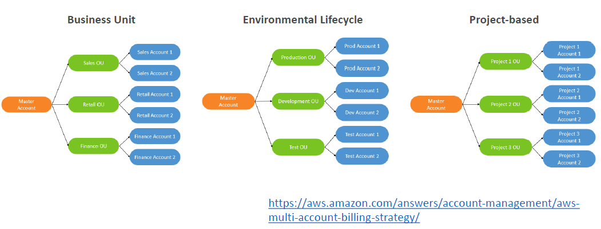

- How can you organize your accounts? Well, you can organize them by Business Units, for example, with a Master Account and then, we have the Sales OU, Retail OU and the Finance OU. Within each OU, you will have multiple accounts or you can organize them by environment, production, development and tests. Or we can have them Project-based, for example, Project-1, Project-2, Project-3, or a mix of all these things

## AWS Organization

  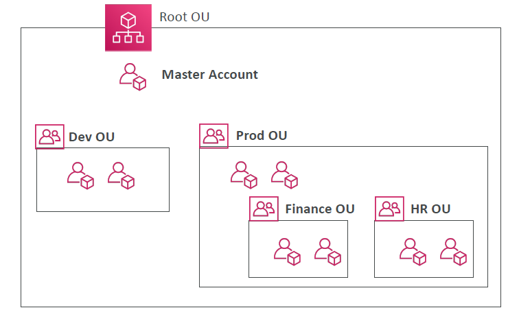

- From the diagram, the Root OU contains everything, it contains the Master Accounts, and then you can create different OU. The Dev OU maybe with the two accounts in it, the Prod OU with two accounts in it, and within the Prod OU, you can also have different OU. A Finance OU and an HR OU with their respective accounts
  
## Service Control Policies (SCP)

- There is something called a Service Control Policy or SCP. It allows you to whitelist or blacklist IAM actions applied at the **OU** or **Account** level, but it doesn't apply to the Master Account. The SCPs have no effects on the Master Account
- The SCPs can be applied to only the **Users and the Roles** of the Account, including a Root. If you apply an SCP onto your account within an OU and you say you cannot use EC2, even an admin within an account cannot use EC2. 
- But the SCP does not apply to service-linked roles. 
  - This is the service roles that other AWS services use to integrate with AWS organizations and can't be restricted by SCPs
- SCP must have an explicit Allow to allow things. So by default it does not allow anything.
- The use cases for SCP, and this is what the exam will test you on, would be to 
  - restrict access to certain services. For example, you're saying, "Okay, in my production accounts, you cannot use EMR"
  - or to enforce PCI Compliance by explicitly disabling services that are not compliant with PCI yet in AWS

### SCP Examples - Blacklist and Whitelist strategies

  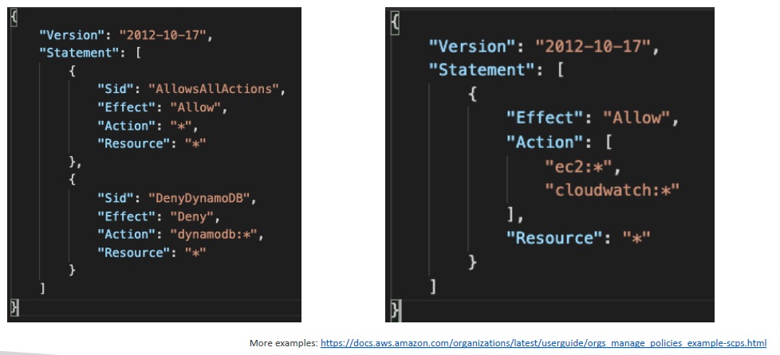

- Let's look at example 1. An SCP looks just like a IAM Policy. So this is Allow all actions. So we allow STAR on STAR. So do you say you can do anything but DenyDynamoDB. And we're saying the effect is Deny on DynamoDB Star for any resource
- Let's look at example 2. This is another strategy to whitelist only a certain type of services. We're saying allow EC2 star and CloudWatch star on Resource Star, but any other services but EC2 and CloudWatch, cannot be usable. If you don't know exactly what this means, you want more examples, there's a link right here that takes you to the documentation and shows you different OUs and SCPs you can have

## AWS Organization - Consolidated Billing

- When you enable this setting, this provides you two things. 
  - Number one, it gives you the **combined usage**, that means that you can combine all the usage of all accounts together to do two things. Number one, you're going to **share the volume pricing**. For example, in Amazon history, if you go over maybe five terabytes of data, then the next service is going to be cheaper. Well, obviously if you combine all your accounts together, if every account is using one terabyte of data and you have six accounts, then altogether they will be benefiting from the discount pricing. So, the combined usage is very important, and also, there are some **Reserved Instances or Savings Plan discounts** on one account. They can be shared across all accounts again to maximize the discounts and the savings
  - One Bill. You get one bill for all the accounts in the organization, which really can help your accounting departments and allow you not to be restricted in how many accounts you can create for AWS

  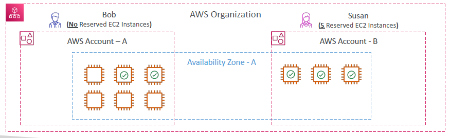

  - Let's take an example, Reserved Instance Sharing. We have an organization with two accounts and in the first one, account A, there is no Reserved Instances, and account B, there are five reserved EC2 instances. Now, let's assume that we are within one AZ because Reserved Instances are at the AZ level and we have nine EC2 instances. As you can see, three are launched in account B, and six are launched in account A. Now, what is going to happen? Well, if we have five EC2 Reserved Instances on account B, then the three EC2 instances obviously are going to be reserved, but because we have enabled Reserved Instances sharing, then two instances in account A will also benefit from Reserved Instances pricing and therefore resulting in cost savings. At the end of the day, we have five Reserved Instances and four non-Reserved Instances in this use case even though Susan in account B only launched three EC2 instances out of the five that were reserved
- Finally, the Reserved Instances discount sharing can be turned off for any accounts in the organization, including the management accounts, the main accounts of your organization

## AWS Control Tower

- It is for you an easy way to **set up and govern a secure and compliant, multi account, AWS environment** based on best practices. Instead of doing everything manually creating an organization and so on and then applying security practices, we have Control Tower where you can, with a few clicks, creates a multi account, AWS environment
- The benefits is that:
  - You can automate the setup of your environments in a few clicks
  - You can automate ongoing policy management using guardrails
  - You can detect the policy violations and remediate them
  - You can monitor your compliance through an interactive dashboard
- AWS Control Tower runs on top of AWS Organizations:
  - That means that it will automatically set up organizations for you to organize your accounts, and it will implement Service Control Policies (SCP) to make sure that the guardrails are operating effectively

## AWS Resource Access Manager (AWS RAM)

- The idea is that you can share AWS resources with other AWS accounts, with resources that are owned by your accounts
- And this can be any other accounts or accounts within your organization
- This allows you to avoid resource duplication 
- And the supported resources include Aurora databases, VPC Subnets, Transit Gateway, Route 53, EC2 Dedicated Hosts, License Manager Configurations. Now, you don't remember these resources in particular, but just the idea behind RAM service

  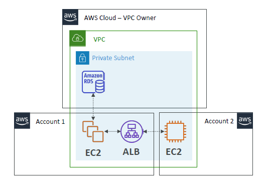

- Let's say we have a cloud accounts and we have a VPC within the cloud accounts and within the VPC, there are private subnets. Now, we can actually share this VPC with other accounts, such as Account one and Account two which are different accounts, still have access to the same VPC and the same subnets. The result of this is that, for example, if an account decides to create EC2 instances and the load balancer within your VPC Account two, with their own EC2 instances, can access directly from the network, for example an Amazon RDS database, or your application load balancer. So, the idea here is that because we've shared our VPC, all the resources within the VPC are going to be able to connect with each other from a network perspective, which is going to simplify our deployments

## AWS Service Catalog

- The users that are new to AWS, they have too many options and they don't follow this course, for example when they get started. If you leave them the option to do anything they want in AWS, whatever they create may not be in line with what the rest of your organization is doing. 
- Some users that just want to have access to quick self-service portal that allows them to launch a set of authorized products, and these have to be predefined by admins. 
- As you can see, these could include virtual machines, databases, storage options, and so on. 
- To do so, to have this self-service portal, you use the AWS Service Catalog!

### Service Catalog Diagram

  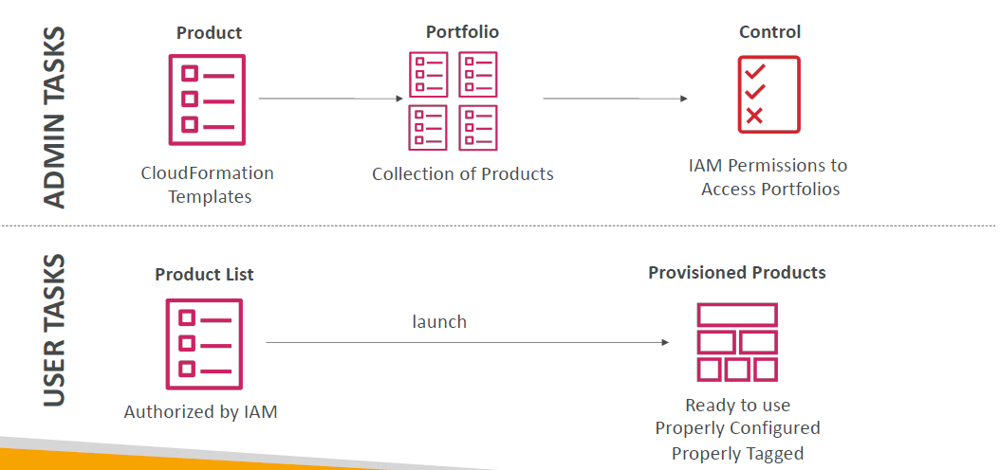

- So very simply, **as an admin** in AWS and Service Catalog, you're going to create products. And products are just CloudFormation templates with the proper parameters. And you can include them in a portfolio, and a portfolio is a collection of products. And then you define who has access to launching what products within my portfolio
- And then **as a user**, you log in to your portal on Service Catalog and you have a quick list of all the products that you can use because of your permissions. And then the users can launch these products and automatically they get provisioned by CloudFormation. But we know that they've been properly configured, properly tagged, and that they respect the way our organization is supposed to work. Say for example,that a user wants to have access to a quick RDS database but doesn't know how to create one properly. Then you could offer this as a service from within the Service Catalog

## Pricing Models in AWS

- AWS has 4 different pricing models
- **Pay as you go** where you pay for what you use. You remain agile, because you can start and stop and delete resources whenever you want, responsive, and you can scale to meet demands as demand happens
- There's also a model where you **save when you reserve**. So this is to minimize risk and to get a predictable budget and to comply with long-term requirements. For example, we can do instance reservations for EC2, DynamoDB Reserved Capacity, ElastiCache Reserved Nodes, RDS Reserved instance, and Redshift Reserved Nodes
- Also, you get to **pay less by using more**. You get volume-based discounts, for example, on Amazon S3
- And as **AWS grows their infrastructure**, they will have some cost savings, and they will pass them onto you so you **pay less**. AWS is very famous for doing cost reductions every month or every year, which is really good, because as their infrastructure grow, and more people use AWS, they have volume and scale, and therefore, they will pass on that economy of scale onto you to get discounts

## Free services & free tier in AWS

- IAM
- VPC
- Consolidated Billing
- Elastic Beanstalk - You do pay for the resources created
- CloudFormation - You do pay for the resources created
- Auto Scaling Groups - You do pay for the resources created
- Free Tier: https://aws.amazon.com/free/
  - EC2 t2.micro instance for a year
  - S3, EBS, ELB, AWS Data transfer for free up to a certain amounts.

## Compute Pricing

### EC2

- Only charged for what you use
- Number of instances
- Instance configuration:
  - Physical capacity
  - Region
  - OS and software
  - Instance type
  - Instance size
- ELB running time and amount of data processed
- Detailed monitoring

- **On-demand instances:**
  - Minimum of 60s
  - Pay per second (Linux/Windows) or per hour (other)
- **Reserved instances:**
  - Up to 75% discount compared to On-demand on hourly rate
  - 1- or 3-years commitment
  - All upfront, partial upfront, no upfront
- **Spot instances:**
  - Up to 90% discount compared to On-demand on hourly rate
  - Bid for unused capacity
- **Dedicated Host:**
  - On-demand
  - Reservation for 1 year or 3 years commitment
- **Savings plans** as an alternative to save on sustained usage

### Lambda & ECS

- **Lambda:**
  - Pay per call
  - Pay per duration
- **ECS:**
  - EC2 Launch Type Model: No additional fees, you pay for AWS resources stored and created in your application
- **Fargate:**
  - Fargate Launch Type Model: Pay for vCPU and memory resources allocated to your applications in your containers

## Storage Pricing

### S3

- **Storage class:** S3 Standard, S3 Infrequent Access, S3 One-Zone IA, S3 Intelligent Tiering, S3 Glacier and S3 Glacier Deep Archive
- Number and size of objects: Price can be tiered (based on volume)
- Number and type of requests
- Data transfer OUT of the S3 region
- S3 Transfer Acceleration
- Lifecycle transitions
- Similar service: EFS (pay per use, has infrequent access & lifecycle rules)

### EBS

- Volume type (based on performance)
- Storage volume in GB per month **provisioned**
- IOPS:
  - General Purpose SSD: Included
  - Provisioned IOPS SSD: provisioned amount in IOPS
  - Magnetic: Number of requests
- Snapshots:
  - Added data cost per GB per month
- Data transfer:
  - Outbound data transfer are tiered for volume discounts
  - Inbound is free

## Database Pricing - RDS

- Per hour billing
- Database characteristics:
  - Engine
  - Size
  - Memory class
- Purchase type:
  - On-demand
  - Reserved instances (1 or 3 years) with required up-front
- Backup Storage: There is no additional charge for backup storage up to 100% of your total database storage for a region.
- Additional storage (per GB per month)
- Number of input and output requests per month
- Deployment type (storage and I/O are variable):
  - Single AZ
  - Multiple AZs
- Data transfer:
  - Outbound data transfer are tiered for volume discounts
  - Inbound is free

## Content Delivery - CloudFront

  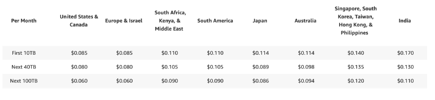

- Pricing is different across different geographic regions
- Aggregated for each edge location, then applied to your bill
- Data Transfer Out (volume discount)
- Number of HTTP/HTTPS requests

## Networking Costs in AWS per GB - Simplified

  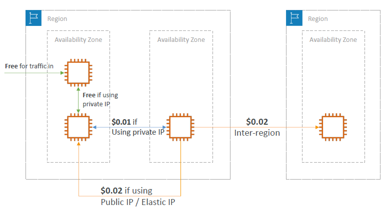

- Use Private IP instead of Public IP for good savings and better network performance
- Use same AZ for maximum savings (at the cost of high availability)
- Through internet it will be costly between two EC2 instance between two Availability Zones
- Recommended to use a private IP between two Availability Zones
- Inter region will be costlier

## Savings Plan

- Commit a certain $ amount per hour for 1 or 3 years
- Easiest way to setup long-term commitments on AWS
- **EC2 Savings Plan**
  - Up to 72% discount compared to On-Demand
  - **Commit to usage of individual instance families in a region (e.g. C5 or M5)**
  - Regardless of AZ, size (m5.xl to m5.4xl), OS (Linux/Windows) or tenancy
  - All upfront, partial upfront, no upfront
- **Compute Savings Plan**
  - Up to 66% discount compared to On-Demand
  - Regardless of **Family, Region**, size, OS, tenancy, **compute options**
  - Compute Options: EC2, Fargate, Lambda
- **Machine Learning Savings Plan:** SageMaker...
- Setup from the AWS Cost Explorer console
- Estimate pricing at <https://aws.amazon.com/savingsplans/pricing/>

## AWS Compute Optimizer

  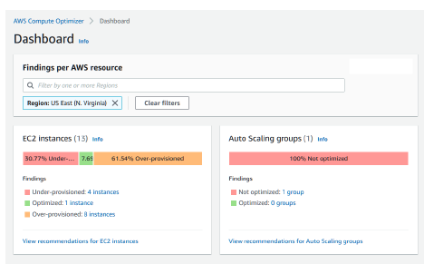

- **Reduce costs** and **improve performance by** recommending optimal AWS resources for your workloads
- Helps you choose optimal configurations and right - size your workloads (over/under provisioned)
- Uses Machine Learning to analyze your **resources' configurations** and their **utilization CloudWatch metrics**
- Supported resources
  - EC2 instances
  - EC2 Auto Scaling Groups
  - EBS volumes
  - Lambda functions
- Lower your costs by up to 25%
- Recommendations can be exported to S3

## Billing and Costing Tools

- **Estimating costs in the cloud:**
  - Pricing Calculator
- **Tracking costs in the cloud:**
  - Billing Dashboard
  - Cost Allocation Tags
  - Cost and Usage Reports
  - Cost Explorer
- **Monitoring against costs plans:**
  - Billing Alarms
  - Budgets

## AWS Pricing Calculator

  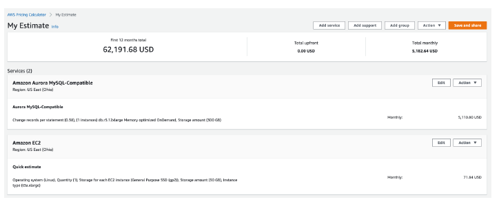

- Available at <https://calculator.aws/>
- Estimate the cost for your solution architecture
- select services -> ram -> os -> hours to get the estimated price at last.

## AWS Billing Dashboard

  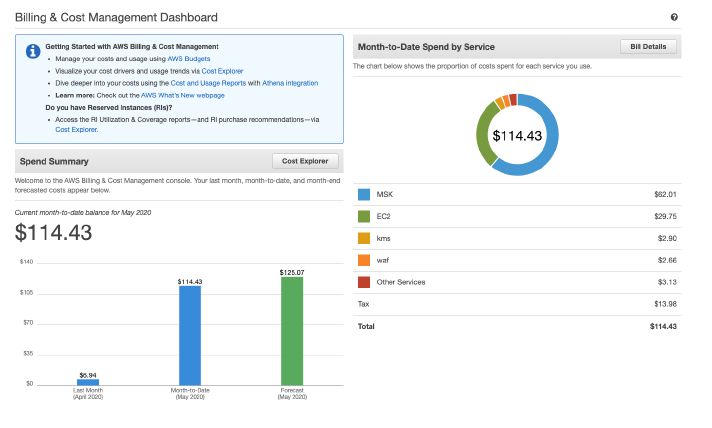
  
- High level tool to get overview of what is happening.

## AWS Free Tier Dashboard

  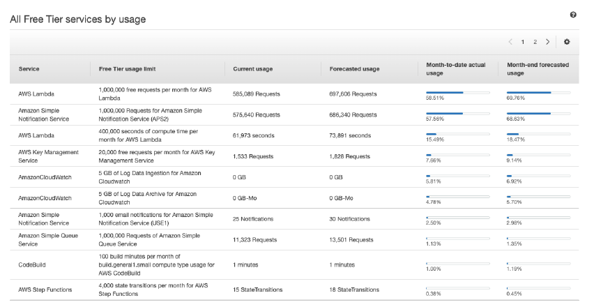

- month to month date and cost and forecast
- free tier limits can be seen aswell.

## Cost Allocation Tags

  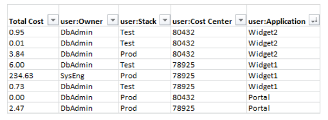

- Use **cost allocation tags** to track your AWS costs on a detailed level
- **AWS generated tags**
  - Automatically applied to the resource you create
  - Starts with Prefix **aws: (e.g. aws: createdBy)**
- **User-defined tags**
  - Defined by the user
  - Starts with Prefix user:

## Tagging and Resource Groups

- **Tags** are used for organizing resources:
  - EC2: instances, images, load balancers, security groups…
  - RDS, VPC resources, Route 53, IAM users, etc...
  - Resources created by CloudFormation are all tagged the same way
- Free naming, common tags are: Name, Environment, Team...
- Tags can be used to create **Resource Groups**
  - Create, maintain, and view a collection of resources that share common tags
  - Manage these tags using the Tag Editor

## Cost and Usage Reports

- Dive deeper into your AWS costs and usage
- The AWS Cost & Usage Report contains **the most comprehensive set of AWS cost and usage data available**, including additional metadata about AWS services, pricing, and reservations **(e.g., Amazon EC2 Reserved Instances (RIs)).**
- The AWS Cost & Usage Report lists AWS usage for each service category used by an account and its IAM users in hourly or daily line items, as well as any tags that you have activated for cost allocation purposes.
- Can be integrated with Athena, Redshift or QuickSight

  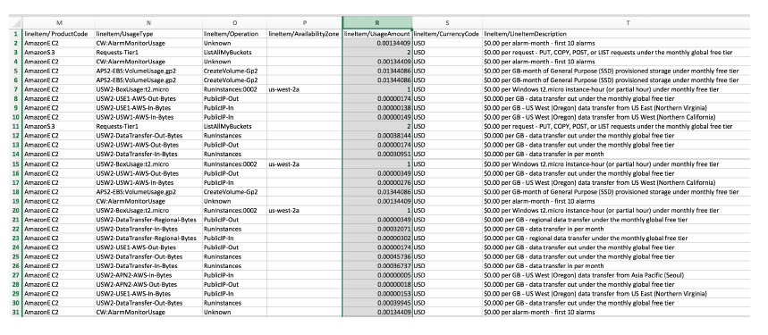

## Cost Explorer

- Visualize, understand, and manage your AWS costs and usage over time
- Create custom reports that analyze cost and usage data.
- Analyze your data at a high level: total costs and usage across all accounts
- Or Monthly, hourly, resource level granularity
- Choose an optimal **Savings Plan**(to lower prices on your bill)
- **Forecast usage up to 12 months based on previous usage** - exam question

  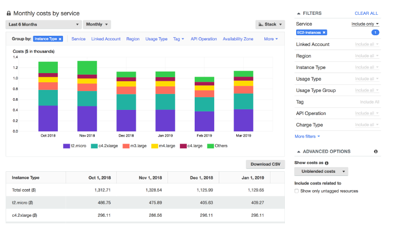

- Cost Explorer – Monthly Cost by AWS Service

  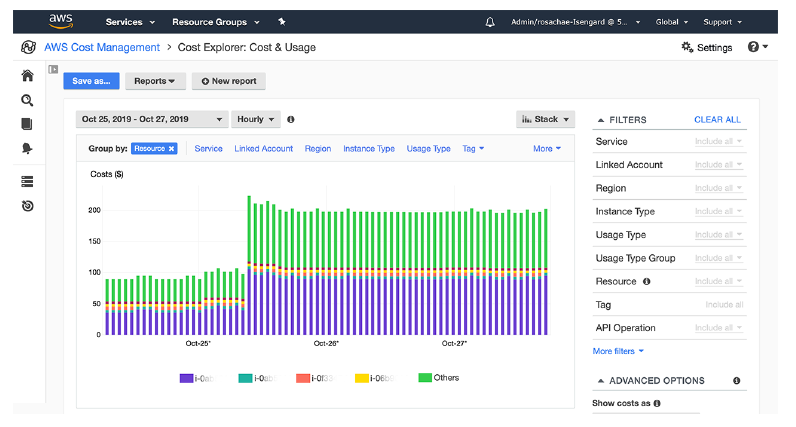

- Cost Explorer– Hourly & Resource Level

  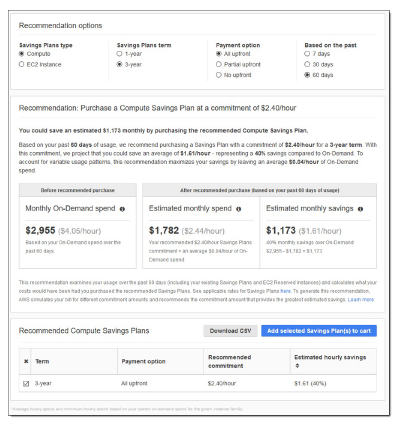

- Cost Explorer – Savings Plan Alternative to Reserved Instances

  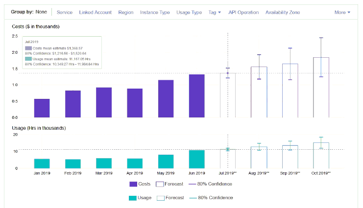

- Cost Explorer – Forecast Usage
- data export -> name -> columns to export -> decide on granularity and then export it to parquet to csv -> s3 bucket the report can go to

## Billing Alarms in CloudWatch

  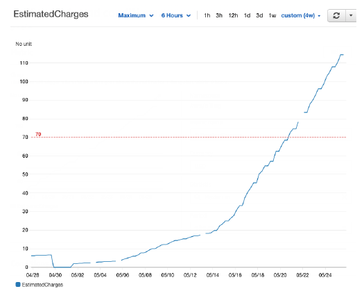

- **Billing data metric is stored in CloudWatch us-east1**
- Billing data are for overall **worldwide** AWS costs
- It's for actual cost, not for projected costs
- Intended a simple alarm (not as powerful as AWS Budgets)

## AWS Budgets

- Create budget and **send alarms when costs exceeds the budget**
- 4 types of budgets: Usage, Cost, Reservation, Savings Plan
- For Reserved Instances (RI)
  - Track utilization
  - Supports EC2, ElastiCache, RDS, Redshift
- Up to 5 SNS notifications per budget
- Can filter by: Service, Linked Account, Tag, Purchase Option, Instance Type, Region, Availability Zone, API Operation, etc...
- Same options as AWS Cost Explorer!
- 2 budgets are free, then $0.02/day/budget

## AWS Cost Anomaly Detection

  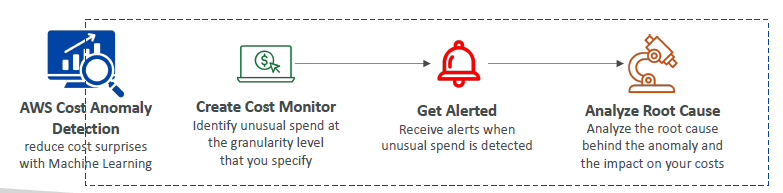

- **Continuously monitor your cost and usage using ML to detect unusual spends**
- It learns your unique, historic spend patterns to detect one-time cost spike
and/or continuous cost increases (you don't need to define thresholds)
- Monitor AWS services, member accounts, cost allocation tags, or cost categories
- Sends you the anomaly detection report with root-cause analysis
- Get notified with individual alerts or daily/weekly summary (using SNS)

## AWS Service Quotas

  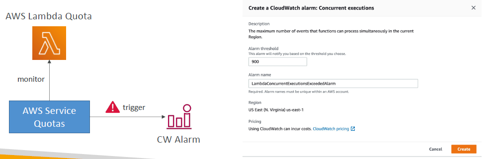

- Notify you when you're close to a service quota value threshold
- Create CloudWatch Alarms on the Service Quotas console
- Example: Lambda concurrent executions
- Request a quota increase from AWS Service Quotas or shutdown resources before limit is reached

## Trusted Advisor

  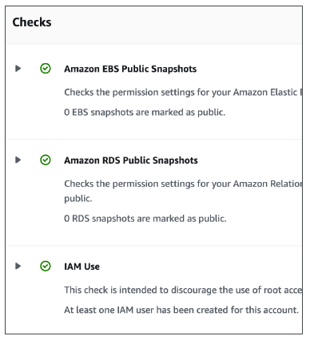

- No need to install anything – high level AWS account assessment
- Analyze your AWS accounts and provides recommendation on 5 categories
  - Cost optimization
  - Performance
  - Security
  - Fault tolerance
  - Service limits
  - Operational Excellence
- **Business & Enterprise Support plan**
  - Full Set of Checks
  - Programmatic Access using **AWS Support API**

### Trusted Advisor - Support Plans Pricing

- Basic Support: free

  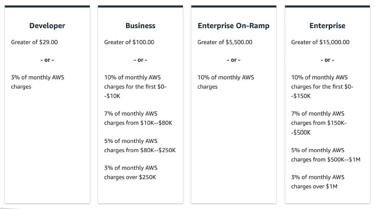

## AWS Basic Support Plan

- **Customer Service & Communities** - 24x7 access to customer service, documentation, whitepapers, and support forums.
- **AWS Trusted Advisor** - Access to the 7 core Trusted Advisor checks and guidance to provision your resources following best practices to increase performance and improve security.
- **AWS Personal Health Dashboard** - A personalized view of the health of AWS services, and alerts when your resources are impacted.

## AWS Developer Support Plan

- All Basic Support Plan +
- **Business hours email access** to Cloud Support Associates
- Unlimited cases / 1 primary contact
- **Case severity / response times:**
  - General guidance: < 24 business hours
  - System impaired: < 12 business hours

## AWS Business Support Plan (24/7)

- Intended to be used if you have **production workloads**
- **Trusted Advisor** – Full set of checks + API access
- **24x7 phone, email, and chat access** to Cloud Support Engineers
- Unlimited cases / unlimited contacts
- Access to Infrastructure Event Management for **additional fee**
- **Case severity / response times:**
  - General guidance: < 24 business hours
  - System impaired: < 12 business hours
  - **Production system impaired: < 4 hours**
  - **Production system down: < 1 hour**

## AWS Enterprise On-Ramp Support Plan (24/7)

- Intended to be used if you have **production or business critical workloads**
- All of Business Support Plan +
- Access to a pool of **Technical Account Managers (TAM)**
- **Concierge Support Team** (for billing and account best practices)
- **Infrastructure Event Management, Well-Architected & Operations Reviews**
- **Case severity / response times:**
  - Production system impaired: < 4 hours
  - Production system down: < 1 hour
  - **Business-critical system down: < 30 minutes**

## AWS Enterprise Support Plan (24/7)

- Intended to be used if you have **mission critical workloads**
- All of Business Support Plan +
- Access to a designated **Technical Account Manager (TAM)**
- **Concierge Support Team** (for billing and account best practices)
- **Infrastructure Event Management, Well-Architected & Operations Reviews**
- Access to **AWS Incident Detection and Response** (for an additional fee)
- **Case severity / response times:**
  - Production system impaired: < 4 hours
  - Production system down: < 1 hour
  - **Business-critical system down: < 15 minutes**

## Account Best Practices - Summary

- Operate multiple accounts using **Organizations**
- Use **SCP** (service control policies) to restrict account power
- Easily setup multiple accounts with best-practices with **AWS Control Tower**
- **Use Tags & Cost Allocation Tags** for easy management & billing
- **IAM guidelines:** MFA, least-privilege, password policy, password rotation
- **Config** to record all resources configurations & compliance over time
- **CloudFormation** to deploy stacks across accounts and regions
- **Trusted Advisor** to get insights, Support Plan adapted to your needs
- Send Service Logs and Access Logs to **S3 or CloudWatch Logs**
- **CloudTrail** to record API calls made within your account
- **If your Account is compromised:** change the root password, delete and rotate all passwords / keys, contact the AWS support
- Allow users to create pre-defined stacks defined by admins using **AWS Service Catalog**

## Billing and Costing Tools - Summary

- **Compute Optimizer**: recommends resources' configurations to reduce cost
- **Pricing Calculator**: cost of services on AWS
- **Billing Dashboard**: high level overview + free tier dashboard
- **Cost Allocation Tags**: tag resources to create detailed reports
- **Cost and Usage Reports**: most comprehensive billing dataset
- **Cost Explorer**: View current usage (detailed) and forecast usage
- **Billing Alarms**: in us-east-1 – track overall and per-service billing
- **Budgets**: more advanced – track usage, costs, RI, and get alerts
- **Savings Plans**: easy way to save based on long-term usage of AWS
- **Cost Anomaly Detection**: detect unusual spends using Machine Learning
- **Service Quotas**: notify you when you're close to service quota threshold