# Other AWS Services

- [Other AWS Services](#other-aws-services)
  - [Amazon WorkSpaces](#amazon-workspaces)
  - [Amazon WorkSpaces - Multiple Regions](#amazon-workspaces---multiple-regions)
  - [Amazon AppStream 2.0](#amazon-appstream-20)
  - [Amazon AppStream 2.0 vs WorkSpaces](#amazon-appstream-20-vs-workspaces)
  - [AWS IoT Core](#aws-iot-core)
  - [Amazon Elastic Transcoder](#amazon-elastic-transcoder)
  - [AWS AppSync](#aws-appsync)
  - [AWS Amplify](#aws-amplify)
  - [AWS Infrastructure Composer](#aws-infrastructure-composer)
  - [AWS Device Farm](#aws-device-farm)
  - [AWS Backup](#aws-backup)
  - [Disaster Recovery Strategies](#disaster-recovery-strategies)
  - [Typical DR Setup for Cloud Deployments](#typical-dr-setup-for-cloud-deployments)
  - [AWS Elastic Disaster Recovery (DRS)](#aws-elastic-disaster-recovery-drs)
  - [AWS DataSync](#aws-datasync)
  - [Cloud Migration Strategies: The 7Rs](#cloud-migration-strategies-the-7rs)
  - [AWS Application Discovery Service](#aws-application-discovery-service)
  - [AWS Application Migration Service (MGN)](#aws-application-migration-service-mgn)
  - [AWS Migration Evaluator](#aws-migration-evaluator)
  - [AWS Migration Hub](#aws-migration-hub)
  - [AWS Fault Injection Simulator (FIS)](#aws-fault-injection-simulator-fis)
  - [AWS Step Functions](#aws-step-functions)
  - [AWS Ground Station](#aws-ground-station)
  - [Amazon Pinpoint](#amazon-pinpoint)

## Amazon WorkSpaces

  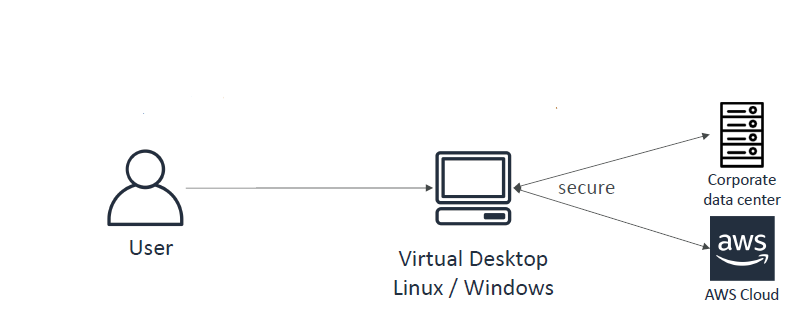

- Managed Desktop as a Service (DaaS) solution to **provision Windows or Linux desktops**
- **Great to eliminate management of on-premise VDI (Virtual Desktop Infrastructure)**
- Fast and quickly scalable to thousands of users
- Secured data – integrates with KMS
- Pay-as-you-go service with monthly or hourly rates

## Amazon WorkSpaces - Multiple Regions

  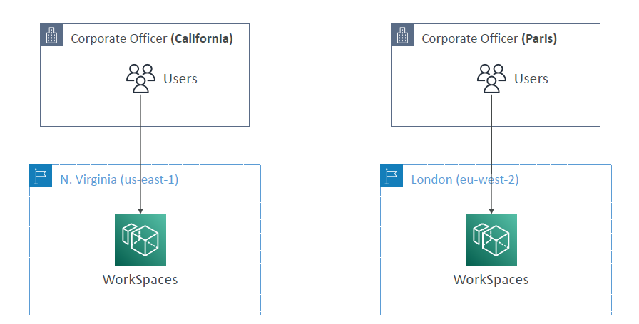

## Amazon AppStream 2.0

  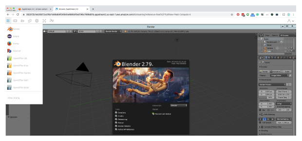

- Desktop Application Streaming Service
- Deliver applications to any computer without provisioning infrastructure
- **Applications are delivered from within a web browser**

## Amazon AppStream 2.0 vs WorkSpaces

- **Workspaces**
  - Fully managed VDI and desktop available
  - The users connect to the VDI and open native or WAM applications
  - Workspaces are on-demand or always on
- **AppStream 2.0**
  - Stream a desktop application to web browsers (no need to connect to a VDI)
  - Works with any device (that has a web browser)
  - Allow to configure an instance type per application type (CPU, RAM, GPU)

## AWS IoT Core

  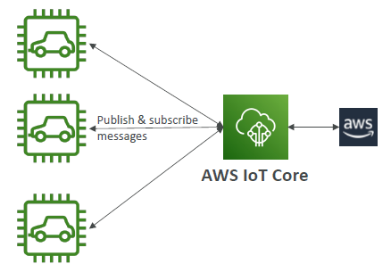

- IoT stands for "Internet of Things" – the network of internet-connected devices that are able to collect and transfer data
- AWS IoT Core allows you to **easily connect IoT devices to the AWS Cloud**
- **Serverless, secure & scalable** to billions of devices and trillions of messages
- Your applications can communicate with your devices even when they aren’t connected
- Integrates with a lot of AWS services (Lambda, S3, SageMaker, etc.)
- Build IoT applications that gather, process, analyze, and act on data

## Amazon Elastic Transcoder

  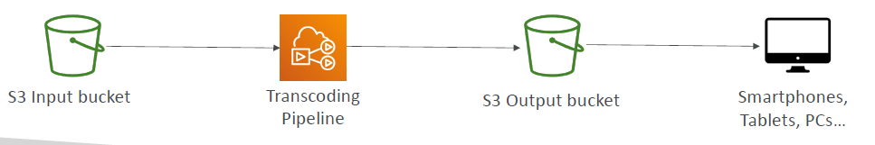

- Elastic Transcoder is used to **convert media files stored in S3 into formats required by consumer playback devices (phones, etc.)**
- Benefits:
  - Easy to use
  - Highly scalable – can handle large volumes and sizes of media files and large file sizes
  - Cost-effective – duration-based pricing model
  - Fully managed & secure, pay for what you use

## AWS AppSync

- Store and sync data across mobile and web apps in real-time
- **Makes use of GraphQL (mobile technology from Facebook)**
- Automatically generates client code
- Integrates with DynamoDB / Lambda
- Real-time subscriptions
- Offline data synchronization (replaces Cognito Sync)
- Fine Grained Security
- AWS Amplify can leverage AWS AppSync in the background!

## AWS Amplify

  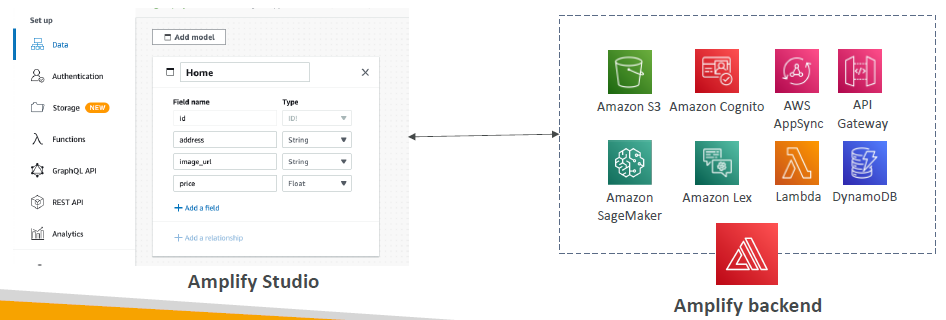

- **A set of tools and services that helps you develop and deploy scalable full stack web and mobile applications**
- Authentication, Storage, API (REST, GraphQL), CI/CD, PubSub, Analytics, AI/ML Predictions, Monitoring, Source Code from AWS, GitHub, etc...

## AWS Infrastructure Composer

  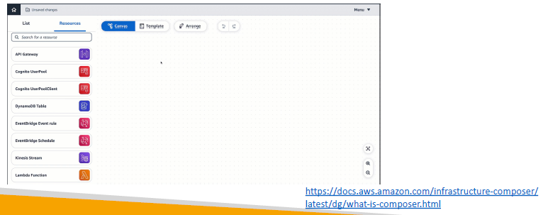

- Visually design and build serverless applications quickly on AWS
- Deploy AWS infrastructure code without needing to be an expert in AWS
- Configure how your resources interact with each other
- Generates Infrastructure as Code (IaC) using CloudFormation
- Ability to import existing CloudFormation / SAM templates to visualize them
- More info: https://docs.aws.amazon.com/infrastructure-composer/latest/dg/what-is-composer.html

## AWS Device Farm

  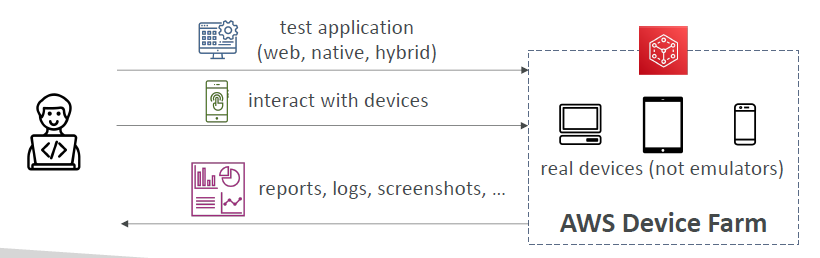

- Fully-managed service that tests web and mobile apps against desktop browsers, real mobile devices, and tablets
- Run tests concurrently on multiple devices to speed up execution
- Ability to configure device settings (GPS, language, Wi-Fi, Bluetooth, ...)

## AWS Backup

- Fully-managed service to centrally manage and automate backups across AWS services
- On-demand and scheduled backups
- Supports PITR (Point-in-time Recovery)
- Retention Periods, Lifecycle Management, Backup Policies, etc.
- Cross-Region Backup
- Cross-Account Backup (using AWS Organizations)

  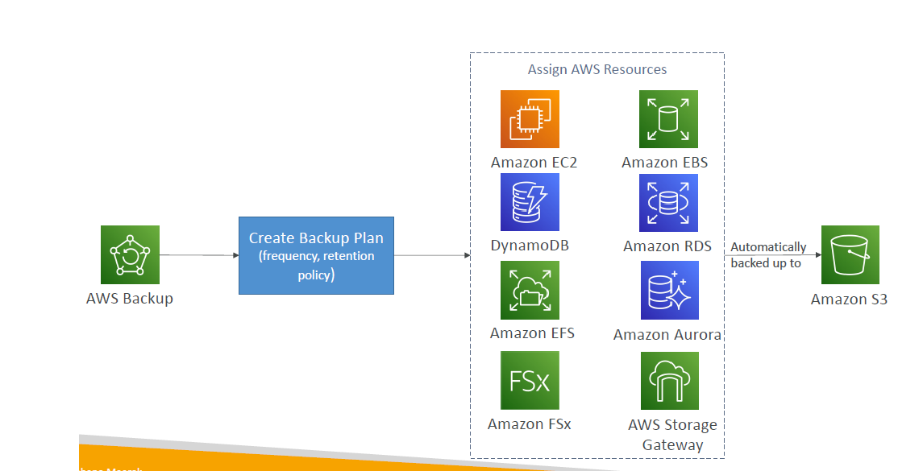

## Disaster Recovery Strategies

  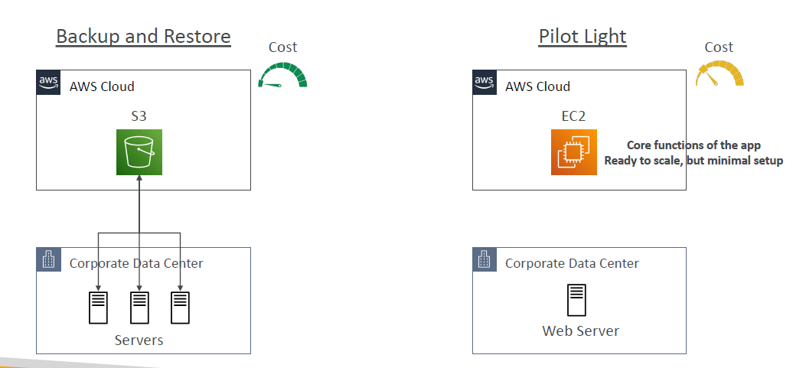

  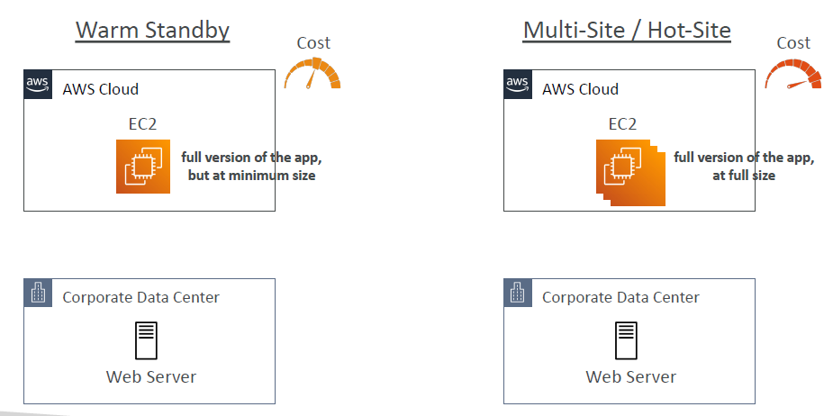

## Typical DR Setup for Cloud Deployments

  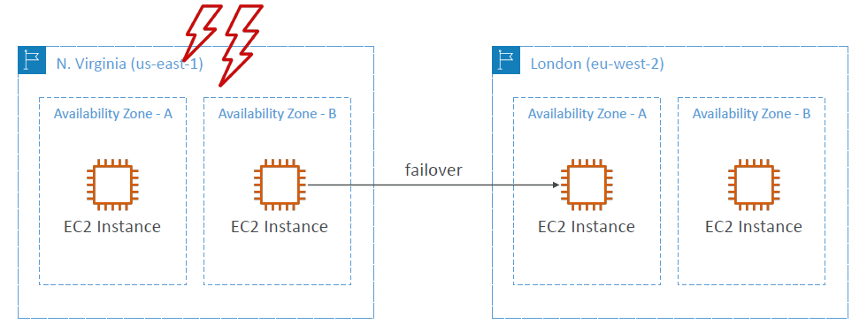

## AWS Elastic Disaster Recovery (DRS)

  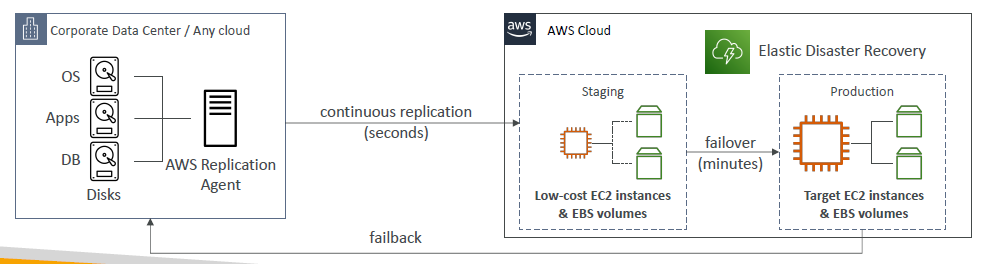

- Used to be named **"CloudEndure Disaster Recovery"**
- Quickly and easily **recover** your physical, virtual, and cloud-based servers into AWS
- Example: protect your most critical databases (including Oracle, MySQL, and SQL Server), enterprise apps (SAP), protect your data from ransomware attacks, …
- Continuous block-level replication for your servers

## AWS DataSync

- Move large amount of data from on-premises to AWS
- Can synchronize to: Amazon S3 (any storage classes – including Glacier), Amazon EFS, Amazon FSx for Windows
- Replication tasks can be scheduled hourly, daily, weekly
- The replication tasks are **incremental** after the first full load

  

## Cloud Migration Strategies: The 7Rs

  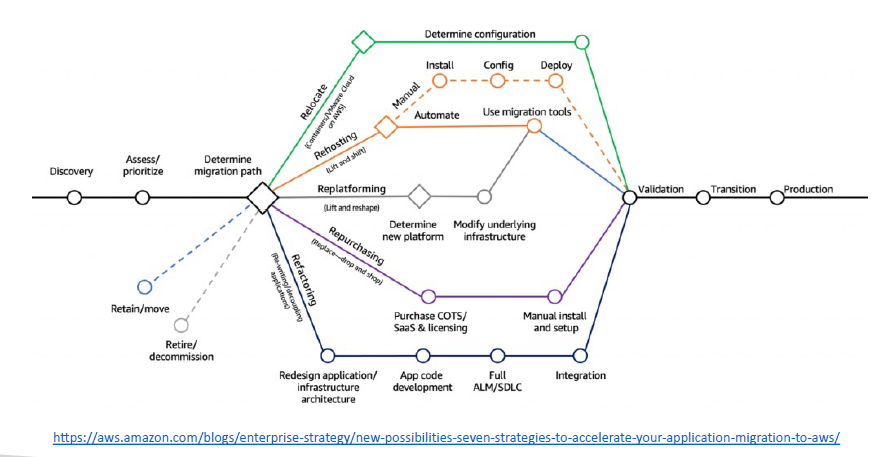

- **Retire:**
  - Turn off things you don’t need (maybe as a result of Re-architecting)
  - Helps with reducing the surface areas for attacks (more security)
  - Save cost, maybe up to 10% to 20%
  - Focus your attention on resources that must be maintained
- **Retain:**
  - Do nothing for now (it’s still a decision to make in a Cloud Migration)
  - Security, data compliance, performance, unresolved dependencies
  - No business value to migrate, mainframe or mid-range and non-x86 Unix apps
- **Relocate:**
  - Move apps from on-premises to its Cloud version
  - Move EC2 instances to a different VPC, AWS account or AWS Region
  - **Example:** transfer servers from VMware Software-defined Data Center (SSDC) to VMware Cloud on AWS
- **Rehost "lift and shift":**
  - Simple migrations by re-hosting on AWS (applications, databases, data…)
  - Migrate machines (physical, virtual, another Cloud) to AWS Cloud
  - No cloud optimizations being done, applications is migrated as is
  - Could save as much as 30% on cost
  - **Example:** Migrate using AWS Application Migration Service
- **Replatform "lift and reshape":**
  - **Example:** migrate your database to RDS
  - **Example:** migrate your application to Elastic Beanstalk
  - Not changing the core architecture, but leverage some Cloud optimizations
  - Save time and money by moving to a fully managed service or Serverless
- **Repurchase "drop and shop":**
  - Moving to a different product while moving to the Cloud
  - Often you move to a SaaS platform
  - Expensive in the short term, but quick to deploy
  - **Example:** CRM to Salesforce.com, HR to Workday, CMS to Drupal
- **Refactor / Re-architect:**
  - Reimagining how the application is architected using Cloud Native features
  - Driven by the need of the business to add features and improve scalability, performance, security, and agility
  - Move from a monolithic application to micro-services
  - **Example:** move an application to Serverless architectures, use AWS S3

## AWS Application Discovery Service

- Plan migration projects by gathering information about on-premises data centers
- Server utilization data and dependency mapping are important for migrations
- **Agentless Discovery (AWS Agentless Discovery Connector):**
  - VM inventory, configuration, and performance history such as CPU, memory, and disk usage
- **Agent-based Discovery (AWS Application Discovery Agent):**
  - System configuration, system performance, running processes, and details of the network connections between systems
- Resulting data can be viewed within AWS Migration Hub

## AWS Application Migration Service (MGN)

  

- ***The "AWS evolution" of CloudEndure Migration, replacing AWS Server Migration Service (SMS)***
- Lift-and-shift (rehost) solution to simplify **migrating** applications to AWS
- Converts physical, virtual, and cloud-based servers to run natively on AWS
- Supports a wide range of platforms, Operating Systems, and databases
- Minimal downtime and reduced costs

## AWS Migration Evaluator

  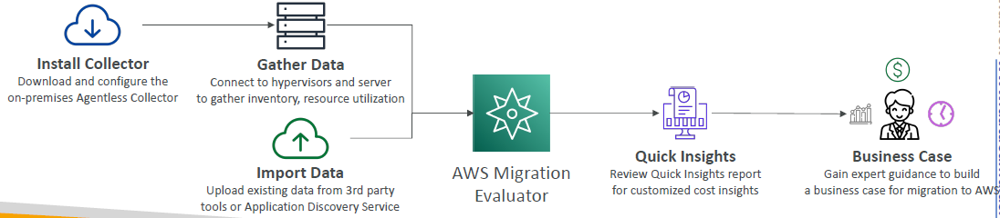

- Helps you build a data-driven business case for migration to AWS
- Provides a clear baseline of what your organization is running today
- Install Agentless Collector to conduct broad-based discovery
- Take a snapshot of on-premises foot-print, server dependepncies, ...
- Analyze current state, define target state, then develop migration plan

## AWS Migration Hub

  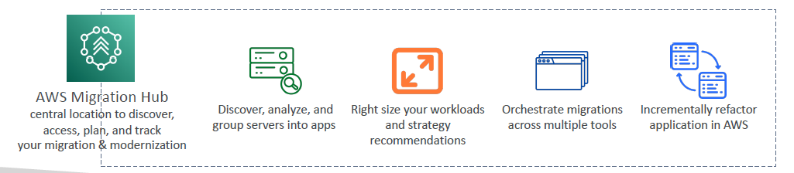

- Central location to collect servers and applications inventory data for the assessment, planning, and tracking of migrations to AWS
- Helps accelerate your migration to AWS, automate lift-and-shift
- **AWS Migration Hub Orchestrator** – provides pre-built templates to save time and effort migrating enterprise apps (e.g., SAP, Microsoft SQL Server...)
- Supports migrations status updates from **Application Migration Service (MGN)** and **Database Migration Service (DMS)**

## AWS Fault Injection Simulator (FIS)

  

- A fully managed service for running fault injection experiments on AWS workloads
- Based on **Chaos Engineering** – stressing an application by creating disruptive events (e.g., sudden increase in CPU or memory), observing how the system responds, and implementing improvements
- Helps you uncover hidden bugs and performance bottlenecks
- Supports the following AWS services: EC2, ECS, EKS, RDS...
- Use pre-built templates that generate the desired disruptions

## AWS Step Functions

  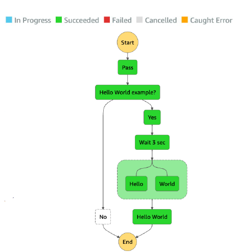

- Build serverless visual workflows to orchestrate Lambda functions
- **Features:** sequence, parallel, conditions, timeouts, error handling, ...
- Can integrate with EC2, ECS, On-premises servers, API Gateway, SQS queues, etc...
- Possibility of implementing human approval feature
- **Use cases:** order fulfillment, data processing, web applications, any workflow

## AWS Ground Station

  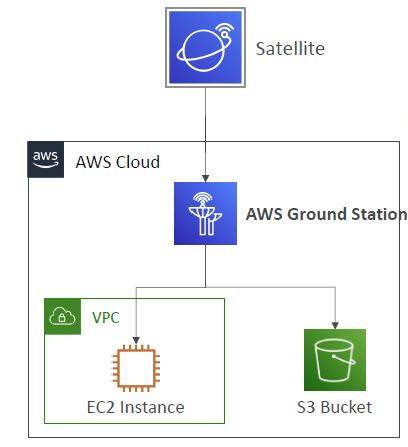

- Fully managed service that lets you control satellite communications, process data, and scale your satellite operations
- Provides a global network of satellite ground stations near AWS regions
- Allows you to download satellite data to your AWS VPC within seconds
- Send satellite data to S3 or EC2 instance
- Use cases: weather forecasting, surface imaging, communications, video broadcasts

## Amazon Pinpoint

  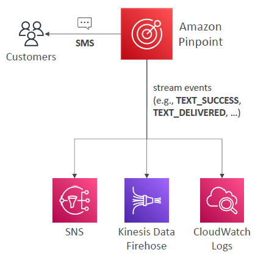

- Scalable **2-way (outbound/inbound)** marketing communications service
- Supports email, SMS, push, voice, and in-app messaging
- Ability to segment and personalize messages with the right content to customers
- Possibility to receive replies
- Scale to billions of messages per day
- Use cases: run campaigns by sending marketing, bulk, transactional SMS messages
- **Versus Amazon SNS or Amazon SES**
  - In SNS & SES you managed each message's audience, content, and delivery schedule
  - In Amazon Pinpoint, you create message templates, delivery schedules, highly-targeted segments, and full campaigns