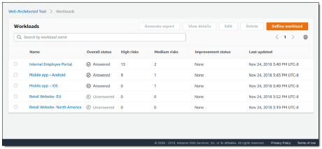
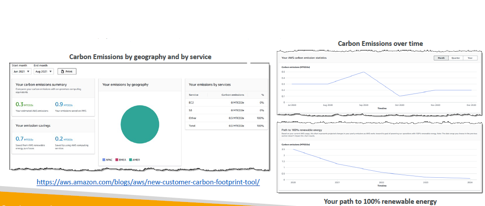
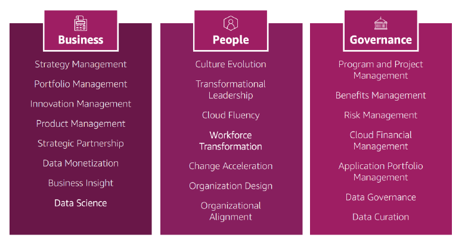
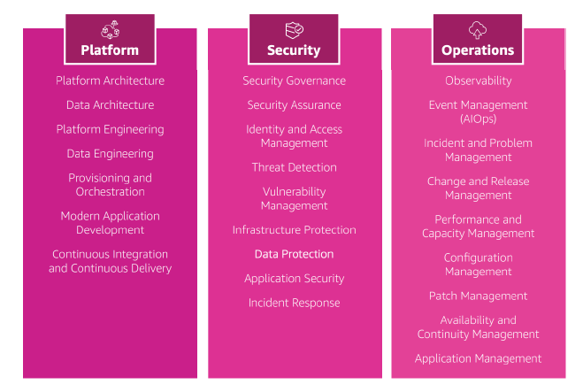
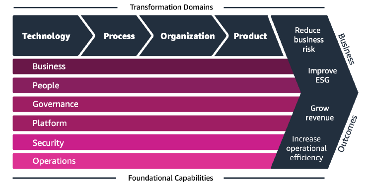
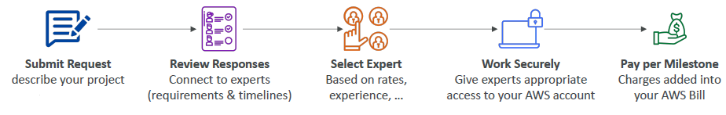
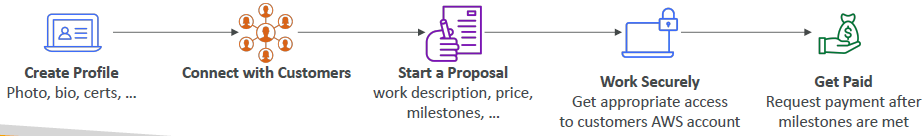
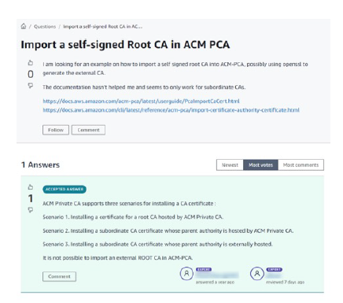
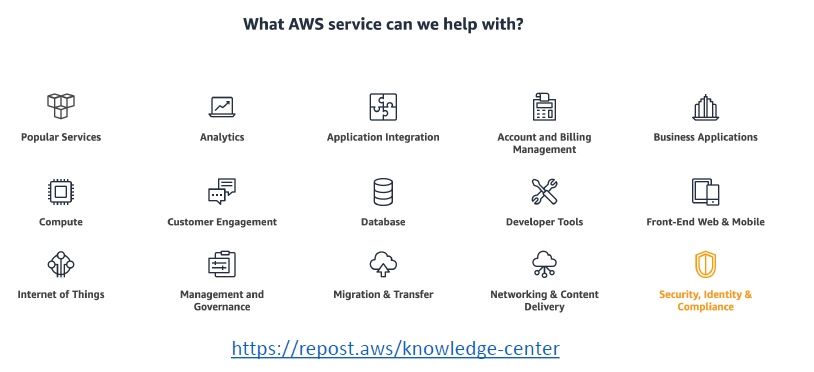
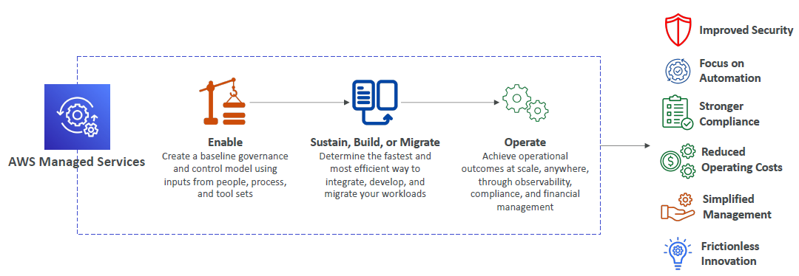

# AWS Architecting & Ecosystem

- [AWS Architecting \& Ecosystem](#aws-architecting--ecosystem)
  - [Well Architected Framework General Guiding Principles](#well-architected-framework-general-guiding-principles)
  - [AWS Cloud Best Practices - Design Principles](#aws-cloud-best-practices---design-principles)
  - [Well Architected Framework 6 Pillars](#well-architected-framework-6-pillars)
    - [1. Operational Excellence](#1-operational-excellence)
    - [2. Security](#2-security)
    - [3. Reliability](#3-reliability)
    - [4. Performance Efficiency](#4-performance-efficiency)
    - [5. Cost Optimization](#5-cost-optimization)
    - [6. Sustainability](#6-sustainability)
  - [AWS Well-Architected Tool](#aws-well-architected-tool)
  - [AWS Customer Carbon Footprint Tool](#aws-customer-carbon-footprint-tool)
  - [AWS Cloud Adoption Framework (AWS CAF)](#aws-cloud-adoption-framework-aws-caf)
    - [CAF Perspectives and Foundational Capabilities](#caf-perspectives-and-foundational-capabilities)
      - [Business Capabilities](#business-capabilities)
      - [Technical Capabilities](#technical-capabilities)
    - [Cloud Transformation Value Chain](#cloud-transformation-value-chain)
    - [AWS CAF – Transformation Domains](#aws-caf--transformation-domains)
    - [AWS CAF – Transformation Phases](#aws-caf--transformation-phases)
  - [AWS Right Sizing](#aws-right-sizing)
  - [AWS Ecosystem - Free Resources](#aws-ecosystem---free-resources)
    - [AWS Ecosystem - AWS Support](#aws-ecosystem---aws-support)
  - [AWS Marketplace](#aws-marketplace)
  - [AWS Training](#aws-training)
  - [AWS Professional Services \& Partner Network](#aws-professional-services--partner-network)
  - [AWS IQ](#aws-iq)
  - [AWS re:Post](#aws-repost)
    - [AWS re:Post - Knowledge Center](#aws-repost---knowledge-center)
  - [AWS Managed Services (AMS)](#aws-managed-services-ams)

## Well Architected Framework General Guiding Principles

- In the cloud when you want a good architecture, you need to **stop guessing your capacity needs** and instead use auto scaling and scale based on what the actual demand on your system is going to be 
- You should also test your systems at production scale. In the cloud you can create as many resources as you want very quickly and as such there is no reason why, for example, for one hour you could not test a system at production scale. This allows you in the future to make sure your system is ready when you actually publish it to your customers
- It is also important to automate to facilitate architectural experimentation easier. For this, CloudFormation is very important because you get Infrastructure as Code (IaC) then you can easily create an architecture on different accounts and different regions. Also, using Platform As A Service Beanstalk could be very helpful to experiment quickly
- You should also allow to make your architectures evolutionary
  - Means you need to design based on changing requirements.
- Drive architectures using data. It is good to guess it is good to look at what the actual usage is. What are the patterns, what are the queries, and then drive your architecture and use the right services based on what you actually need based on this data
- Also improve through game days by simulating applications for flash sale days which will stress your system which allows you know whether your system is doing well. For example, Netflix has something called "Chaos Monkey" a program that is in their EC2 environment goes ahead and terminates EC2 instances at random in production. Thanks to Chaos Monkey they will see if they are ready for failures, ready for big spikes, ready for errors. 

## AWS Cloud Best Practices - Design Principles

- **Scalability**: Scale both vertically and horizontally
- **Disposable Resources**: Servers should be disposable and easily configured. If you put too much configuration onto a server and somehow that server loses its resource, and you need three days to reconfigure that server back, then you haven't done things properly
- **Automation**: Guided by principles like serverless, infrastructure as a service, auto-scaling and so on
- **Loose Coupling**: 
  - Break monolithic applications into smaller
  - Loosely coupled components 
  - A change or a failure in one component should not cascade to other components
- **Services, Not Servers**: 
  - Don't use just EC2
  - Use managed services, databases, and serverless options, etc..

## Well Architected Framework 6 Pillars

- This is where the Well Architected Framework made up of 6 pillars comes in:
  - Operational Excellence
  - Security
  - Reliability
  - Performance Efficiency
  - Cost Optimization
  - Sustainability
- The idea is that acting with these 6 pillars you are having good architecture on AWS
- They are not something you balance and compromise between them or trade offs, they are actually a synergy. For example, when you prove your operational excellence you are probably also improving your cost optimization

### 1. Operational Excellence

- This is the ability to run and monitor systems for business value and continuously improve supporting processes and procedures.
- **Design Principles**:
  - **To perform operations as code** - Infrastructure as code
  - **Make frequent, small, reversible changes** - So that in case of any failure, you can reverse it. If you start making huge changes every 3 months, things are not going to go well
  - **Refine operations procedures frequently** - ensure that all your team members are familiar with these new operations procedures
  - **Anticipate failure**
  - **Learn from all operational failures**
  - **Use managed services** - to reduce operational burden
  - **Implement observability for actionable insights** - This includes performance, reliability, and cost

### 2. Security

- It includes the ability to protect information, systems, and assets while delivering business value through risk assessments and mitigation strategies. Once you have security in place, you are really minimizing a risk over time and you save cost from disasters and you really don't want to have a risk, or a security issue in your company
- **Design Principles**:
  - **Implement a strong identity foundation** - You may want to centralize how you manage your accounts, you may want to rely on priniciple of least privilege and IAM is one the services to help you do that
  - **We want to enable traceability** - that means we need to look into all the logs, all the metrics and store them and automatically respond and take action every time something loks really weird
  - **Apply security at all layers** - like edge network, VPC, subnet, load balancer, every instance you ever have, OS, application
  - **Automate security best practices** - it is mostly done well, when it is automated
  - **Protect data in transit and at rest** - Means always enable encryption, always do SSL, always use tokenization, and do access control to keep people away from data. Why is someone requesting data? Isn't that risk when you allow someone to access data, do they really need it or is there a way to automate the need for that direct access and that manual processing of data
  - **Prepare for security events** - Security event must happen in every company someday. Then you run response simulations, use tools to automate the speed of detection, investigation and recovery

### 3. Reliability

- It is the ability to recover from infrastructure or service disruptions, dynamically acquire computing resources to meet demand, and mitigate disruptions such as misconfigurations or transient network issues
- It is about making sure your application runs no matter what
- **Design Principles**:
  - **Test recovery procedures** - Use automation to simulate different failures or to recreate scenarios that led to failures before
  - **Automatically recover from failure** - You need to anticipate and remediate failures before they occur
  - **Scale horizontally to increase aggregate system availability** - Distribute requests across multiple, smaller resources to ensure that they don't share a common point of failure
  - **Stop guessing capacity** - Maintain the optimal level to satisfy demand without over or under provisioning - Use Auto Scaling to make sure you have the right capacity at any time
  - **Manage change in automation** - Use automation to make changes to infrastructure. This is to make sure that your application will be reliable or you can rollback or whatever

### 4. Performance Efficiency

- It includes the ability to use computing resources efficiently to meet system requirements, and to maintain that efficiency as demand changes and technologies evolve
- It is all about adapting and providing the best performance
- **Design Principles**:
  - **Democratize advanced technologies** - To use advance technologies and as the services become available they might be helpful for your product developments
  - **Go global in minutes** - If you need to deploy in multiple regions, it should not last days, it should last minutes may be using CloudFormation
  - **Use serverless architectures** - That's the golden state. That means you do not manage any servers, and everything scales for you.
  - **Experiment more often** - May be you have something working really well today, but you think it won't scale to 10 times the load, you experiment. May be try serverless architectures and see if that works for you.
  - **Mechanical Sympathy** - Be aware of all AWS services

### 5. Cost Optimization

- Includes the ability to run systems to deliver business value at the lowest price point
- **Design Principles**:
  - **Adopt a consumption model** - Pay for only what you use. For example, AWS Lambda is one of the services, you do not pay for it, where as RDS, if you do not use your database, you still pay for it because you have provisioned your database.
  - **Measure overall efficiency** - Use CloudWatch
  - **Stop spending on data center operations** - AWS does the infrastructure for you and they just allow you to focus on your applications, your systems
  - **Analyze and attribute expenditure** - Meaning when you do not use tags on your AWS resources, you are goingg to have a lot of trouble figuring out which application is costing yoou a lot of money. Using tags ensures that you are able track the cost of each application and optimize them over time and get a Return On Investment (ROI) on how much money it generates for your business
  - **Use managed and application level services to reduce cost of ownership** - Because managed services leverage the cloud and operate at cloud scale and they can offer such a lower cost per transaction or service, and that is really something that you have to remember about the cloud

### 6. Sustainability

- The sustainability pillar focuses on minimizing the environmental impacts of running cloud workloads.
- **Design Principles**:
  - **Understand your impact** - Establish performance indicators, and evalute improvements
  - **Establish sustainability goals for each workload** - Set long-term goals for each workload, model Return On Investment (ROI)
  - **Maximize utilization of your resources** - Because you want to be energy efficient and obviously be environmental conscious
  - **Anticipate and adopt new, more efficient hardware and software offerings** - Because AWS does some optimizations to their infrastructure and if you use their newer stuff, then you are being more efficient
  - **Use managed services** - Because you share the infrastructure with many people and therefore you are in a better space for sustainability. One of the best practices is moving infrequent accessed data to cold storage and adjusting compute capacity.
  - **Reduce downstream impact of your cloud workloads** - Reduce the amount of energy or resources required to use your services and reduce the need for your customers to constantly upgrade their devices

## AWS Well-Architected Tool

- The idea is that you want to review your architectures against the 6 pillars and adopt architectural best practices

  

- **How it works**:
  - You select your workload and answer questions. Questions are specifically called as lens that provide a set questions for you to consider for all of your cloud architecture. You can also define custom lens if you wanted to
  - Then you review answers against the 6 pillars 
  - Then you obtain advice via: videos, documentation, reports, and dashboards
- Let's have a look: https://console.aws.amazon.com/wellarchitected

## AWS Customer Carbon Footprint Tool

  

- A tool used to track, measure, review, and forecast the Carbon emissions generated from your AWS usage
- Helps you meet your own sustainability goals
- This tool is going to give you access to your carbon emissions, your savings, and understanding which services is emitting a lot of carbon, as well as tracking your emissions over time and seeing a path to 100% renewable energy used for your AWS accounts

## AWS Cloud Adoption Framework (AWS CAF)

- Basically, AWS CAF is a white paper and not a service, but the cloud adoption framework helps you build and then execute a comprehensive plan to do your digital transformation through innovative use of AWS. 
- In short, AWS CAF helps to leverage a cloud to be transformed
- It is created by AWS Professionals by taking advantage of AWS Best Practices and lessons learned from 1000s of customers
- AWS CAF identifies **two** components:
  - Organizational capabilities that underpins successful cloud transformations
  - These capabilities are regrouped into **six perspectives**:
    - **Business**
    - **People**
    - **Governance**
    - **Platform**
    - **Security**
    - **Operations**
  - We can divide them again into **two** categories:
    - Business Capabilities
    - Technical Capabilities

### CAF Perspectives and Foundational Capabilities
#### Business Capabilities

- **Business Perspective** helps ensure that your cloud investments accelerate your digital transformation ambitions and business outcomes
- **People Perspective** serves **as a bridge between technology and business**, accelerating the cloud journey to help organizations more rapidly evolve to a culture of continuous growth, learning, and where change becomes business-as-normal, and through the people you have a focus on culture, organizational structure, leadership, and workforce
- **Governance Perspective** helps you orchestrate your cloud initiatives while maximizing organizational benefits and minimizing transformation-related risks

  

- Within each of these perspectives we have the capabilities
- Under business, we have capabilities that are related to business 
- Under people, we have all the capabilities that are related to people
- Under governance, we have all the capabilities related to governance
- No need to remember this diagram for the exam

#### Technical Capabilities

- **Platform Perspective** helps you build an enterprise-grade, scalable, hybrid cloud platform; modernize existing workloads; and implement new cloud-native solutions.
- **Security Perspective** helps you achieve the confidentiality, integrity, and availability of your data and cloud workloads.
- **Operations Perspective** helps ensure that your cloud services are delivered at a level that meets the needs of your business.

  

- Again we have capabilities within these perspectives
- Under platform, we have capabilities that are related to platform
- Under security, we have anything related to security
- Under operations, we have everything about operations we do in the cloud

### Cloud Transformation Value Chain

  

### AWS CAF – Transformation Domains

- These domains helps you drive business outcomes
- **Technology** - we use the cloud to migrate and modernize legacy infrastructure, applications, data and analytics platforms...
- **Process** - we want to be digitizing everything, automating, and optimizing your business operations
  - means you want to be leveraging new data and analytics platforms to create actionable insights
  - and using machine learning (ML) to improve your customer service experience...
- **Organization** - How do you reimagine your operating model?
  - you want to reorganize your teams around products and value streams
  - you want to **leverage agile methods to rapidly iterate and evolve**
- **Product** – reimagining your business model by creating new value propositions (such as products & services) and revenue models

### AWS CAF – Transformation Phases

- **Envision** – this is when you want to demonstrate how the cloud will accelerate business outcomes by identifying transformation opportunities and create a foundation for your digital transformation
- **Align** – this is where you look at the six CAF perspectives we have seen, and we identify capability gaps and this will result in an Action Plan
- **Launch** – where we build and deliver pilot initiatives in production and demonstrate incremental business value
- **Scale** – to expand these pilot initiatives to the desired scale while realizing the desired business benefits

## AWS Right Sizing

- The idea is you have so many EC2 instance types, but choosing the most powerful instance type isn't the best choice, because the cloud is **elastic** and you can change the instance type whenever you want
- Right sizing is the process of matching instance types and sizes to your workload performance and capacity requirements **at the lowest possible cost** making sure the size is right
- **Scaling up is easy so always start small to find the right size**
- It's also the process of looking at deployed instances and, for example, looking at their metrics, to identify opportunities to eliminate or downsize without compromising capacity or other requirements, which in turn results in lower costs
- It’s important to Right Size in two moments in your cloud journey:
  - **before a Cloud Migration** - because it is very common for a company to just migrate to the cloud, puts everything with biggest instance size and forget it. This is not the best way. **You need to right size before you do cloud migration**
  - **continuously after the cloud onboarding process (requirements change over time)** - it is important to see if you need to right size-up or right-size down
- You need to always scale up over time, so start small
- You right size just before a cloud migration, and also continuously in the cloud
- CloudWatch, Cost Explorer, Trusted Advisor, 3rd party tools can help

## AWS Ecosystem - Free Resources

- **AWS Blogs**: [AWS Blogs](https://aws.amazon.com/blogs/aws/)
- **AWS Forums**: [AWS Forums](https://forums.aws.amazon.com/index.jspa)
- **AWS Whitepapers & Guides**: [AWS Whitepapers & Guides](https://aws.amazon.com/whitepapers)
- **AWS Solutions Library (formerly AWS Quick Starts)**: [AWS Quick Starts](https://aws.amazon.com/solutions/)
  - Vetted technology solutions for the AWS Cloud.
  - Example - If you want to implement live streaming on AWS, you would just find it on the solutions website [live streaming on AWS](https://aws.amazon.com/solutions/implementations/live-streaming-on-aws)

### AWS Ecosystem - AWS Support

| DEVELOPER | BUSINESS | ENTERPRISE |
| --------- | -------- | ---------- |
| Business hours email access to Cloud Support Associates | 24x7 phone, email, and chat access to Cloud Support Engineers | Access to a Technical Account Manager (TAM) |
| General guidance: < 24 business hours | Production system impaired: < 4 hours | Concierge Support Team (for billing and account best practices) |
| System impaired: < 12 business hours | Production system down: < 1 hour | Business-critical system down: < 15 minutes |

## AWS Marketplace

- It is a digital catalog with thousands of software listings from **independent software vendors** (3rd party)
- Examples:
  - Custom AMI (custom OS, firewalls, technical solutions...) -  you can buy a AMI for someone that was customized with some OS, some firewalls, or some technical solutions 
  - CloudFormation templates - You can also buy CloudFormation templates that are production ready
  - Software as a Service
  - Containers
- If you buy through the AWS Marketplace, the advantage is it goes directly into your AWS bill
- You can **sell your own solutions** on the AWS Marketplace if you want to become a marketplace seller

## AWS Training

- We have different types of training given directly by AWS:
  - AWS Digital (online) 
  - Classroom Training (in-person or virtual)
  - AWS Private Training (for your organization)
  - Training and Certification for the U.S Government
  - Training and Certification for the Enterprise
- AWS Academy: to help universities teach AWS for people who get their university degree, also know how to use the cloud
- And your favorite online teacher teaching you all about AWS Certifications and more!

## AWS Professional Services & Partner Network

- The AWS Professional Services organization is a global team of experts who can help you with AWS
- They work alongside your team (your people handling AWS) and a chosen member of the APN
- APN = AWS Partner Network - It is a network of people that AWS knows are good with the cloud
  - **APN Technology Partners:** providing hardware, connectivity, and software
  - **APN Consulting Partners:** professional services firm to help build on AWS
  - **APN Training Partners:** people who can help you learn AWS. They will be able to deliver AWS Training mentioned before
  - **AWS Competency Program:** AWS Competencies are granted to APN Partners who have demonstrated technical proficiency and proven customer success in specialized solution areas
  - **AWS Navigate Program:** help Partners become better Partners (to train the partners)

## AWS IQ

- Quickly find professional help for your AWS projects
- Engage and pay AWS Certified 3rd party experts for on-demand project work. You use IQ to engage and pay them
- IQ provides you with video-conferencing, contract management, secure collaboration, integrated billing
- **For Customers of AWS IQ**

  

  - You are going to submit a request to describe your project, and then it is like a freelancer platform
  - You are going to review your responses and going to connect to experts based on requirements, timelines, and so on
  - Once you have shortlisted everyone, you can select an expert, for example, based on rates, experience and so on
  - And then you can work securely with that expert by giving him/her access securely to your AWS accounts
  - Finally, once you are happy with the work being delivered, you can unlock milestones and then the milestones will be charged directly into your AWS bill

- **For Experts**

  

  - If you are an expert, then you would create your profile
  - Then you connect with customers
  - Then you start a proposal
  - If it is accepted, then you work securely, and 
  - You get paid after the milestones are unlocked

## AWS re:Post

- The other option to get help is to use AWS re:Post
- This is actually a community forum in which you find your answers, you answer questions, you will find best practices or you can join groups.

  

- **AWS-managed Q&A service** offering crowd-sourced, expert-reviewed answers to your technical questions about AWS and that replaces what used to be the original AWS Forums. It looks like StackOverflow, someone asks a question and then you get answers, some of them can be upvoted, some of them can be accepted, and they are reviewed by experts all the time
- It is part of the AWS Free Tier, so it does not cost you anything to access it
- If you are a community member, you can earn reputation points to build up their community expert status by providing accepted answers and reviewing answers from other users
- **Questions from AWS Premium Support customers that do not receive a response from the community are passed on to AWS Support engineers**
- AWS re:Post is not intended to be used for questions that are time-sensitive or involve any proprietary information. That means, if you need a help right now, re:Post is not for you

### AWS re:Post - Knowledge Center

- Part of AWS re:Post portal
- A place where you can find the most frequent & common questions, requests, and best practices on AWS
- It has a lot of different categories shown in the diagram
- You can find more information you can find it on [Knowledge Center](https:/repost.aws/knowledge-center/all) portal

  

## AWS Managed Services (AMS)

- This is a bit weird as many of the services on AWS, for example, RDS and others are managed services, but AWS Managed Services are actually a team of people who are going to provide you infrastructure and application support on AWS
- **AMS offers a team of AWS experts** who manage and operate your infrastructure for security, reliability, and availability
- Helps organizations offload routine management tasks and focus on their business objectives.
- It is a fully managed service and AWS is going to handle many common activities such as change requests, monitoring, patch management, security, and backup services
- They will implement best practices and maintains your AWS infrastructure to reduce your operational overhead and risk
- AMS business hours are 24/7 and 365 days a year and they really help you to get started with the cloud and worry about other things and how to run the cloud itself

  

- To summarize, the managed services of AWS enable you to create a baseline, then you can sustain, build or migrate. They will help you operate your infrastructure in the cloud
- So this is not a service which you can do from the console directly, rather you have to contact the sales of AWS who will get in touch with you and help you.
- Thanks to AWS Managed Services benefits, you will get improved security, focus on automation, stronger compliance, reduced operating costs as you are dealing with experts, simplified management, and frictionless innovation