# Deployments and Managing Infrastructure at Scale

- [Deployments and Managing Infrastructure at Scale](#deployments-and-managing-infrastructure-at-scale)
  - [What is CloudFormation?](#what-is-cloudformation)
    - [Benefits of AWS CloudFormation](#benefits-of-aws-cloudformation)
    - [CloudFormation + Infrastructure Composer](#cloudformation--infrastructure-composer)
  - [AWS Cloud Development Kit (CDK)](#aws-cloud-development-kit-cdk)
    - [CDK Example](#cdk-example)
  - [Typical architecture: Web App 3-tier](#typical-architecture-web-app-3-tier)
  - [Developer problems on AWS](#developer-problems-on-aws)
  - [AWS Elastic Beanstalk Overview](#aws-elastic-beanstalk-overview)
    - [Elastic Beanstalk vs CloudFormation](#elastic-beanstalk-vs-cloudformation)
    - [Elastic Beanstalk - Health Monitoring](#elastic-beanstalk---health-monitoring)
  - [AWS CodeDeploy](#aws-codedeploy)
  - [AWS CodeCommit - Important - Deprecation](#aws-codecommit---important---deprecation)
  - [AWS CodeCommit](#aws-codecommit)
  - [AWS CodeBuild](#aws-codebuild)
  - [AWS CodePipeline](#aws-codepipeline)
  - [AWS CodeArtifact](#aws-codeartifact)
  - [AWS CodeStar](#aws-codestar)
  - [AWS Cloud9](#aws-cloud9)
  - [AWS Systems Manager (SSM)](#aws-systems-manager-ssm)
    - [How AWS Systems Manager works](#how-aws-systems-manager-works)
    - [AWS Systems Manager - SSM Session Manager](#aws-systems-manager---ssm-session-manager)
    - [AWS Systems Manager Parameter Store](#aws-systems-manager-parameter-store)
  - [AWS OpsWorks (not included anymore)](#aws-opsworks-not-included-anymore)
    - [OpsWorks Architecture (not included anymore)](#opsworks-architecture-not-included-anymore)
  - [Deployment - Summary](#deployment---summary)
  - [Developer Services - Summary](#developer-services---summary)

## What is CloudFormation?

- CloudFormation is a declarative way of outlining your AWS Infrastructure, for any resources (most of them are supported).
- For example, within a CloudFormation template, you say:
  - I want a security group
  - I want two EC2 instances using this security group
  - I want an S3 bucket
  - I want a load balancer (ELB) in front of these machines
- Then CloudFormation creates those for you, in the **right order**, with the exact configuration that you specify

### Benefits of AWS CloudFormation

- Infrastructure as code
  - No resources are manually created, which is excellent for control
  - Changes to the infrastructure are reviewed through code review
- **Cost:**
  - Each resources within the stack is going to get a tag and that is going to be similar to all the other resources created within the stack. This stack helps you see easily how much a stack costs you
  - You can estimate the costs of your resources using the CloudFormation template
  - **Savings strategy:** In Dev, you could automation deletion of templates at 5 PM and recreated at 8 AM, safely. You have cost savings because you don't have any resources between 5 PM and 8 AM. With CloudFormation it is super easy to create and delete resources which is one of the biggest cloud principle
- **Productivity:**
  - Ability to destroy and re-create an infrastructure on the cloud on the fly
  - Automated generation of Diagram for your templates!
  - Declarative programming (No need to figure out ordering and orchestration. Meaning, you don't need to figure out if you need to create a DynamoDB table first, or an EC2 instance, or all these things together. The CloudFormation template is clever to figure out how to do things)
- **Don't re-invent the wheel:**
  - Leverage existing templates on the web!
  - Leverage the documentation
- **Supports (almost) all AWS resources:**
  - Everything we’ll see in this course is supported
  - You can use “custom resources” for resources that are not supported

### CloudFormation + Infrastructure Composer

- You can visualize the CloudFormation template using the **Infrastructure Composer Service**
- Example: WordPress CloudFormation Stack

  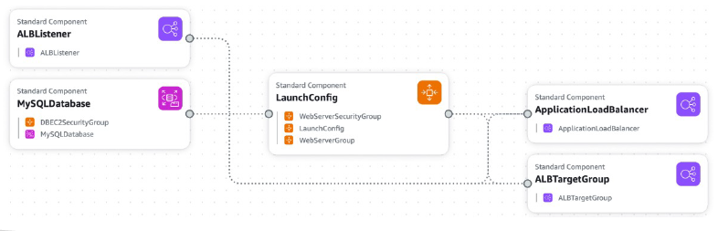

- We can see all the resources of our CloudFormation template
- On top of it, we can see the relations between the components and how they are linked together which is very handy when you want to understand your architecture diagrams
- From an exam perspective, CloudFormation is going to be used when we have Infrastructure as Code (IaC), when we need to repeat an architecture in different environments, different regions, or even different AWS accounts

## AWS Cloud Development Kit (CDK)

- This is a way for you to define your cloud infrastructure using a familiar language when you do not like to use CloudFormation directly because it uses a JSON/YAML format:
  - JavaScript/TypeScript, Python, Java, and .NET
- The code is “compiled” by the CDK into a CloudFormation template in JSON/YAML format
- **You can therefore deploy infrastructure and application runtime code together because they can share the same languages**
  - Great for Lambda functions
  - Great for Docker containers in ECS / EKS

  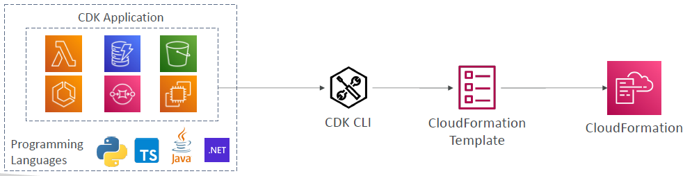

- Let's take an example of Python as a programming language
- We are going to write our own CDK application in Python, and we are going to define a Lambda function, DynamoDB table, and may be four other services in AWS
- Then this CDK appplication using the CDK CLI is going to transform the programming code into CloudFormation template.
- This CloudFormation template can then be applied into AWS CloudFormation to deploy our infrastructure
- Using a programming language to come up with a cloud infrastructure allows to get type safety, reuse some code etc..

### CDK Example

  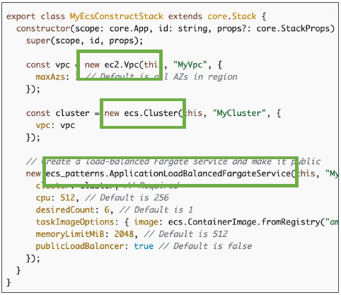

- To use AWS CDK, you need to install the CDK CLI and initialize a new CDK project. Once you have set up your project, you can start defining your cloud infrastructure using the programming language of your choice. Then, you can deploy the infrastructure to your AWS account using the CDK CLI.
- In below example, we define a VPC, we have an ECS cluster, and we have an Application Load Balancer with a Fargate service. These three things will be compiled by the CDK CLI into CloudFormation template that will be usable and that you can upload and deploy

## Typical architecture: Web App 3-tier

  

- When we have deployed an application in AWS, we typically follow a **3-tier architecture**
- In a 3-tier architecture, our users talk to a load balancer that could be in multiple AZs
- Then the load balancer will forward traffic to multiple EC2 instances managed by an Auto Scaling Group
- These EC2 instances need to store data somewhere so they will use a database such as Amazon RDS for relational database to read and write data
- If they need to have an in-memory database for an in-memory cache, then they can also use ElastiCache to store and retrieve the session data or the cached data
- This architecture is something we can easily reproduce manually or we can also reproducee it on AWS through CloudFormation, but there is a better way 

## Developer problems on AWS

- When you are a developer on AWS, you don't want to:
  - Managing infrastructure
  - Deploying Code
  - Configuring all the databases, load balancers, etc
  - Scaling concerns
  - Most web apps have the same architecture (ALB + ASG)
  - All the developers want is for their code to run!
  - Possibly, consistently across different applications and environments

## AWS Elastic Beanstalk Overview

- Elastic Beanstalk is a developer centric view of deploying an application on AWS
- It uses all the component’s we’ve seen before: EC2, ASG, ELB, RDS, etc...
- But it’s all in one view that’s easy to make sense of!
- We still have full control over the configuration of all the components, but it is all within Beanstalk
- **Beanstalk from a cloud perspective is a Platform as a Service (PaaS)** because we just worry about our code
- Beanstalk is free but you pay for the underlying instances
- Managed service, that means
  - All the EC2 Instance configuration / OS will be handled by Beanstalk
  - Deployment strategy is configurable but again the deployment itself is performed by Elastic Beanstalk
  - Capacity provisioning are done by Beanstalk
  - Load balancing & auto-scaling are done by Beanstalk
  - Application health-monitoring & responsiveness is included in the Beanstalk dashboard
- **Just the application code is the responsibility of the developer**
- Three architecture models with Elastic Beanstalk:
  - **Single Instance deployment:** good for development environment
  - **LB + ASG:** great for pre-production or production web applications
  - **ASG only as a standalone:** great for non-web apps in production (workers, etc..)

- **Support for many platforms:** (No need to know for the exam)
  - Go
  - Java SE
  - Java with Tomcat
  - .NET on Windows Server with IIS
  - Node.js
  - PHP
  - Python
  - Ruby
  - Packer Builder
  - Single Container Docker
  - Multi-Container Docker
  - Preconfigured Docker
- If not supported, you can write your custom platform.

### Elastic Beanstalk vs CloudFormation

AWS Elastic Beanstalk uses AWS CloudFormation underneath for managing the infrastructure and resources required to run your application. Then, what's the difference between them?

| Parameters    | AWS CloudFormation                                     | AWS Elastic Beanstalk                            |
| ------------- | ------------------------------------------------------ | ------------------------------------------------ |
| Purpose       | Infrastructure as Code                                 | Platform as a Service                            |
| Deployment    | Define and manage AWS infrastructure                   | Simplified application deployment and scaling    |
| Control       | High control and flexibility over underlying resources | Simplified management of underlying resources    |
| Management    | Manages entire stack of resources                      | Abstracts infrastructure management              |
| Granularity   | Fine-grained control over individual                   | Limited configuration of underlying resources    |
| Configuration | Uses JSON or YAML templates                            | Prescriptive configuration and environment setup |
| Use Cases     | Complex architectures and multi-service                | Web application deployment and scaling           |

### Elastic Beanstalk - Health Monitoring

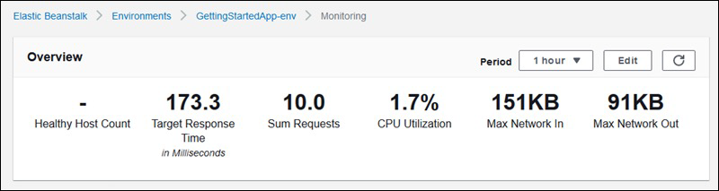
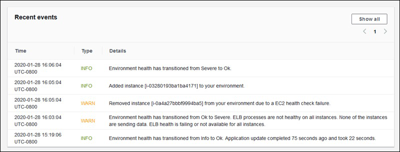
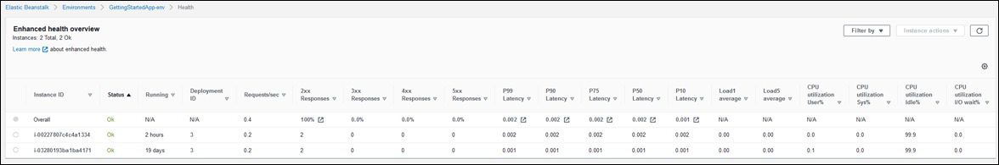
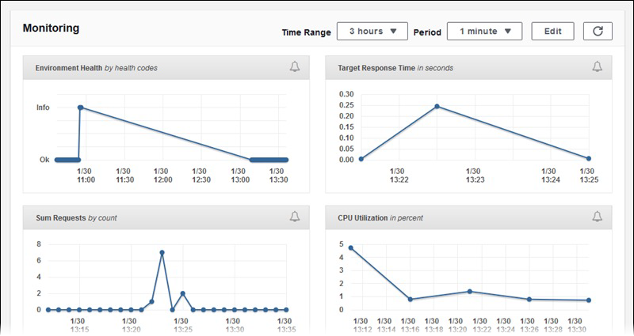

- Beanstalk has a full monitoring suite available within the service itself
- Health agents available on each EC2 instance within Beanstalk and that is going to push metrics to CloudWatch
- Checks for app health, publishes health events

## AWS CodeDeploy

- CodeDeploy is also a way for us to deploy our application **automatically**
- Difference from Beanstalk is that it is a bit more permissive and it does not need a Beanstalk or CloudFormation. CodeDeploy is competely indepedent
- If your application is in version 1 and you want to upgrade it to version 2, CodeDeploy will find us a way to do this 
- CodeDeploy works with two things: 
  - **Works with EC2 Instances** - where many EC2 instances want to upgrade application from version 1 to 2
  - **Works with On-Premises Servers** - when there are server on-prem and you want to help them upgrade from version 1 to 2
- **Hybrid Service** - as it works for both On-Premises, and for EC2 instances
- CodeDeploy allows you to work with any kind of servers. However, the servers / instances must be provisioned and configured ahead of time. 
- You must configure them to install the CodeDeploy Agent which assist you to do these upgrades
- Basically, CodeDeploy allows people to do the transition from On-Premises to AWS by using the same way to deploy the application either with your On-Premises Servers, or your EC2 instances using the same single interface

## AWS CodeCommit - Important - Deprecation

- On July 25th, 2024, AWS abruptly discontinues CodeCommit
- New customers cannot use the service
- AWS recommends to migrate to an external Git solution 

## AWS CodeCommit

- Before pushing the application code to servers, it needs to be stored somewhere
- Developers usually store **code in a repository, using the Git technology**
- A famous public offering is GitHub, AWS’ competing product is **CodeCommit**
- CodeCommit:
  - Source-control service that **hosts Git-based repositories**
  - Makes it easy to **collaborate with others on code**
  - The code changes are automatically **versioned**
- Benefits:
  - Fully managed code repository
  - Scalable & highly available, but also lives within your AWS accounts
  - Private, Secured, Integrated with all AWS services

## AWS CodeBuild

- Code building service in the cloud (name is obvious)
- **Compiles source code, run tests, and the output of which is going to produce packages that are ready to be deployed (by CodeDeploy for example)**

  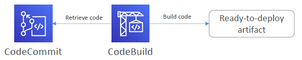

- As a diagram, CodeBuild is going to retrieve this code from CodeCommit, run some scripts that you have defined, build your code to produce some ready-to-deploy artifacts
- **Benefits:**
  - Fully managed, serverless
  - Continuously scalable & highly available
  - Secure
  - Pay-as-you-go pricing – only pay for the build time

## AWS CodePipeline

- How do you know that CodeCommit and CodeBuild are connected? We connect them using **CodePipeline**
- **A way to orchestrate the different steps to have the code automatically pushed to production**
  - Code => Build => Test => Provision => Deploy
  - Basis for CICD (Continuous Integration & Continuous Delivery)

  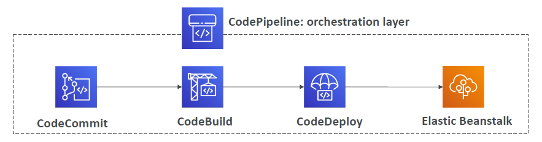

- From the above example, say we have code as an orchestration layer, it will retrieve the code from CodeCommit, built it with CodeBuild, then decide to deploy it with CodeDeploy, and may be deployed into an Elastic Beanstalk environment. This is just one way of deploying code but there are so many different ways
- **Benefits:**
  - Fully managed, compatible with CodeCommit, CodeBuild, CodeDeploy, Elastic Beanstalk, CloudFormation, GitHub, other 3rd-party services (GitHub...) & custom plugins...
  - Fast delivery & rapid updates
- It is at the core of the CICD services within AWS

## AWS CodeArtifact

- Software packages depend on each other to be built (also called code dependencies), and new ones are created
- Storing and retrieving these dependencies is called **artifact management**
- Traditionally, you need to setup your own artifact management system, may be on Amazon S3 or using some custom software on EC2 instances, and that may be complicated 
- **CodeArtifact** is a secure, scalable, and cost-effective **artifact management service** for software development
- Works with common dependency management tools such as Maven, Gradle, npm, yarn, twine, pip, and NuGet
- **Developers and CodeBuild can then retrieve dependencies straight from CodeArtifact**
- That means once you push your code to CodeCommit, CodeBuild will build, then CodeBuild can also retrieve the dependencies directly from CodeArtifact

## AWS CodeStar

- Unified UI to easily manage software development activities in one place
- "Quick way" to get started to correctly set-up CodeCommit, CodePipeline, CodeBuild, CodeDeploy, Elastic Beanstalk, EC2, etc…
- Can edit the code "in-the-cloud" using AWS Cloud9

## AWS Cloud9

- AWS Cloud9 is a cloud IDE (Integrated Development Environment) for writing, running and debugging code
- "Classic" IDE (like IntelliJ, Visual Studio Code...) are downloaded on a computer before being used
- A cloud IDE can be used within a web browser, meaning you can work on your projects from your office, home, or anywhere with internet with no setup necessary
- AWS Cloud9 also allows for code collaboration in real-time (pair programming)

## AWS Systems Manager (SSM)

- Helps you manage your fleet of **EC2 and On-Premises** systems at scale
- Yet again it is a way to manage both AWS and On-Premises systems. Therefore it is called a **Hybrid AWS service**
- Get operational insights about the state of your infrastructure
- Suite of 10+ products
- Most important features are:
  - **Patching automation of all your servers and instances for enhanced compliance**
  - **Run commands across an entire fleet of servers**
  - Store parameter configuration with the SSM Parameter Store
- Works for both Windows, Linux, MacOS, and Raspberry Pi OS (Raspbian)

### How AWS Systems Manager works

  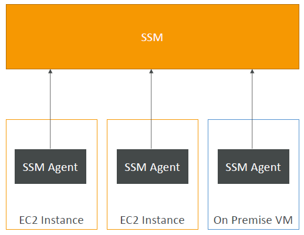

- We need to install the SSM agent onto the systems we control and that is a small program that will be running in the background
- The agents are installed by default on Amazon Linux AMI & some Ubuntu AMI
- If you look at your EC2 instances and on-premises virtual machines, we first have to install the **SSM agent** on all of these, and the SSM agent will be reporting back to the SSM service in AWS.
- As you can see, it is linked to both EC2 instances and On-Premises VM thus making it a **hybrid service**
- If an instance can't be controlled with SSM, it's probably an issue with the SSM agent!
- Thanks to the SSM agent installed on our servers, we can use SSM service to run commands across all these servers, or we can patch thm all at once, or we can configure them consistently using the SSM service

### AWS Systems Manager - SSM Session Manager

- Allows you to start a secure shell on your EC2 instances and on-premises servers without having an SSH access, or the need for bastion hosts, or any SSH keys
- That means the port 22 on your EC2 instances is going to be closed because there is going to be no need to do an SSH to establish a secure shell onto your EC2 instance. That means better security

  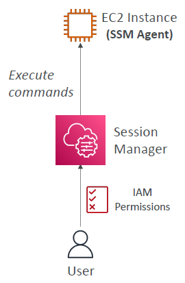

- How does that work?
  - The EC2 instance has an SSM agent and that agent is connected to the Session Manager Service which allows us to get a secure shell running. That means your users can access the EC2 instance through the Session Manager Service and execute some commands on it
- Supports Linux, macOS, and Windows
- Send session log data to S3 or CloudWatch Logs

### AWS Systems Manager Parameter Store

- It is a way to store configurations and secrets securely on AWS
- Numerous data like API Keys, passwords, configurations can centrally store the configurations of many of your applications in one place 
- Serverless, scalable, durable, easy SDK
- It is secure because you control access permissions to each parameter in the parameter store using IAM
- Since your configurations and parameters can evolve over time, therefore you have version tracking & encryption (optional)

  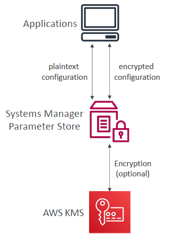

- Our users can enter plain text configurations or encrypted configurations (in which case, it is encrypted with KMS) in our parameter store. Therefore, you can manage and centrally store the configurations of many applications in one place

## AWS OpsWorks (not included anymore)

- Chef & Puppet help you perform server configuration automatically, or repetitive actions
- They work great with EC2 & On-Premises VM
- AWS OpsWorks = Managed Chef & Puppet
- It’s an alternative to AWS SSM
- Only provision standard AWS resources:
  - EC2 Instances, Databases, Load Balancers, EBS volumes…
- **Chef or Puppet needed => AWS OpsWorks**

### OpsWorks Architecture (not included anymore)

## Deployment - Summary

- **CloudFormation: (AWS only)**
  - Infrastructure as Code, works with almost all of AWS resources
  - Allows you to create templates, and these templates can be used to deploy infrastructure on AWS 
  - These templates can be used across Regions & Accounts to make your infrastructure truly repeatable
- **Beanstalk: (AWS only)**
  - Platform as a Service (PaaS), limited to certain programming languages or Docker
  - Deploy code consistently with a known architecture: ex, ALB + EC2 + RDS
- **CodeDeploy (hybrid):** deploy & upgrade any application onto servers
- **Systems Manager (hybrid):** patch, configure and run commands at scale
- **OpsWorks (hybrid):** managed Chef and Puppet in AWS

## Developer Services - Summary

- **CodeCommit:** Store code in private git repository (version controlled)
- **CodeBuild:** Build & test code in AWS
- **CodeDeploy:** Deploy code onto servers
- **CodePipeline:** Orchestration of pipeline (from code to build to deploy)
- **CodeArtifact:** Store software packages / dependencies on AWS
- **CodeStar:** Unified view for allowing developers to do CICD and code
- **Cloud9:** Cloud IDE (Integrated Development Environment) with collab
- **AWS CDK:** Define your cloud infrastructure using a programming language
