# Global Infrastructure

- [Global Infrastructure](#global-infrastructure)
  - [Why make a global application?](#why-make-a-global-application)
    - [Global AWS Infrastructure](#global-aws-infrastructure)
    - [Global Applications in AWS](#global-applications-in-aws)
  - [Amazon Route 53 Overview](#amazon-route-53-overview)
    - [Route 53 - Diagram for A Record](#route-53---diagram-for-a-record)
  - [Route 53 Routing Policies](#route-53-routing-policies)
    - [Simple Routing Policy](#simple-routing-policy)
    - [Weighted Routing Policy](#weighted-routing-policy)
    - [Latency Routing Policy](#latency-routing-policy)
    - [Failover Routing Policy](#failover-routing-policy)
  - [AWS CloudFront](#aws-cloudfront)
    - [CloudFront - Origins](#cloudfront---origins)
    - [CloudFront at a high level](#cloudfront-at-a-high-level)
    - [CloudFront - S3 as an origin](#cloudfront---s3-as-an-origin)
    - [CloudFront vs S3 Cross Region Replication](#cloudfront-vs-s3-cross-region-replication)
    - [S3 Transfer Acceleration](#s3-transfer-acceleration)
  - [AWS Global Accelerator](#aws-global-accelerator)
    - [AWS Global Accelerator vs CloudFront](#aws-global-accelerator-vs-cloudfront)
  - [AWS Outposts](#aws-outposts)
    - [AWS Outposts Benefits](#aws-outposts-benefits)
  - [AWS WaveLength](#aws-wavelength)
  - [AWS Local Zones](#aws-local-zones)
  - [Gloabl Applications Architecture](#gloabl-applications-architecture)
  - [Global Applications - Summary](#global-applications---summary)

## Why make a global application?

- A global application is an application deployed in **multiple geographies**
- When you translate this on AWS: this could mean that you deploy your application onto different **AWS Regions** and / or **Edge Locations**
- **Decreased Latency**
  - When you deploy the app on different AWS Regions and / or edge locations, what it gives for users around the world is a decreased latency
  - **Latency** is the time it takes for a network packet to reach a server
  - If you consider that Earth is big, then it takes more time for a packet from Asia to reach the US
  - If you deploy your applications closer to your users then it will decrease the latency, and the users will have a better experience
- **Disaster Recovery (DR)**
  - The idea is to not rely on one data center or one region. For example, if an entire AWS region goes down (earthquake, storms, power shutdown, politics), then by having disaster recovery strategy in place you can fail-over to another region and have your application will still be working
  - A DR plan is important to increase the availability of your application
- **Attack protection**: It is common for hackers online to attack your application and if you have your application across multiple regions and distributed globally, then it is going to be much harder for an attacker to attack all these locations at once making you application more protected against these attacks

### Global AWS Infrastructure

- Regions: For deploying applications and infrastructure
- Availability Zones: Regions are made of multiple availability zones which are nothing but multiple data centers
- Edge Locations (Points of Presence): Used for content delivery as close as possible to users. These are for content delivery networks, so you cannot deploy an application there, but something like CloudFront will be using it
- More at: <https://infrastructure.aws/>

### Global Applications in AWS

- **Global DNS: Route 53**
  - Great to route users to the closest deployment with least latency
  - Great for disaster recovery strategies
- **Global Content Delivery Network (CDN): CloudFront**
  - Replicate part of your application to AWS Edge Locations again to decrease the latency
  - Cache common requests – improved user experience and a decreased latency
- **S3 Transfer Acceleration**
  - Accelerate global uploads & downloads into Amazon S3
- **AWS Global Accelerator:**
  - Improve global application availability and performance using the AWS global network

## Amazon Route 53 Overview

- Amazon Route53 is going to be very important for us to deploy a global application
- Route53 is a Managed DNS (Domain Name System)
- DNS is like a phone book with a collection of rules and records which helps clients find the right servers through URLs.
- In AWS, the most common records are:
  - if you are mapping a **www.google.com** hostname to an **IP address** say, 12.34.56.78 then it is called an **A record (IPv4)**
  - if you are mapping a **www.google.com** hostname to an **IPv6 address** say, 2001:0db8:85a3:0000:0000:8a2e:0370:7334 then it is called an **AAAA rcord (IPv6)**
  - if you are mapping a **search.google.com** hostname to another hostname say, **www.google.com** then it is called a **CNAME** because we are mapping a **hostname to hostname**
  - if you are mapping a **example.com** hostname to an **AWS resource**, it is a special type of rcord called an **Alias record (ex: ELB, CloudFront, S3, RDS, etc...)**
- Basically, Route53 will allow us to create a record which will guide us to the instance that has the least latency

### Route 53 - Diagram for A Record

- For Route53 say, we want to see what happens for an A record
- We have a web browser and an application server that we have deployed that has a public IPv4
- We want to be able to access our application server using a normal URL
- For this, we go into Route53 and create an A record so that when the web browser does a DNS request for **myapp.mydomain.com**, the DNS will reply back with an IP
- That IP can be used by our web browser to get to our correct server and then get the HTTP response from our server. At a very high level this is how th DNS works


<!--
```mermaid
sequenceDiagram
    participant Web browser
    participant Route 53
    participant Application Server(IP=11.12.13.1)
    Web browser->>Route 53: DNS Request app.domain.com
    Route 53 ->> Web browser: Send back IP:11.12.13.1(A record: hostname or IP)
    Web browser->>Application Server(IP=11.12.13.1): HTTP Request IP:11.12.13.1 (Host:app.domain.com)
    Application Server(IP=11.12.13.1) ->> Web browser: HTTP Response
``` -->

## Route 53 Routing Policies

Need to know them at a high-level for the Cloud Practitioner Exam

- Simple Routing Policy
- Weighted Routing Policy
- Latency Routing Policy
- Failover Routing Policy

### Simple Routing Policy

  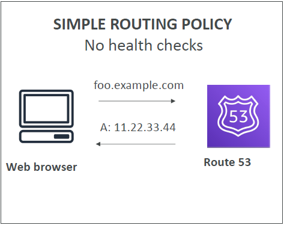

- Has no health checks
- Our web browser will go into our DNS system, does a DNS query and gets an IPv5 as a result

### Weighted Routing Policy

  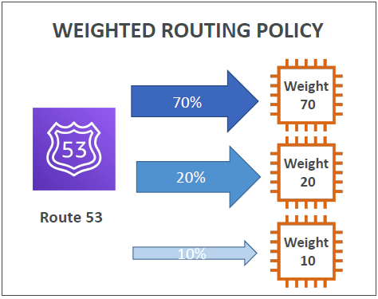

- Allows us to distribute the traffic across multiple EC2 instances
- In this example, we have to assig weights to your EC2 instances. For ex, 70, 20 and 10
- Then DNS will make sure that our clients send 70% of traffic onto the first EC instance, 20% to the second instance and 10% to the third instance. This is effectively some kind of load balancing. In this, we use health checks

### Latency Routing Policy

  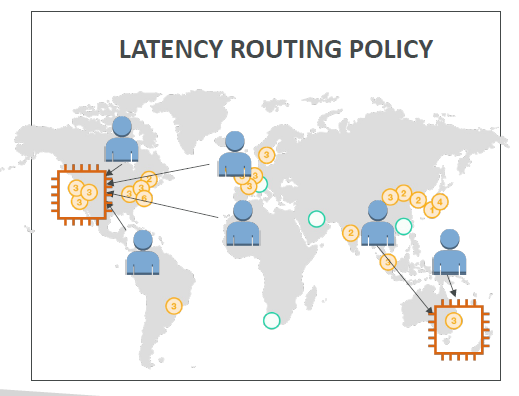

- Say, we are displaying our application globally, one in California and the other one is Australia and our users are all around the world
- In latency routing policy, we look at where the user is located and if they are located close to our American EC2 instance then they will be redirected to talk to that server, If they are close to Australia then they will be redircted to talk to the Australia server
- In this example, Route53 will be used to minimize the latency between the users and servers by making the users connect to the server that is the closest to them

### Failover Routing Policy

  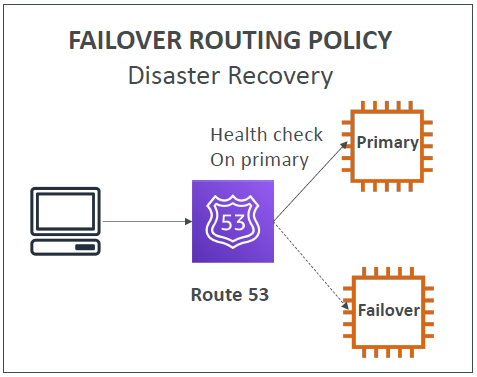

- Here we have a client, a primary EC2 instance and a failover EC2 instance
- DNS system will do a health check on the primary instance. And in case the primary instance fails, then we will be redirected to the failover instance. This helps in disaster recovery
- The clients will know exactly which instance to connect to based on the health of that instance. Thanks to Route53

## AWS CloudFront

- CloudFront is the Content Delivery Network (CDN)
- **Improves read performance of your website by caching the content at different edge locations**
- Because your content is cached all around the world then your users all around the world will have a lower latency therby improving  user experience
- CloudFront is made of **216 Points of Presence** globally which corresponds to edge locations around the world, and AWS keeps on adding locations to improve user experience even further everywhere
- By having the content distributed globally, we are getting a DDoS protection (an attack where all your servers around the world are getting attacked at the same time) because your application is worldwide then you are protected against these attacks, also using something called Shield, andd AWS Web Application Firewall
- Source: <https://aws.amazon.com/cloudfront/features/?nc=sn&loc=2>

  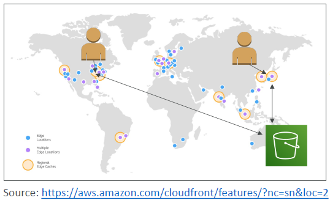

- Example - If you see the World Map and we see some edge locations as well as edge caches. Say, we had created an S3 bucket and website on our S3 bucket in Australia, but we had a user may be in the US of A, then if the user requests the content from a American Edge location using CloudFront, and CloudFront will be able to fetch the content from Australia. Now, if another user in the US of A requests the same content, then it will be served directly from the edge without going all the way to Australia to serve that content. Same holds true for an user in China, it will talk to a Chinese Point of Presence, which is redirected to the S3 buckets in Australia, later the content will be cached at the Chinese edge location for other user requests

### CloudFront - Origins

CloudFront has several types of origins, which are basically backends you want to connect CloudFront to
- **S3 bucket**
  - For distributing files and caching them at the edge
  - For uploading files to S3 directly through CloudFront. Here CloudFront can be used as an ingress
  - The connection between S3 bucket and CloudFront is enhanced with security using Origin Access Control (OAC)
- **VPC Origin**
  - We can connect CloudFront directly to the applications hosted in VPC private subnets
  - You can connect CloudFront directly to Application Load Balancer / Network Load Balancer / EC2 Instances privately
- **Custom Origin (anything that uses HTTP can be used in the backend)**
  - An S3 website (must first enable the bucket as a static S3 website)
  - Any public HTTP backend you want within or outside of AWS

### CloudFront at a high level

  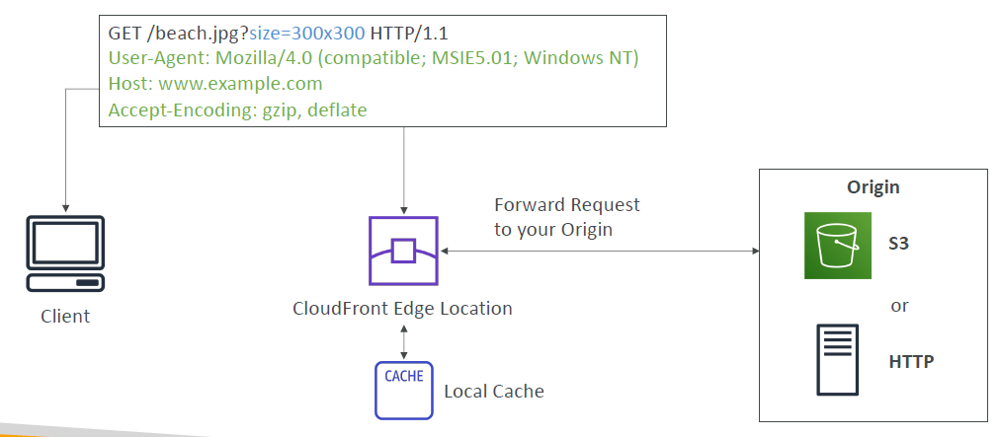

- We have Edge Locations all around the world and then it will be connecting to your origin. Would it be an S3 bucket, or an HTTP server?
- When the client connects and does an HTTP request into your edge location, then the edge location will see if it has it in the cache. If it doesn't, then it will go to the origin to the get the request results. And then once it retrieves the results, it will be caching it into a local cache, so that if another client requests the same content from the same Edge Location, then the Edge Location does not need to go to the origin

### CloudFront - S3 as an origin

  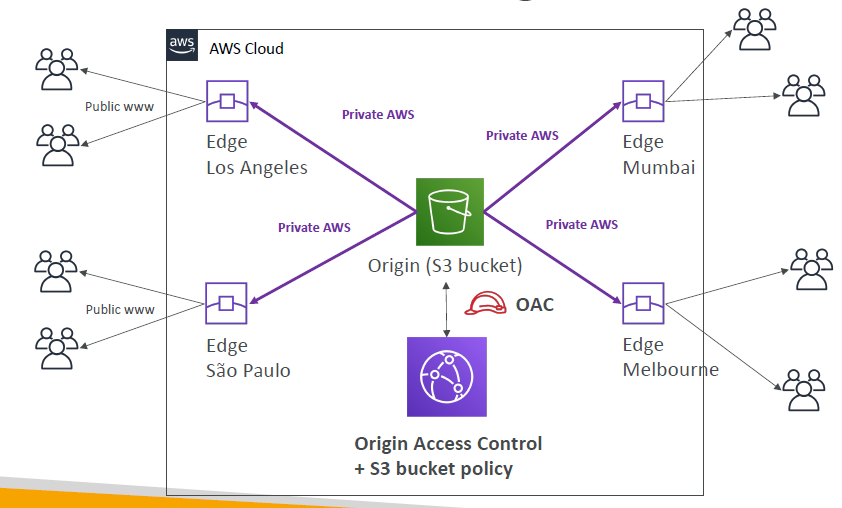

- If we have S3 as an origin, then if you look at the cloud your S3 bucket is your origin in some region, and then you have Edge Locations all around the world. For example, at Los Angeles, and your users accessing the Edge Location in Los Angeles will get their content directly served through the Edge Location but first the Edge Location will get it from the origin S3 bucket through the private network
- The S3 bucket will be secured using an Origin Access Control with a modified S3 bucket policy on the S3 bucket
- This is the same when we have a user in Sao Paulo in Brazil. This will be another Edge Location serving users close to Brazil and then it will be a private connection between your Edge Location and S3 bucket and so on

### CloudFront vs S3 Cross Region Replication

| CloudFront | S3 Cross Region Replication |
| ---------- | --------------------------- |
| Global Edge network (about 216 Points of Presence) | Must be setup for each region you want replication to happen |
| Files are cached in each edge location for a TTL (Time to Live) (maybe a day) | Files are updated in near real-time. It is for read-only |
| **Great for static content that must be available everywhere around the world** | **Great for dynamic content that needs to change all the time and be available at low-latency in a few regions** |

### S3 Transfer Acceleration

- S3 buckets are linked to only one region and so sometimes you are looking to transfer files from all around the world into one specific S3 buckets. There is a way to speed up the transfer using S3 Transfer Acceleration

  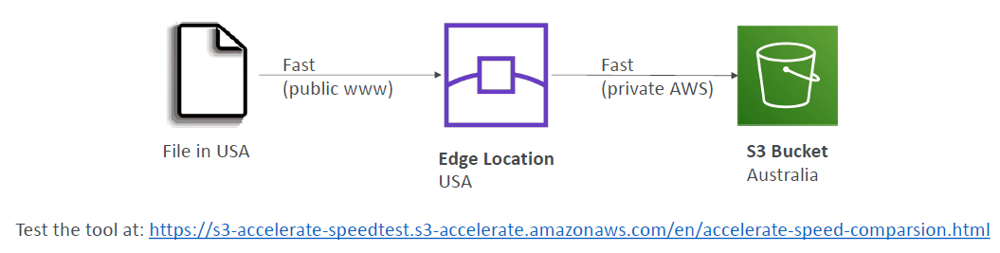

- Increase transfer speed by transferring file to an AWS edge location which will forward the data to the S3 bucket in the target region
- In the above example, if we try to upload a file from the US of A into an S3 bucket in Australia, first it will try to upload the file into the nearest edge lcoation to a user in the US of A. Later using the internal AWS network, the Edge Location will transfer the file to the S3 buckets in Australia resulting in a more reliable and fast connection. This is the basics of how S3 Transfer Acceleration works and this is only used when you want to upload or download a file from S3 bucket that is far away from you
- Test the tool at: <https://s3-accelerate-speedtest.s3-accelerate.amazonaws.com/en/accelerate-speed-comparsion.html>

## AWS Global Accelerator

- This is used to improve the global application **availability** and **performance** using the AWS global network
- The idea is that the traffic is routed to your applications using the AWS global network instead of the internet.
- By leveraging the AWS internal network we optimize the route to your application for about 60%

  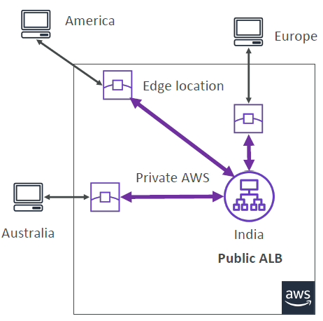

- In the above example, say we have deployed an ALB in India and users all around the world want to access our application
- Using Global Accelerator, users connect to an edge location and the edge location will route the traffic directly into India
- Benefit we get out of this is the traffic on the public internet only happens between America and the closest edge location and then it leverages the private AWS network to speed up the connection from the edge location to your ALB. This is same for Europe, Australia and to the rest of the world 
- On top of it, you only access your application through 2 static IPs called Anycast IPs. Using Anycast IP you will be redirected automatically tot he correct edge location. Then the edge location will send the traffic to your application
- Test the tool at: <https://speedtest.globalaccelerator.aws/#/>
- Here is a diagram which shows what happens with and without a Global Acclerator

  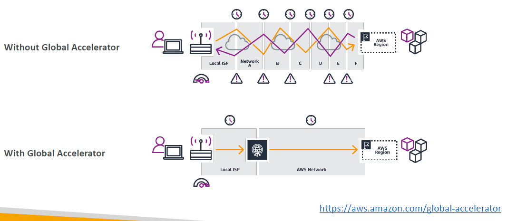

- Without Global Accelerator, your client to get to your appilcation can go through a lot of hops on a lot of network and there could be problems, and could be latencies added to it
- With Global Accelerator, then you just connect to an Edge Location of AWS and then very quickly from the Edge Location to the region you are connecting to, it goes through the private AWS network

### AWS Global Accelerator vs CloudFront

- They both use the AWS global network and its edge locations around the world
- Both services integrate with AWS Shield for DDoS protection.
- **CloudFront – Content Delivery Network**
  - Improves performance for your cacheable content (such as images and videos)
  - Content is cached and served at the edge
- **Global Accelerator**
  - No caching, requests are passed on from the edge locations back to your application in your regions
  - Improves performance of these queries over a wide range of applications over TCP or UDP
  - Good for HTTP use cases that require static IP addresses
  - Good for HTTP use cases that required deterministic, fast regional failover
  - Basically, Global Accelerator is to make your request go faster and go through the internal AWS network globally
  - A small tool to do a speed comparison for AWS Global Accelerator - https://speedtest.globalaccelerator.aws/#/

## AWS Outposts

  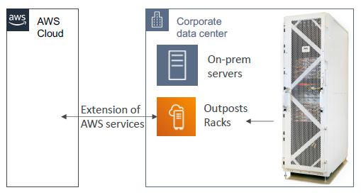

- **Hybrid Cloud**: businesses that keep an on-premises infrastructure alongside a cloud infrastructure
- Therefore, two ways of dealing with IT systems:
  - One for the AWS cloud (using the AWS console, CLI, and AWS APIs)
  - One for their on-premises infrastructure
- So two different skillsets, two different types of APIs, and that may be complicated
- AWS recognized that some companies run a hybrid cloud therefore they came up with **AWS Outposts**
- **AWS Outposts are "server racks"** that offers the same AWS infrastructure, services, APIs & tools to build your own applications on-premises just as in the cloud
- **AWS will come and setup and manage "Outposts Racks"** which are servers within your on-premises infrastructure. These servers come preloaded with the AWS services but you can benefit them from on-premises
- On your corporate data centesr you will have your Outpost racks directly set up by AWS and this allows you to extend your AWS services directly onto your on-premises data centers which is revolutionary
- But the difference between an EC2 instance running on the cloud and an EC2 instance running in your own data center is that now you are responsible for the Outposts Rack physical security

### AWS Outposts Benefits

- Low-latency access to on-premises systems
- Local data processing - data may never leave your on-premise system and never go to the cloud
- Data residency
- Easier migration from on-premises to AWS Outpose and then to the cloud
- Fully managed service - AWS manages these servers for you
- Some services that work on Outposts:
  - EC2
  - EBS
  - S3
  - EKS
  - ECS
  - RDS
  - EMR

## AWS WaveLength

- WaveLength Zones are infrastructure deployments embedded within the telecommunications providers' datacenters at the edge of the 5G networks
- The idea is that you are able to bring AWS services directly to the edge of the 5G networks
- Example: You would be able to deploy EC2, EBS, VPC to a Wavelength Zone

  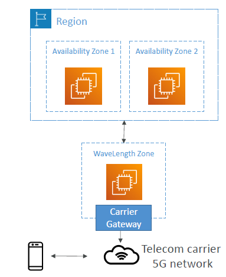

- Say, you have a telecom carrier, having a 5G network and you are going to have a Wavelength Zone and through a carrier gateway, you are able to deploy an EC2 instance on that zone, but that zone belong to the 5G network itself. So whenever a user on the 5G network for a mobile device accesses your Wavelength Zone, they will have really, really low latency because the application is really deployed at the edge. This is the idea of AWS Wavelength to give ultra-low latency to applications through 5G networks
- Traffic doesn't leave the Communication Service Provider's (CSP) network. It actually never reaches AWS
- In case you need to have a secure connection to AWS then you can. The Wavelength Zone is connected to the parent AWS Region in case, for example, your EC2 instances in your wavelength zone needs to access a database - an RDS or a DynamoDB within your main parent AWS region
- No additional charges or service agreements for using AWS Wavelength
- Use cases: Smart Cities, ML-assisted diagnostics, Connected Vehicles, Interactive Live Video Streams, AR/VR, Real-time Gaming anything that requires low latency and to be very very close at the edge to your users. This is a use case enabled by 5G network

## AWS Local Zones

- We have the concept of AZ and these regions all around the world, but now there is a concept of Local Zones, which allows you to place compute storage database and other services that are selected by database closer to end users, to run latency sensitive applications
- The idea is you extend your VPC to one or more locations or "Availability Zones" – "Extension of an AWS Region"
- Compatible with EC2, RDS, ECS, EBS, ElastiCache, Direct Connect...
- Example:
  - You have an AWS Region: N. Virginia (us-east-1) with 6 default AZs
  - But you can extend these AZs with more AWS Local Zones so that you have Boston, Chicago, Dallas, Houston, Miami...
  
  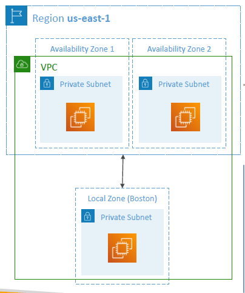

  - How does the above example work? You have region us-east-1 with 2 AZs but it is possiblee for you to define a local zone in Boston and then extend your VPC to be going across these AZs and local zones. Then you will be able to launch an EC2 instance into this local zone
  - That means if you knew that you had users in Boston and we really, really want them to have low-latency access to our applications directly from Boston, then we can enable the local zone in Boston. Once you enable, while creating an EC2 instance we can choose the subnet in VPC. For the AZ, we will be able to choose the Boston subnet and then associate that with the local zone. This would extend the VPC to local zone and therefore deploy EC2 instances closer to your users

## Gloabl Applications Architecture

  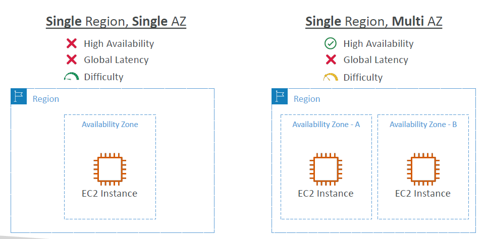

- **Single Region, Single AZ:**
  - does not give us high availability
  - will not have global latency
  - it is very simple to setup

- **Single Region, Multi AZ:**
  - will give us high availability as it has multi AZ
  - no improvements on global latency - for a user far away from your AZs will have high latency
  - it is bit more difficult to setup

  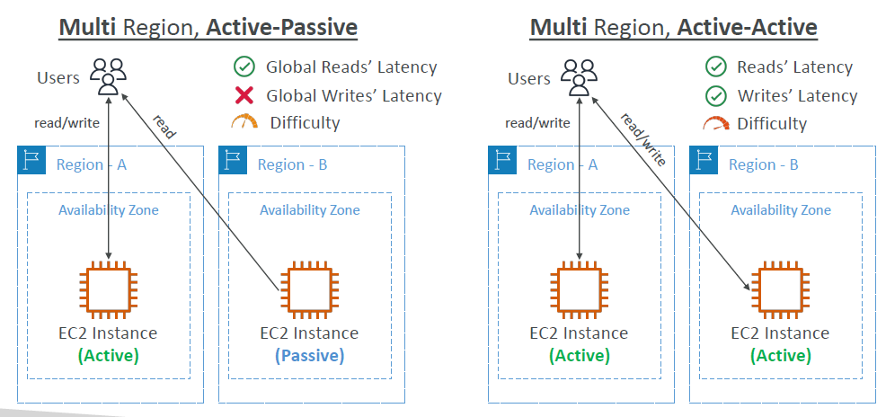

- **Multi Region, Active-Passive:**
  - active-passive means that we have two regions where each region has one or multiple AZ
  - in one region our EC2 instances are going to be active meaning, our users where ever they are in the world will be able to read and write to our EC2 instance in active region
  - other EC2 instance is passive that means there is data replication between the active region and the passive region.
  - possibly the users can do reads from the passive region, but cannot write to the passive region
  - With this we will have imprived read latency
  - However all the writes still need to go to the same central region and will have high latency
  - With multiple regions it is an increased difficulty to setup 

- **Multi Region, Active-Active:**
  - this is where each EC2 instance is able to take writes and reads. 
  - There is replications still happening within these two instances which improves the read latency, the write latency at the global level
  - It is very difficult to setup because now your application a lot of things in every single region

## Global Applications - Summary

- Global DNS: Route 53
  - Great to route users to the closest deployment with least latency
  - Great for disaster recovery strategies
- Global Content Delivery Network (CDN): CloudFront
  - Replicate part of your application to AWS Edge Locations – decrease latency
  - Cache common requests – improved user experience and decreased latency
- S3 Transfer Acceleration
  - Accelerate global uploads & downloads into Amazon S3
- AWS Global Accelerator
  - Improve global application availability and performance using the AWS global network
- AWS Outposts
  - Deploy Outposts Racks in your own Data Centers to extend AWS services
- AWS WaveLength
  - Brings AWS services to the edge of the 5G networks
  - Ultra-low latency applications
- AWS Local Zones
  - Bring AWS resources (compute, database, storage, ...) closer to your users
  - Good for latency-sensitive applications
