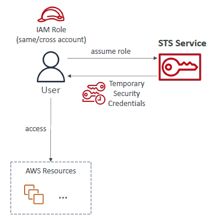
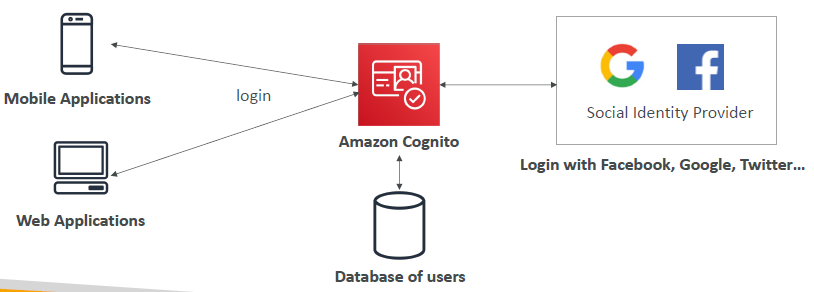
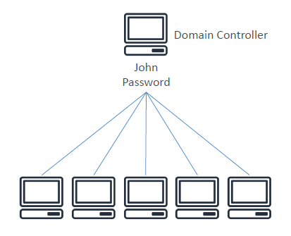
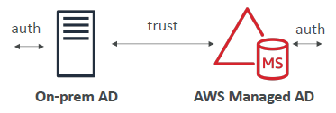
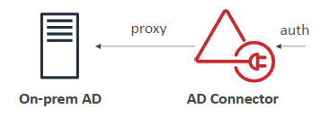
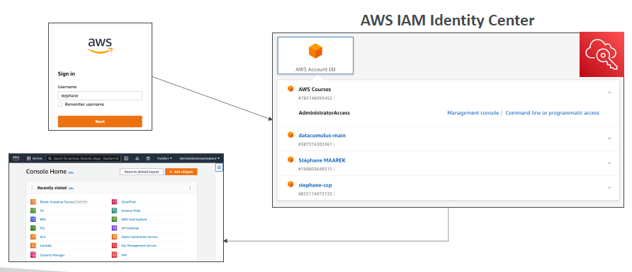

# Advanced Identity

- [Advanced Identity](#advanced-identity)
  - [AWS STS (Security Token Service)](#aws-sts-security-token-service)
  - [Amazon Cognito](#amazon-cognito)
  - [Microsoft Active Directory (AD)](#microsoft-active-directory-ad)
    - [AWS Directory Services](#aws-directory-services)
  - [AWS IAM Identity Center](#aws-iam-identity-center)
  - [AWS IAM Identity Center - Login Flow](#aws-iam-identity-center---login-flow)
  - [Summary](#summary)

## AWS STS (Security Token Service)

- Enabled you to create **temporary, limited-privilege credentials** to access your AWS resources.
- Short-term credentials: you configure expiration period.
- A user would assume a role, call Security Token Service (STS) and get Temporary Security Credentials.
- The credentials looks like an **access key, security key** as well as a **session key** which is going to be limited in time.
- Using these three credentials, the user will be able to access AWS resources using the assumed role.

  

- Use cases:
  - Identity federation: manage user identities in external systems, providing STS tokens for AWS resource access
  - IAM Roles for cross-account or same-account access
  - IAM Roles for EC2 instances: temporary credentials for EC2 to access AWS resources

## Amazon Cognito

- Manages identity for web and mobile application users (potentially millions)
- Instead of creating IAM users, create users in Cognito. IAM users is for those users who want to access AWS directly.
- Use Cognito when you are thinking of building a web or mobile application and you want to have a way to manage users on AWS.

  

## Microsoft Active Directory (AD)

- Available on any Windows Server with AD Domain Services
- Database of **objects**: User Accounts, Computers, Printers, File Shares, Security Groups usually within on-premises systems.
- Centralized security management, create accounts, assign permissions
- When would you have used an AD before?
  * Say you have a Windows laptop and you were connected to your corporate internet, then you would have a domain controller which defined that you, John as a user, have a password. If you login onto any of the machines, belonging to your company, because they are connected to the Domain Controller you can use this combination of username and password of any of these machines allowing you to seemlessly use your login on too many different services or laptops and so on. 

  

### AWS Directory Services

- AWS is different because it doesn't have active directory on it, but you can extend active directory using AWS Directory Services. We have 3 flavours of it (not needed to know for the exam).
- **AWS Managed Microsoft AD**
  
    
  
  - Create and manage your own AD in AWS, supports MFA
  - Establish "trust" connections with on-premise AD

- **AD Connector**
  
    
  
  - Directory gateway (proxy) to redirect to on-premise AD, supports MFA
  - Users are managed on the on-premise AD

- **Simple AD**
  
    
  
  - AD-compatible managed directory on AWS
  - Cannot be joined with on-premise AD

## AWS IAM Identity Center

- AWS IAM Identity Center is a successor to AWS Single Sign-On.
- One login (single sign-on) for all your:
  - AWS accounts in AWS Organizations
  - Business cloud applications (e.g., Salesforce, Box, Microsoft 365)
  - SAML 2.0-enabled applications
  - EC2 Windows instances
- Identity providers (the user data is stored):
  - Where you can have a built-in identity store in IAM Identity Center
  - Or you can connect to a third party identity store: Microsoft Active Directory, OneLogin, Okta
  - Idea is when you see one access to multiple AWS accounts, you think about **IAM Identity Center**. 

## AWS IAM Identity Center - Login Flow

- You login through one URL and then you provide a username and password.
- Then you have access to the AWS IAM Identity Center Portal where you will have access to multiple accounts under my organization where we can click on any one of them and click on Management Console which will give us direct access to the management console of a specific account. All of this just by remembering one login versus four logins for all of the accounts.

  

## Summary

- **IAM**: Identity and Access Management within your AWS account for trusted users within your company
- **Organizations**: Manage multiple AWS accounts
- **Security Token Service (STS)**: Temporary, limited-privilege credentials to access AWS resources
- **Cognito**: Create a database of users for your mobile and web applications
- **Directory Services**: Integrate Microsoft Active Directory in AWS
- **IAM Identity Center**: One login for multiple AWS accounts and applications