# Cloud Monitoring

- [Cloud Monitoring](#cloud-monitoring)
  - [Amazon CloudWatch Metrics](#amazon-cloudwatch-metrics)
    - [Example: CloudWatch Billing Metric](#example-cloudwatch-billing-metric)
    - [Important Metrics](#important-metrics)
    - [Amazon CloudWatch Alarms](#amazon-cloudwatch-alarms)
  - [Amazon CloudWatch Logs](#amazon-cloudwatch-logs)
    - [CloudWatch Logs for EC2](#cloudwatch-logs-for-ec2)
  - [Amazon EventBridge (formerly CloudWatch Events)](#amazon-eventbridge-formerly-cloudwatch-events)
    - [Amazon EventBridge Rules](#amazon-eventbridge-rules)
    - [Amazon EventBridge](#amazon-eventbridge)
  - [AWS CloudTrail](#aws-cloudtrail)
    - [CloudTrail Diagram](#cloudtrail-diagram)
  - [AWS X-Ray](#aws-x-ray)
    - [AWS X-Ray - Visual analysis of our applications](#aws-x-ray---visual-analysis-of-our-applications)
    - [AWS X-Ray advantages](#aws-x-ray-advantages)
  - [Amazon CodeGuru](#amazon-codeguru)
    - [Amazon CodeGuru Reviewer](#amazon-codeguru-reviewer)
    - [Amazon CodeGuru Profiler](#amazon-codeguru-profiler)
  - [AWS Health Dashboard - Service History](#aws-health-dashboard---service-history)
  - [AWS Health Dashboard - Your Account](#aws-health-dashboard---your-account)
  - [Cloud Monitoring Summary](#cloud-monitoring-summary)

## Amazon CloudWatch Metrics

- CloudWatch provides metrics for ***every*** services in AWS
- **Metric** is a variable to monitor (CPUUtilization, NetworkIn, etc..)
- Metrics have **timestamps**
- Can create **CloudWatch dashboards** of metrics

### Example: CloudWatch Billing Metric

  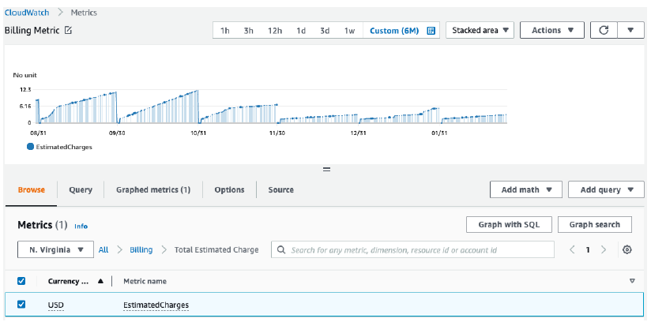

- Here is an example of a very common metric for CloudWatch which is called the Billing metric
- This metric is only available in us-east-I, so only in one region, and it represents the total amounts you have spent on your AWS cloud
- Obviously, at every month end it will reset back in to zero, but as you can see, over time that metric goes up and then will go back to zero

### Important Metrics

- **EC2 Instances:**
  - **CPU Utilization** - There are a ton more metrics we can look at. For example, for our EC2 instances, we can look at the CPU Utilization, which is how much we are making the CPU work and if it makes it work a lot, than maybe our instance is too busy and we need to scale it up or scale it out.
  - **Status Check** - The Status Check to make sure that our EC2 instance is properly functioning
  - **Network (not RAM)** - the Network, to see how much network is going in our instance and out our instance. As you can see, the RAM is not an available metric for your EC2 instances
  - By default these metrics are produced every 5 minutes
  - Option for Detailed Monitoring ($$$): more expensive to get these metrics every 1 minute
- **EBS volumes**: Disk Read/Writes
- **S3 Buckets:** BucketSizeBytes, NumberOfObjects, AllRequests
- **Billing**: Total Estimated Charge (only in us-east-1)
- **Service Limits**: which is how much you have been using a service AP
- **Custom metrics**: if you don't find the metric you like, you can push your own metrics

### Amazon CloudWatch Alarms

- Alarms are used to trigger notifications for any metric and that means that once a metric goes above a threshold, then we can have a CloudWatch Alarm action
- **Alarms actions**
  - **Auto Scaling:** These actions can be for an auto scaling group to increase or decrease the number of EC2 instances desired counts effectively allowing your auto scaling group to scale automatically
  - **EC2 Actions:**  if you want to stop, terminate, reboot, or **recover an EC2 instance**
  - **SNS notifications:** SNS notifications if you wanted to send a notification into an SNS topic. For example, you're saying, okay if my EC2 instance has a utilization of over 90%, then send us an email because we want to look at it and something's wrong
- Various options (sampling, %, max, min, etc...) - Then you get various options for creating the alarm, sampling, percentage, max, min, etc..
- You can choose the period on which to evaluate an alarm, whether it be five minutes, ten minutes, an hour
- You can create what's called **a billing alarm** on the CloudWatch Billing metric, which allows you to get notified if your metric goes over, for example, 10 or $20.
- **Alarm States:** The alarm state can be **OK** when everything is green, **INSUFFICIENT_DATA** when there's not enough data points to figure out if it should be green or bad, and then **ALARM** when it's bad

## Amazon CloudWatch Logs

- CloudWatch Logs as the name suggests it is to collect log files 
- So what is a log file? - Well, when you have an application running on any server, usually you want the application to write some text about how it is doing. For example, when it is doing some actions for a userwhen it is performing some clean ups, etc., and so all these logs can be collected and when a user needs to troubleshoot something, then they will go through the log file and see what the application did or said. These logs can exist in different forms, but you can collect the logs from:
  - Elastic Beanstalk: collection of logs from application
  - ECS: collection from containers
  - AWS Lambda: collection from function logs
  - CloudTrail based on filter
  - **CloudWatch log agents: on EC2 machines or on-premises servers** - which is when you install a log agent on an EC2 machine or an on-premise server to get your log directly from that server onto AWS
  - Route53: For logging DNS queries
- CloudWatch logs overall where it collects all these logs it allows for **real-time monitoring** of your logs and then with it you can react to whatever is happening within your logs
- Adjustable CloudWatch Logs retention - Meaning, you can have your logs, for example, for just one week or 30 days or a year or infinitely

### CloudWatch Logs for EC2

- By default, your EC2 instances will not send any log files to CloudWatch Logs
- For this you need to create a CloudWatch Log agent on your EC2 instances, and they will push the log files that you want onto the CloudWatch Log service

  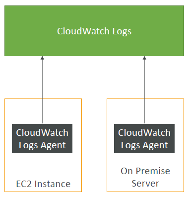

- To summarize the diagram, the CloudWatch Logs service is running and your EC2 instance is running. You will install the CloudWatch Logs agent and this agent will send the log files directly into CloudWatch Logs. For this to work, we need to make sure that our EC2 instance has a proper instance role with the correct IAM permissions to send the log data into CloudWatch Logs. 
- Then, **the CloudWatch log agent can also be setup on on-premises servers as well**, so this is a hybrid agent. It works both on-premises or on AWS and it allows you to collect logs from both your EC2 instances and your on-premises servers directly into the CloudWatch Log service

## Amazon EventBridge (formerly CloudWatch Events)

- it used to be called CloudWatch Events. So if online, you see CloudWatch Events, think about Amazon EventBridge and vice versa, but Amazn EventBridge is the new name
- Schedule: Cron jobs (scheduled scripts)

  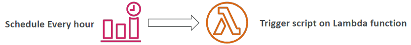

  - With EventBridge, you can react to events happening within your AWS accounts
  - And one use case for them is to schedule cron jobs. You want to have a script scheduled on a regular basis. For example, in EventBridge, you can create a rule that says that every one hour you should have an event created and that event will trigger a script running on a Lambda function. Effectively, you've done a serverless cron job

- Event Pattern: Event rules to react to a service doing something
  
  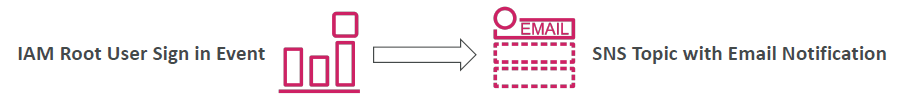

  - But you can also not just react to events happening every hour, we can react to a service doing something. For example, say you wanted to give alerts to your security team whenever someone is going to log in using the root user because, well, the rule is that you should not reuse the root user or only very rarely. So maybe we want to react to the IAM root user sign-in events and then send this into an SNS topic that is combined with email notifications. In that case, whenever someone signs in, we will receive an email

- And you can, as the destination, trigger Lambda functions, send SNS and SQS messages, and so on. Actually, you can do all these things

### Amazon EventBridge Rules

  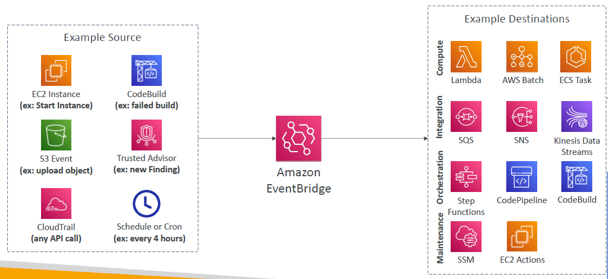

  - Do not linger on this too much. Not to be known for the exam.
  - The sources can be anything you want. It could be EC2 Instances, CodeBuild, S3 Event, Trusted Advisor, and so on. There's a lot and, of course, a schedule. 
  - It goes into EventBridge, and from EventBridge, you can send and trigger many different kinds of destinations. Would it be for compute, for integration, orchestration, maintenance, and so on. This is just a sample

### Amazon EventBridge

  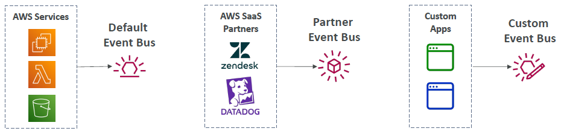

- EventBridge has more capability. What you see here is called the default event bus. 
- From the diagram, there are events happening from within AWS Services, or, for example, your schedules. 
- But it is possible for you to receive events from partners of AWS. For example, if you're using Zendesk, or Datadog, or others that are partnered with AWS, then they can send their own events into your account through a partner event bus, and, therefore, you can react to events happening outside of AWS as well. 
- And finally, you could plug in your own custom applications that would send their own event to your own custom event bus to write any kind of integration you want and be really able to customize everything. EventBridge also has more capability
- **Schema Registry:** EventBridge also has more capability. There is this Schema Registry to model the events schema to see what it looks like, the data types and so on
- You can also **archive all the events** sent to an event bus indefinitely or for a set period
- And then you can **replay these archived events**

## AWS CloudTrail

- **CloudTrail is a service that provides governance, compliance and audit for your AWS Account**
- Whenever you use an account, CloudTrail is enabled by default 
- because CloudTrail will get an **history of all the API calls or events that happen within your AWS account**
  - If someone, for example, logs in the **console** then whatever they do will be logged in CloudTrail
  - If someone uses the **SDK**, it will be logged in CloudTrail
  - If someone does a command with the **CLI** it will again be logged with CloudTrail
  - Any **AWS Service** activity as well will be logged in CloudTrail
- And then for you, for audit and security purposes you can take the logs of all the history of events and API calls made within CloudTrail and send them to two locations, either CloudWatch Logs or Amazon S3
- Now, when you create a trail in CloudTrail, **you can actually apply it to monitor what's happening in all regions (default)**. And then the trail can go into CloudWatch Logs or Amazon S3 or just **drill it down to a single region**. 
- So the exam would ask a question saying, hey for example, a user has deleted something. How would we know what has been deleted and who deleted it and when? Then the **answer is going to be CloudTrail**. So anytime there is an API call that needs to be looked up CloudTrail is going to be the right answer
- If a resource is deleted in AWS, investigate CloudTrail first!

### CloudTrail Diagram

  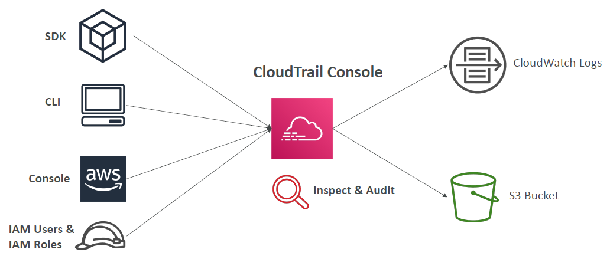

- To summarize the diagram. From within the CloudTrail console, we can have information about usage of the SDK, CLI and Console, as well as any IAM users and IAM roles and all the API calls they make, then the CloudTrail consult will display it. 
- But if you want long term retention of data what you can do is that you can send them to CloudWatch Logs or to your S3 bucket for longer term retention. From within CloudTrail you can do any type of inspection and audit

## AWS X-Ray

- When, by default, some people do debugging in Production once your application is actually deployed
  - the good old way, you would test locally
  - then you would add log statements anywhere
  - Maybe look into how it logs, then you would re-deploy in production, and then see if you can find the problem this way
- And the problem is that we have logs from different services and different applications. Doing log analysis it is very hard because we have to combine everything
- If you have one application that's called a big monolith - one giant application, it's sort of easy to do debugging. But if you have distributed services they're connected through SQS queues, SNS topics, they're decoupled and so on, it becomes really, really hard to trace and see what is happening within your system
- You have no common view of your entire architecture
- But to solve that problem, you can use **AWS X-Ray**

### AWS X-Ray - Visual analysis of our applications

  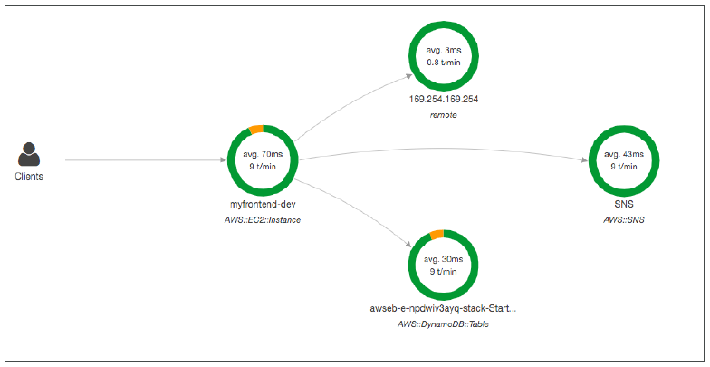

- With X-Ray, you're going to be able to do a tracing and get visual analysis of your application
- So, X-Ray, once you enable it on your services, then you'll get a full picture of what is happening for each service. And see where they're failing, their performance, and in case one request goes wrong, you will be able to visualize it directly into the X-Ray console.

### AWS X-Ray advantages

- The X-Ray advantages is to So, the X-Ray advantages,
  - is to do troubleshooting of the performance through the bottlenecks 
  - or to understand the dependencies in a microservice architecture, because they're all connected as you saw in the previous graph
  - We can pinpoint a service issue with tracing
  - We can review a specific request behavior 
  - find the errors and exceptions for that request
  - We can know if we're meeting or not our service-level agreement, or SLA, meaning are we replying on time for all the requests 
  - And if we're being throttled, if we're being slowed down, where is it happening, in which service? 
  - And finally, what or which users are going to be impacted by these outages
- So, X-Ray really is great when you see, distributed tracing, troubleshooting, and you want to have a service graph
  
## Amazon CodeGuru

- Amazon CodeGuru is a ML-powered service that will do two things. Number one is **automated code reviews**, and number two is **application performance recommendations**. 
- When developers push outheir code, there is usually another developer that does a code review. 
- Then when the code is deployed into production, you need to be able to monitor the performance of your code, and maybe you'll detect bugs by looking at the performance. CodeGuru does that in an automated fashion

  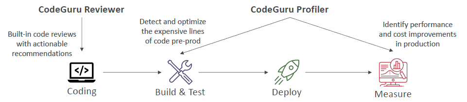

- Provides two functionalities
  - **CodeGuru Reviewer:** CodeGuru Reviewer is here to do automated code reviews with static code analysis (development). That means when you deploy your code onto a repository, for example, CodeCommit or GitHub,then the CodeGuru can have a look at all the lines of code and then can give you actionable recommendations in case it detects a bug or a memory leak or something that it has seen before. Because of this machine learning capability, it can detect bugs before even other reviewers detect them, which is very helpful
  - **CodeGuru Profiler:** CodeGuru Profiler is going to be here to give you visibility/recommendations about your application performance during runtimes or in production. When you build and test your application, CodeGuru Profiler is already going to detect and optimize the expensive lines of code pre-production. And then when you deploy your application, you're going to measure your application in real time, and CodeGuru Profiler, yet again, is going to identify performance and cost improvements in production and give you these recommendations directly in your code

### Amazon CodeGuru Reviewer

  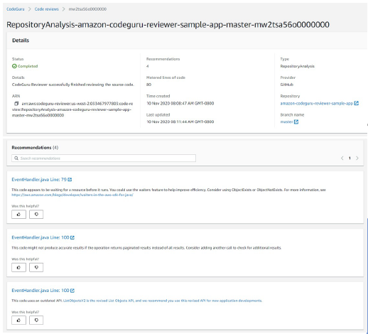

- If we do a deep dive, CodeGuru Reviewer really looks at your commits, so whenever you push your code, and tells you the lines of code that are probably wrong, so it could be very, very handy, so you can identify critical issues, security vulnerabilities, and hard-to-find bugs. 
- For example, you can implement coding best practices, you can find resource leaks, do security detections in case you're creating a security hole, or input validation. 
- The way it does it is using machine learning and automated reasoning. 
- How does it do it? Well, there are code reviews that were analyzed by CodeGuru across thousands of open source repositories out there, and also on all the amazon.com repositories, so this is how it learned to be a code reviewer through machine learning. 
- It supports currently Java and Python 
- It has integration with GitHub, Bitbucket, and AWS CodeCommit

### Amazon CodeGuru Profiler

  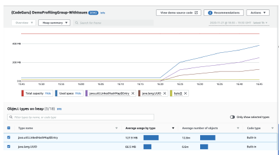

- Lastly, CodeGuru Profiler. CodeGuru Profiler is when your application is in production or in pre-prod, and it helps understand the runtime behavior of your application, 
- and to look at what consumes excessive CPU capacity, for example, on the logging routine. 
- Features: 
  - It will allow you to identify and remove code inefficiencies
  - Improve the application performance, for example, reduce the CPU utilization 
  - Decrease compute costs
  - Provide heap summaries so to identify which objects are taking a lot of space in memory
  - Anomaly detection, as well, in case your application behaves weirdly
- It also supports applications that will be running on AWS Cloud or even on-premises
- And there's going to be a minimal overhead on the application to be monitored using CodeGuru Profiler

## AWS Health Dashboard - Service History

  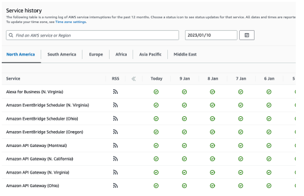

- The Service History will show you all the regions and all the services' health. It looks like as shown in the diagram. You can follow, based on the region you're in, how a service behaved, if there was any issue with it. 
- You can look at history. The diagram shows for each day
- There is an RSS feed you can subscribe to. 
- It used to be previously called the **AWS Service Health Dashboard**

## AWS Health Dashboard - Your Account

- The next one is the AWS Health Dashboard, which is for your accounts. It was used to be called the **AWS Personal Health Dashboard** (PHD), but now just Health Dashboard for Your Accounts
- It'll provide you **alerts and remediation guidance** when AWS is going to be experiencing **events that impact you directly**
- While the Service Health Dashboard will display a general status of all your services, the Account Health Dashboard will give you a **personalized view for the performance and the availability for the AWS services that you're actually using in your accounts and your resources**
- It gives you **relevant and timely information** and also gives you **proactive notifications** to look out for **scheduled maintenance activities** 
- On top of it, within this Health Dashboard for Your Accounts you **can aggregate data for your entire AWS organization**
- To get access to your health dashboard, just click on the top right corner next to the bell and you'll have access to it. 
- It's a global service and it will show directly the outages that directly impact you

  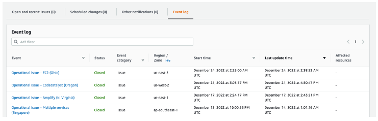

- You will get the event log to see past events. And you can see, for example, in the diagram, there was an EC2 issue in US East 2. So you'll get alerts, remediation information, proactive notification in case there is a scheduled change, as well as scheduled activities

## Cloud Monitoring Summary

- **CloudWatch:**
  - **Metrics:** monitor the performance of AWS services and billing metrics
  - **Alarms:** automate notification, perform EC2 action, notify to SNS based on metric
  - **Logs:** collect log files from EC2 instances, servers, Lambda functions...
  - **Events (or EventBridge):** react to events in AWS, or trigger a rule on a schedule
- **CloudTrail:** audit API calls made within your AWS account
- **CloudTrail Insights:** automated analysis of your CloudTrail Events
- **X-Ray:** trace requests made through your distributed applications
- **AWS Health Dashboard:** status of all AWS services across all regions
- **AWS Account Health Dashboard:** AWS events that impact your infrastructure
- **Amazon CodeGuru:** automated code reviews and application performance recommendations