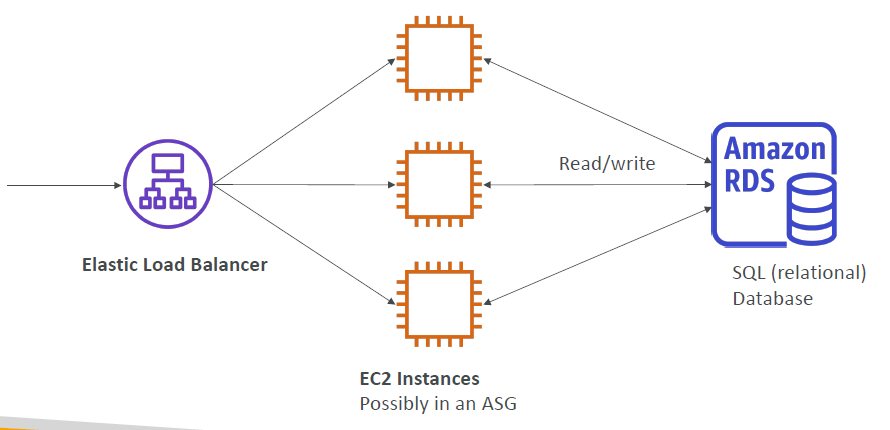
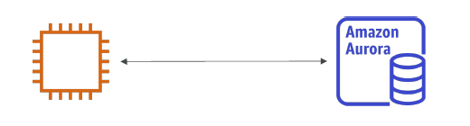
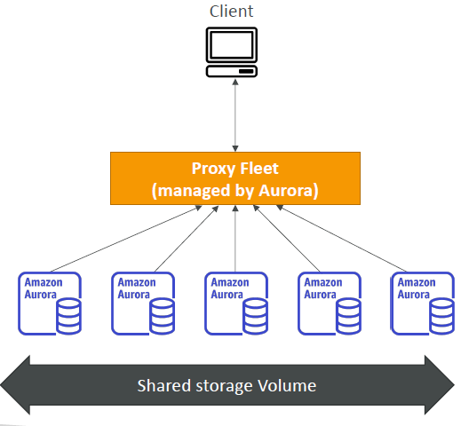

# Databases & Analytics

- [Databases \& Analytics](#databases--analytics)
  - [Databases Intro](#databases-intro)
  - [Relational Databases (SQL)](#relational-databases-sql)
  - [NoSQL Databases](#nosql-databases)
    - [NoSQL data example: JSON](#nosql-data-example-json)
  - [Databases \& Shared Responsibility on AWS](#databases--shared-responsibility-on-aws)
  - [AWS RDS Overview](#aws-rds-overview)
    - [Advantage over using RDS versus deploying DB on EC2](#advantage-over-using-rds-versus-deploying-db-on-ec2)
  - [RDS Solution Architecture](#rds-solution-architecture)
  - [Amazon Aurora](#amazon-aurora)
  - [Amazon Aurora Serverless](#amazon-aurora-serverless)
    - [RDS Deployments](#rds-deployments)
    - [RDS Deployments: Read Replicas, Multi-AZ](#rds-deployments-read-replicas-multi-az)
    - [RDS Deployments: Multi-Region](#rds-deployments-multi-region)
  - [Amazon ElastiCache Overview](#amazon-elasticache-overview)
  - [DynamoDB Overview](#dynamodb-overview)
    - [DynamoDB Accelerator (DAX)](#dynamodb-accelerator-dax)
    - [DynamoDB Global Tables](#dynamodb-global-tables)
  - [Redshift Overview](#redshift-overview)
  - [Amazon EMR (Elastic MapReduce) Overview](#amazon-emr-elastic-mapreduce-overview)
  - [Amazon Athena Overview](#amazon-athena-overview)
  - [Amazon QuickSight Overview](#amazon-quicksight-overview)
  - [DocumentDB (with MongoDB Compatibility) Overview](#documentdb-with-mongodb-compatibility-overview)
  - [Amazon Neptune Overview](#amazon-neptune-overview)
  - [Amazon QLDB](#amazon-qldb)
  - [Amazon Managed Blockchain Overview](#amazon-managed-blockchain-overview)
  - [AWS Glue Overview](#aws-glue-overview)
  - [DMS - Database Migration Service Overview](#dms---database-migration-service-overview)
  - [Databases \& Analytics Summary](#databases--analytics-summary)

## Databases Intro

- Storing data on disk (EFS, EBS, EC2 Instance Store, S3) can have its limits
- Sometimes, you want to store data in a database...
- You can **structure** the data
- You build **indexes** to efficiently **query** / **search** through the data
- You define **relationships** between your datasets
- Databases are **optimized for a purpose** and come with different features, shapes and constraints
- **Managed Databases**: AWS takes care of maintenance, backups, and security for databases.
- **Benefits**: Reduced operational complexity, built-in high availability, disaster recovery, scalability, and enhanced security.
- **Types of databases:**
  - **Relational Databases** (SQL)
  - **NoSQL Databases**
  - **Data Warehousing**
  - **In-memory Caching**

## Relational Databases (SQL)

- Looks just like Excel spreadsheets, with links between each table
- Can use SQL language to perform queries / lookups
- **Structured Data**: Stored in predefined schema tables, managed with SQL
- **Use Cases**: Transactional applications, financial systems
- **Examples**: MySQL, PostgreSQL, Oracle, SQL Server, MariaDB

## NoSQL Databases

- NoSQL = non-SQL = non-relational databases
- NoSQL databases are modern databases built for a specific data models and have flexible schemas for building modern applications. The schema is basically the shape of the data
- **Use Cases**: Real-time applications, IoT, mobile apps.
- Benefits:
  - Flexibility: easy to evolve data model
  - Scalability: designed to scale-out by using distributed clusters. For example, in relational databases, it is not easy to add servers to scale it, you have to do a vertical scaling, but with NoSQL databases, you can do horizontal scaling
  - High-performance: means it is optimized for a specific data model
  - Highly functional: means its types are optimized for the data model
- **Examples**: Key-value, document, graph, in-memory, search databases

### NoSQL data example: JSON

- JSON is a common form of data that fits into a NoSQL model
- Data can be **nested**
- Fields can **change** over time
- Support for new types: **arrays**, etc...

```json
{
  "name": "Abc",
  "age": 30,
  "cars": [
    "Ford",
    "BMW",
    "Fiat"
  ],
  "address": {
    "type": "house",
    "number": 23,
    "street": "Abc Road"
  }
}
```

## Databases & Shared Responsibility on AWS

- AWS offers us to **manage** different databases
- **Benefits include:**
  - Quick to provision, High Availability, Vertical and Horizontal Scaling
  - They also include some utilities to do Automated Backup & Restore, Operations, Upgrades
  - Operating System Patching of the underlying instance is handled by AWS
  - Monitoring, alerting are going to be integrated
- Note: many database technologies could be run on EC2, but when you install your database on the EC2 instance, then you must handle yourself the resiliency, backup, patching, high availability, fault tolerance, and scaling. This is why using a managed databases are going to be a lifesaver

| **AWS Responsibility**                      | **Customer Responsibility**                      |
| ------------------------------------------- | ------------------------------------------------ |
| Infrastructure management, backups, patches | Data security, encryption, access controls (IAM) |
| Availability and failover                   | Data management, monitoring, performance tuning  |

## AWS RDS Overview

- **RDS (Relational Database Service)**: 
  - Fully managed service for relational databases.
  - It's a managed DB service for DB use SQL as a query language.
  - It allows you to create databases in the cloud that are managed by AWS
  - Supports 
    - **MySQL**
    - **PostgreSQL**
    - **MariaDB**
    - **Oracle**
    - **Microsoft SQL Server**
    - **IBM DB2**
    - **Aurora (AWS Proprietary Database)**
  - AWS itself handles **backup**, **patching**, **high availability** (Multi-AZ), and **scaling**.

### Advantage over using RDS versus deploying DB on EC2

- RDS is a managed service:
  - Automated provisioning of the database, OS patching will be done by WS
  - Continuous backups and restore to specific timestamp (Point in Time Restore)!
  - Monitoring dashboards to see if our database is doing good
  - Read replicas for improved read performance
  - Multi AZ setup for DR (Disaster Recovery)
  - Maintenance windows for upgrades
  - Scaling capability (vertical and horizontal)
  - Storage backed by EBS (gp2 or io1)
- BUT you can't SSH into your instances since AWS manages the database entirely for us

## RDS Solution Architecture

- We have our load balancer fronting multiple backend EC2 instances possibly into an Auto Scaling Group and they need to store and share the data somewhere. 
- It is a structured data which is not using EBS, EFS or EC2 Instance Store
- They will be using a database. Relational database in this case, so SQL based
- EC2 instances will be connecting to the database and doing read/writes all at once. All EC2 instances will be sharing the same database in the backend

  

## Amazon Aurora

- Aurora is a proprietary technology from AWS (not open sourced)
- Works same way as RDS and we have our EC2 instances connecting directly into Amazon Aurora

  

- **PostgreSQL** and **MySQL** are both supported as Aurora DB
- Aurora is "AWS cloud optimized" and claims 5x performance improvement over MySQL on RDS, over 3x the performance of Postgres on RDS
- Aurora storage automatically grows in increments of 10GB, up to 128 TB
- Aurora costs more than RDS (20% more) – but is more efficient
- Not in the free tier
- Aurora is more cloud-native compared to RDS which runs the technologies you know directly as a managed service 

## Amazon Aurora Serverless

- We have a **serverless** option for Amazon Aurora where database instantiation is going to be automated and on top of it, you will have auto-scaling based on actual usage of your database
- **PostgreSQL** and **MySQL** are both supported as Aurora Serverless DB
- No capacity planning needed
- Least management overhead
- Pay per second, can be more cost-effective than provisioning an Aurora cluster yourself
- Use cases: good for infrequent, intermittent or unpredictable workloads. How does that work?
  - From client's perspective, it connects to a proxy fleet that is managed by Aurora
  - Aurora, behind the scenes, is going to instantiate database instances when it needs to scale up or down
  - These Aurora databases are going to be sharing the same storage volume no matter what
  - From exam perspective, if you see Aurora with no management overhead, think of Aurora Serverless 

  

### RDS Deployments

- **Read Replicas**: Improves read performance, **asynchronous** replication.
- **Multi-AZ**: Automatic failover, high availability for production environments.
- **Multi-Region**: Disaster recovery across regions, global availability.

### RDS Deployments: Read Replicas, Multi-AZ

| Read Replicas                       | Multi-AZ                                          |
| ----------------------------------- | ------------------------------------------------- |
| Scale the read workload of your DB (scalability) | Failover in case of AZ outage (high availability) |
| Can create up to 5 Read Replicas    | Data is only read/written to the main database    |
| Data is only written to the main DB | Can only have 1 other AZ as failover              |


### RDS Deployments: Multi-Region

- Multi-Region (Read Replicas)
  - Disaster recovery in case of region issue
  - Local performance for global reads
  - Replication cost


## Amazon ElastiCache Overview

- **ElastiCache**: In-memory data caching service.
  - **Redis**: Advanced key-value store with replication and persistence.
  - **Memcached**: Simple, memory-only caching service.
  - Reduces database load and speeds up applications by **caching frequent queries**.
  - Caches are in-memory databases with high performance, low latency
  - AWS takes care of OS maintenance / patching, optimizations, setup, configuration, monitoring, failure recovery and backup

## DynamoDB Overview

- Fully managed, serverless NoSQL database.
- Supports key-value and document data models.
- Automatically scales based on demand.
- Provides high availability and durability with replication across 3 AZ
- Millions of requests per seconds, trillions of row, 100s of TB of storage
- Fast and consistent in performance
- Single-digit millisecond latency – low latency retrieval
- Integrated with IAM for security, authorization and administration
- Low cost and auto scaling capabilities
- Standard & Infrequent Access (IA) Table Class

### DynamoDB Accelerator (DAX)

- In-memory caching for DynamoDB.
- **10x faster** read performance.  Single-digit millisecond latency to microseconds latency – when accessing your DynamoDB tables
- Secure, highly scalable & highly available
- Ideal for use cases where **low-latency reads** are critical.

### DynamoDB Global Tables

- Multi-region replication for **global** applications.
- **Low-latency** reads and writes across multiple regions.
- Ensures data availability globally with **multi-master replication**.

## Redshift Overview

- Managed data warehousing service.
- Optimized for **online analytical processing (OLAP)** and big data analytics.
- Uses **columnar storage** for fast query performance.
- 10x better performance than other data warehouses, scale to PBs of data
- Columnar storage of data (instead of row based)
- Supports integration with **BI tools** (QuickSight, Tableau).
- Massively Parallel Query Execution (MPP), highly available.
- Has a SQL interface for performing the queries.
- Pay-per-query or **reserved instances** for cost savings.
- Designed for **massive datasets**.

## Amazon EMR (Elastic MapReduce) Overview

- Managed big data processing service.
- Uses **Hadoop**, **Apache Spark**, and **Hive** for processing large data sets.
- Ideal for **data transformation**, **machine learning**, and **ETL** (Extract, Transform, Load).
- Integration with **S3**, **DynamoDB**, and **Redshift**.
- The clusters can be made of hundreds of EC2 instances
- EMR takes care of all the provisioning and configuration
- Auto-scaling and integrated with Spot instances
- Use cases: data processing, machine learning, web indexing, big data

## Amazon Athena Overview

- Serverless query service
- Use **SQL** to query structured and unstructured data stored in **S3**.
- No infrastructure to manage, pay-per-query.
- Supports various formats like **CSV**, **JSON**, **Parquet**, and **ORC**.
- Pricing: $5.00 per TB of data scanned
- Use compressed or columnar data for cost-savings (less scan)
- Use cases: Business intelligence / analytics / reporting, analyze & query VPC Flow Logs, ELB Logs, CloudTrail trails, etc...
- Analyze data in S3 using serverless SQL, use Athena

## Amazon QuickSight Overview

- Business Intelligence (BI) tool for data visualization.
- Serverless machine learning-powered business intelligence service to create interactive dashboards
- Fast, automatically scalable, embeddable, with per-session pricing
- Supports data from S3, Redshift, RDS, and other AWS data sources.
- **Pay-per-session** pricing model for cost efficiency.
- Use cases:
  - Business analytics
  - Building visualizations
  - Perform ad-hoc analysis
  - Get business insights using data

## DocumentDB (with MongoDB Compatibility) Overview

- Managed document database, **MongoDB-compatible**.
- DocumentDB is the same for MongoDB (which is a NoSQL database)
- Highly scalable and durable with **Multi-AZ**.
- Built for **JSON** document storage.
- Aurora storage automatically grows in increments of 10GB, up to 64 TB.
- Automatically scales to workloads with millions of requests per seconds
- Use cases: Content management, cataloging, and mobile backends.

## Amazon Neptune Overview

- Fully managed graph database
- A popular graph dataset would be a social network
  - Users have friends
  - Posts have comments
  - Comments have likes from users
  - Users share and like posts…
- Highly available across 3 AZ, with up to 15 read replicas
- Build and run applications working with highly connected datasets – optimized for these complex and hard queries
- Can store up to billions of relations and query the graph with milliseconds latency
- Highly available with replications across multiple AZs
- Great for knowledge graphs (Wikipedia), fraud detection, recommendation engines, social networking

## Amazon QLDB

- QLDB stands for ”Quantum Ledger Database”
- A ledger is a book **recording financial transactions**
- Fully Managed, Serverless, High available, Replication across 3 AZ
- Used to **review history of all the changes made to your application data** over time
- **Immutable** system: no entry can be removed or modified, cryptographically verifiable
- 2-3x better performance than common ledger blockchain frameworks, manipulate data using SQL
- Difference with Amazon Managed Blockchain: no decentralization component, in accordance with financial regulation rules

## Amazon Managed Blockchain Overview

- Blockchain makes it possible to build applications where multiple parties can execute transactions without the need for a trusted, central authority.
- Amazon Managed Blockchain is a managed service to:
  - Join public blockchain networks
  - Or create your own scalable private network
- Compatible with the frameworks Hyperledger Fabric & Ethereum

## AWS Glue Overview

- Managed extract, transform, and load (ETL) service
- Useful to prepare and transform data for analytics
- Fully serverless service
- Glue Data Catalog: catalog of datasets
  - can be used by Athena, Redshift, EMR

## DMS - Database Migration Service Overview

- Quickly and securely migrate databases to AWS, resilient, self healing
- The source database remains available during the migration
- Supports:
  - Homogeneous migrations: ex Oracle to Oracle
  - Heterogeneous migrations: ex Microsoft SQL Server to Aurora

## Databases & Analytics Summary

- Relational Databases - OLTP: RDS & Aurora (SQL)
- Differences between Multi-AZ, Read Replicas, Multi-Region
- In-memory Database: ElastiCache
- Key/Value Database: DynamoDB (serverless) & DAX (cache for DynamoDB)
- Warehouse - OLAP: Redshift (SQL)
- Hadoop Cluster: EMR
- Athena: query data on Amazon S3 (serverless & SQL)
- QuickSight: dashboards on your data (serverless)
- DocumentDB: “Aurora for MongoDB” (JSON – NoSQL database)
- Amazon QLDB: Financial Transactions Ledger (immutable journal, cryptographically verifiable)
- Amazon Managed Blockchain: managed Hyperledger Fabric & Ethereum blockchains
- Glue: Managed ETL (Extract Transform Load) and Data Catalog service
- Database Migration: DMS
- Neptune: graph database
