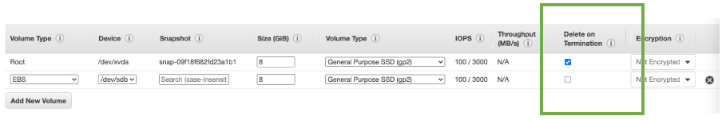
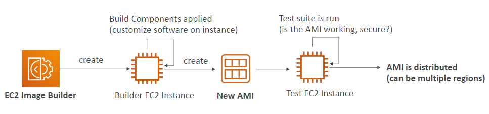
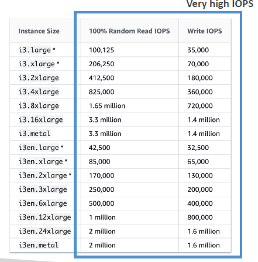
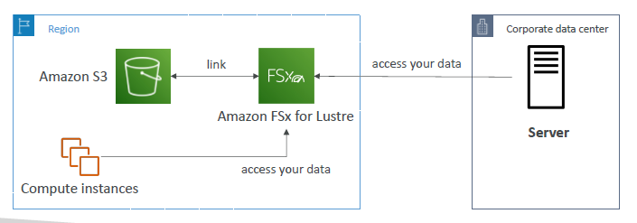

# EC2 Instance Storage

- [EC2 Instance Storage](#ec2-instance-storage)
  - [EBS Volumes](#ebs-volumes)
    - [What's an EBS Volume?](#whats-an-ebs-volume)
    - [EBS Volume](#ebs-volume)
    - [EBS – Delete on Termination Attribute](#ebs--delete-on-termination-attribute)
    - [EBS Snapshots](#ebs-snapshots)
    - [EBS Snapshots Features](#ebs-snapshots-features)
  - [AMI Overview](#ami-overview)
    - [AMI Process (from an EC2 instance)](#ami-process-from-an-ec2-instance)
  - [EC2 Image Builder](#ec2-image-builder)
  - [EC2 Instance Store](#ec2-instance-store)
  - [Local EC2 Instance Store](#local-ec2-instance-store)
  - [EFS: Elastic File System](#efs-elastic-file-system)
  - [EBS vs EFS](#ebs-vs-efs)
  - [EFS Infrequent Access (EFS-IA)](#efs-infrequent-access-efs-ia)
  - [Shared Responsibility Model for EC2 Storage](#shared-responsibility-model-for-ec2-storage)
  - [Amazon FSx – Overview](#amazon-fsx--overview)
    - [Amazon FSx for Windows File Server](#amazon-fsx-for-windows-file-server)
    - [Amazon FSx for Lustre](#amazon-fsx-for-lustre)
  - [EC2 Instance Storage Summary](#ec2-instance-storage-summary)

## EBS Volumes

- AWS official Doc. <https://docs.aws.amazon.com/ebs/latest/userguide/ebs-volumes.html>

### What's an EBS Volume?

- An EBS (Elastic Block Store) Volume is a network drive you can attach
to your instances while they run
- It allows your instances to persist data, even after their termination
- **They can only be mounted to one instance at a time (at the CCP level)**
- They are bound to **a specific availability zone**
- Analogy: Think of them as a "network USB stick". it's a USB stick that you can take from a computer and put it in another computer.
- Free tier: 30 GB of free EBS storage of type General Purpose (SSD) or Magnetic per month

### EBS Volume

- It's a network drive (i.e. not a physical drive)
  - It uses the network to communicate the instance, which means there might be a bit of latency
  - It can be detached from an EC2 instance and attached to another one quickly
- It's locked to an Availability Zone (AZ)
  - An EBS Volume in us-east-1a cannot be attached to us-east-1b
  - To move a volume across, you first need to snapshot it
- Have a provisioned capacity (size in GBs, and IOPS) in advance. You need to say how many GBs you want in advance and the IOPS, which is I/O operations per seconds, and you're basically defining how you want your EBS volumes to perform.
  - You get billed for all the provisioned capacity
  - You can increase the capacity of the drive over time if you want to have a better performance or more size.
- As it is evident from the below diagram, we cannot attach the same EBS volume to two EC2 instances at a time at the CCP level. 
- However, it is very possible to have two EBS volumes attached to one EC2 instance. Think of it as two network USB sticks into one machine.
- EBS volumes are linked to an availability zone. If you want EBS volumes in other AZs then in that case you need to create EBS volumes in the other AZ.

  

### EBS – Delete on Termination Attribute

  

- Controls whether the EBS volume is automatically deleted when the associated EC2 instance is terminated
  - By default, the root EBS volume is deleted (attribute enabled)
  - By default, any other attached EBS volume is not deleted (attribute disabled)
- This can be controlled by the AWS console / AWS CLI
- **Use case: preserve root volume when instance is terminated**

### EBS Snapshots

- Make a backup (snapshot) of your EBS volume at a point in time
- Not necessary to detach volume to do snapshot, but recommended
- Can copy snapshots across AZ or Region

  

### EBS Snapshots Features

- **EBS Snapshot Archive**
  - Move a Snapshot to an "archive tier" that is 75% cheaper
  - Takes within 24 to 72 hours for restoring the archive
  
  

- **Recycle Bin for EBS Snapshots**
  - Setup rules to retain deleted snapshots so you can recover them after an accidental deletion
  - Specify retention (from 1 day to 1 year)

  

## AMI Overview

- AMI = Amazon Machine Image
- AMI are a **customization** of an EC2 instance
  - You add your own software, configuration, operating system, monitoring…
  - Faster boot / configuration time because all your software is pre-packaged
- AMI are built for a **specific region** (and can be copied across regions)
- You can launch EC2 instances from:
  - **A Public AMI:** AWS provided
  - **Your own AMI:** you make and maintain them yourself
  - **An AWS Marketplace AMI:** an AMI someone else made (and potentially sells)

### AMI Process (from an EC2 instance)

- Start an EC2 instance and customize it
- Stop the instance (for data integrity)
- Build an AMI – this will also create EBS snapshots
- Launch instances from other AMIs

  

## EC2 Image Builder

- Used to automate the creation of Virtual Machines or container images
- => Automate the creation, maintain, validate and test **EC2 AMIs**
- Can be run on a schedule (weekly, whenever packages are updated, etc…)
- Free service (only pay for the underlying resources)

  

## EC2 Instance Store

- EBS volumes are network drives with good but "limited" performance
- If you need a high-performance hardware disk, use EC2 Instance Store
- Better I/O performance
- EC2 Instance Store lose their storage if they're stopped (ephemeral)
- Good for buffer / cache / scratch data / temporary content
- Risk of data loss if hardware fails
- Backups and Replication are your responsibility

## Local EC2 Instance Store

  

## EFS: Elastic File System

- Managed NFS (network file system) that can be mounted on 100s of EC2
- EFS works with Linux EC2 instances in multi-AZ
- Highly available, scalable, expensive (3x gp2), pay per use, no capacity planning

  

## EBS vs EFS

  

## EFS Infrequent Access (EFS-IA)

• **Storage class** that is cost-optimized for files not accessed every day
• Up to 92% lower cost compared to EFS Standard
• EFS will automatically move your files to EFS-IA based on the last time they were accessed
• Enable EFS-IA with a Lifecycle Policy
• Example: move files that are not accessed for 60 days to EFS-IA
• Transparent to the applications accessing EFS

  

## Shared Responsibility Model for EC2 Storage

| **AWS Responsibilities** | **User Responsibilities** |
| ------------------------ | ------------------------- |
| Ensure durability and availability of EBS and EFS storage | Back up data via snapshots, EFS replication, etc. |
| Data replication within the AZ for EBS volumes | Manage access and encryption of storage resources |
| Provide encryption capabilities (KMS integration) | Apply encryption for sensitive data at rest |
| Replacing faulty hardware | Responsibility of any data on the drives |

## Amazon FSx – Overview

- Launch 3rd party high-performance file systems on AWS
- Fully managed service providing file systems optimized for different workloads.
  - FSx for Lustre
  - FSx for Windows File Server
  - FSx for NetApp ONTAP

### Amazon FSx for Windows File Server

- A fully managed, highly reliable, and scalable **Windows native** shared file system
- Built on **Windows File Server**
- Supports **SMB protocol** & Windows NTFS
- Integrated with Microsoft Active Directory
- Can be accessed from AWS or your on-premise infrastructure

  

### Amazon FSx for Lustre

- A fully managed, high-performance, scalable file storage for **High Performance Computing (HPC)**
- The name Lustre is derived from "Linux" and "cluster"
- Machine Learning, Analytics, Video Processing, Financial Modeling, …
- Scales up to 100s GB/s, millions of IOPS, sub-ms latencies

  

## EC2 Instance Storage Summary

- **EBS volumes:**
  - network drives attached to one EC2 instance at a time
  - Mapped to an Availability Zones
  - Can use EBS Snapshots for backups / transferring EBS volumes across AZ
- **AMI:** create ready-to-use EC2 instances with our customizations
- **EC2 Image Builder:** automatically build, test and distribute AMIs
- **EC2 Instance Store:**
  - High performance hardware disk attached to our EC2 instance
  - Lost if our instance is stopped / terminated
- **EFS:** network file system, can be attached to 100s of instances in a region
- **EFS-IA:** cost-optimized storage class for infrequent accessed files
- **FSx for Windows:** Network File System for Windows servers
- **FSx for Lustre:** High Performance Computing Linux file system
