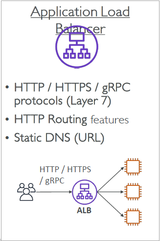
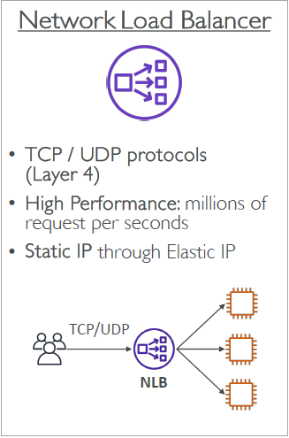
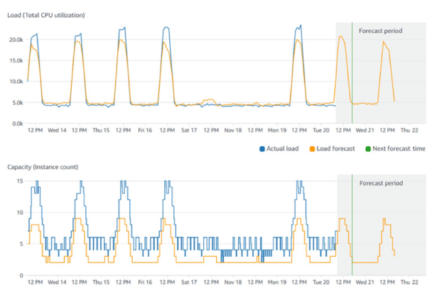

# Elastic Load Balancing & Auto Scaling Groups

- [Elastic Load Balancing \& Auto Scaling Groups](#elastic-load-balancing--auto-scaling-groups)
  - [Scalability \& High Availability](#scalability--high-availability)
  - [Vertical Scalability](#vertical-scalability)
  - [Horizontal Scalability](#horizontal-scalability)
  - [High Availability](#high-availability)
  - [High Availability \& Scalability for EC2](#high-availability--scalability-for-ec2)
  - [Scalability vs Elasticity (vs Agility)](#scalability-vs-elasticity-vs-agility)
  - [What is Load Balancing?](#what-is-load-balancing)
    - [Why Use a Load Balancer?](#why-use-a-load-balancer)
    - [Why Use an Elastic Load Balancer?](#why-use-an-elastic-load-balancer)
      - [Types of ELB](#types-of-elb)
  - [What's an Auto Scaling Group?](#whats-an-auto-scaling-group)
    - [Auto Scaling Group in AWS](#auto-scaling-group-in-aws)
    - [Auto Sclaing Group in AWS with Load Balancer](#auto-sclaing-group-in-aws-with-load-balancer)
    - [Auto Scaling Group Scaling Strategies](#auto-scaling-group-scaling-strategies)
  - [ELB \& ASG Summary](#elb--asg-summary)

## Scalability & High Availability

- **Scalability**: Ability of a system to handle an increase in load by adapting to the demand.
- **High Availability**: Ensures a system is operational and accessible for a high percentage of time, often achieved by reducing the impact of failures.
- There are **two kinds** of scalability:
  - Vertical Scalability
  - Horizontal Scalability (= elasticity)
- **Scalability is linked but different to High Availability**

## Vertical Scalability

- Vertical Scalability means increasing the size of the instance
• For example, your application runs on a t2.micro
• Scaling that application vertically means running it on a t2.large
• Vertical scalability is very common for non distributed systems, such as a database.
• There's usually a limit to how much you can vertically scale (hardware limit)

## Horizontal Scalability

- Horizontal Scalability means increasing the number of instances / systems for your application
- Horizontal scaling implies distributed systems.
- This is very common for web applications / modern applications
- It's easy to horizontally scale thanks the cloud offerings such as Amazon EC2

## High Availability

- High Availability usually goes hand in hand with Horizontal Scaling
- High Availability means running your application / system in at least 2 Availability Zones
- The goal of High Availability is to survive a data center loss (disaster)

## High Availability & Scalability for EC2

- Vertical Scaling: Increase instance size (= scale up / down)
  - From: t2.nano - 0.5G of RAM, 1 vCPU
  - To: u-12tb1.metal – 12.3 TB of RAM, 448 vCPUs
- Horizontal Scaling: Increase number of instances (= scale out / in)
  - Auto Scaling Group
  - Load Balancer
- High Availability: Run instances for the same application across multi AZ
  - Auto Scaling Group multi AZ
  - Load Balancer multi AZ

## Scalability vs Elasticity (vs Agility)

| **Term**        | **Definition**                                                                                                    |
| --------------- | ----------------------------------------------------------------------------------------------------------------- |
| **Scalability** | ability to accommodate a larger load by making the hardware stronger (scale up), or by adding nodes (scale out)   |
| **Elasticity**  | once a system is scalable, elasticity means that there will be some “auto-scaling” so that the system can scale based on the load. This is “cloud-friendly”: pay-per-use, match demand, optimize costs |
| **Agility**     | (not related to scalability - distractor) new IT resources are only a click away, which means that you reduce the time to make those resources available to your developers from weeks to just minutes. |

## What is Load Balancing?

- Load balancers are servers that forward internet traffic to multiple servers (EC2 Instances) downstream.

  

### Why Use a Load Balancer?

- Spread load across multiple downstream instances
- Expose a single point of access (DNS) to your application
- Seamlessly handle failures of downstream instances
- Do regular health checks to your instances
- Provide SSL termination (HTTPS) for your websites
- High availability across zones

### Why Use an Elastic Load Balancer?

- An ELB (Elastic Load Balancer) is a **managed load balancer**
  - AWS guarantees that it will be working
  - AWS takes care of upgrades, maintenance, high availability
  - AWS provides only a few configuration knobs
- It costs less to setup your own load balancer but it will be a lot more effort on your end (maintenance, integrations)
- 4 kinds of load balancers offered by AWS:
  - Application Load Balancer (HTTP / HTTPS only) – Layer 7
  - Network Load Balancer (ultra-high performance, allows for TCP) – Layer 4
  - Gateway Load Balancer – Layer 3
  - Classic Load Balancer (retired in 2023) – Layer 4 & 7

#### Types of ELB

1. **Application Load Balancer (ALB)**: For HTTP and HTTPS traffic, operates at Layer 7 (application level).

  

2. **Network Load Balancer (NLB)**: Handles high-performance traffic at Layer 4 (transport level).

  

3. **Gateway Load Balancer (GWLB)**: Layer 3

  

4. **Classic Load Balancer**: (retired in 2023) – Layer 4 & 7. This was replaced by ALB and NLB.

## What's an Auto Scaling Group?

- In real-life, the load on your websites and application can change
- In the cloud, you can create and get rid of servers very quickly
- The goal of an Auto Scaling Group (ASG) is to:
  - Scale out (add EC2 instances) to match an increased load
  - Scale in (remove EC2 instances) to match a decreased load
  - Ensure we have a minimum and a maximum number of machines running
  - Automatically register new instances to a load balancer
  - Replace unhealthy instances
- Cost Savings: only run at an optimal capacity (principle of the cloud)

### Auto Scaling Group in AWS

  

### Auto Sclaing Group in AWS with Load Balancer

  

### Auto Scaling Group Scaling Strategies

- **Manual Scaling**: Adjusting the number of instances manually based on load prediction.
- **Dynamic Scaling**: Automatically adjusts the number of instances based on demand (e.g., CPU usage).
  - **Simple / Step Scaling**
    - When a CloudWatch alarm is triggered (example CPU > 70%), then add 2 units
    - When a CloudWatch alarm is triggered (example CPU < 30%), then remove 1
  - **Target Tracking Scaling**
    - Example: I want the average ASG CPU to stay at around 40%
  - **Scheduled Scaling**
    - Anticipate a scaling based on known usage patterns
    - Example: increase the min. capacity to 10 at 5 pm on Fridays
- **Predictive Scaling**: 
  - Uses Machine Learning to predict future traffic ahead of time
  - Automatically provisions the right number of EC2 instances in advance
  - Useful when your load has predictable timebased patterns

  

## ELB & ASG Summary

- **High Availability vs Scalability** (vertical and horizontal) vs **Elasticity** vs **Agility** in the Cloud
- **Elastic Load Balancers (ELB)**
  - Distribute traffic across backend EC2 instances, can be Multi-AZ
  - Supports health checks
  - 4 types: Application LB (HTTP – L7), Network LB (TCP – L4), Gateway LB (L3), Classic LB (old)
- **Auto Scaling Groups (ASG)**
  - Implement Elasticity for your application, across multiple AZ
  - Scale EC2 instances based on the demand on your system, replace unhealthy
  - Integrated with the ELB
