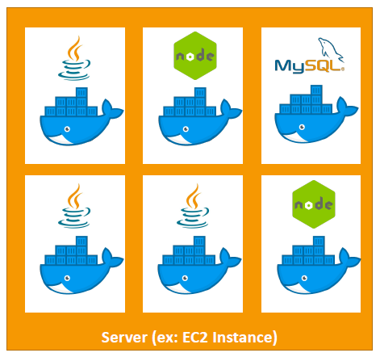
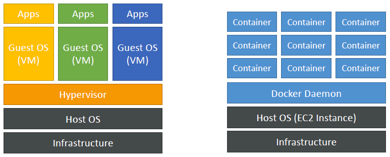
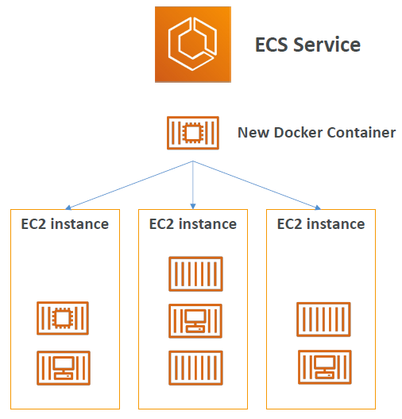
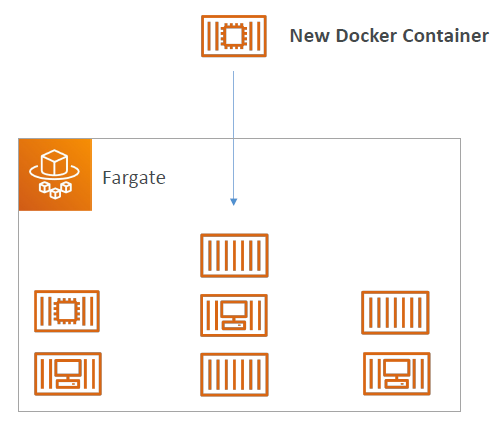
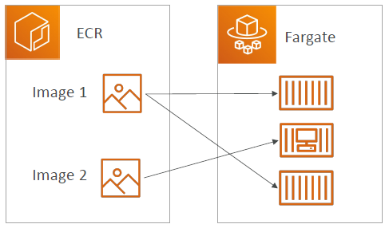
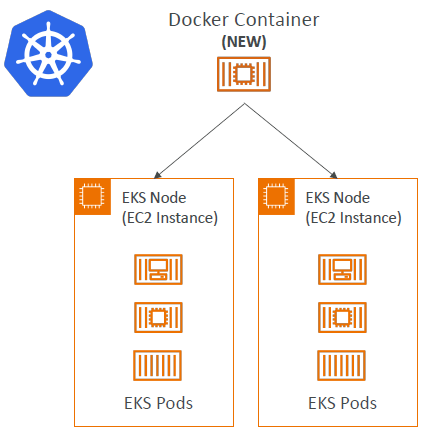
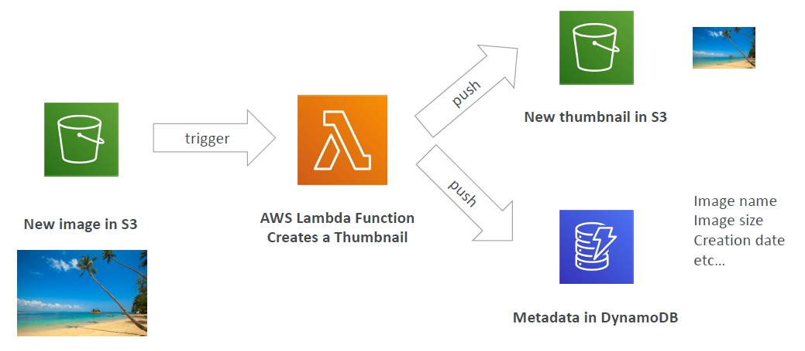
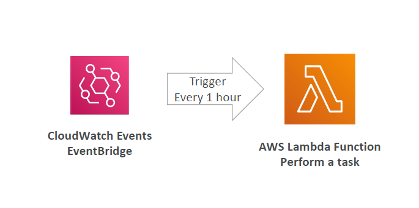
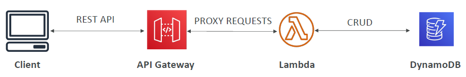
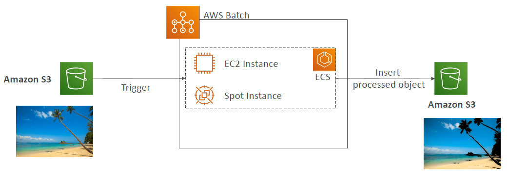

# Other Compute

## What is Docker?

- Docker is a software development platform to deploy apps
- Apps are packaged in **containers** that can be run on any OS
- **Apps run the same, regardless of where they're run**
  - Any machine
  - No compatibility issues
  - Predictable behavior
  - Less work
  - Easier to maintain and deploy
  - Works with any language, any OS, any technology
- Scale containers up and down very quickly (seconds)

### Docker on an OS

- If we talk about Docker on an EC2 instance, a Docker running Java code, a Docker running NodeJS code, a Docker running a MySQL database and so on all onto the same EC2 instance
- The idea is if we managed to package our application in a Docker container, then it will become very easy for us to run it on an EC2 instance 
  
  

### Where are Docker images stored?

- You need to create Docker images and that is how you run a container
- **Docker Hub**: Centralized public repository for storing Docker images
- **Public:** Docker Hub <https://hub.docker.com/>
  - Find base images for many technologies or OS:
    - Ubuntu OS
    - MySQL DB
    - NodeJS, Java etc..  
- **Private:** **Amazon ECR (Elastic Container Registry)**: AWS service for storing, managing, and deploying container images

### Docker versus Virtual Machines

- Docker is "sort of" a virtualization technology, but not exactly
- Resources are shared with the host that means you can have many containers on one server

  

- In case of Virtual Machines, we have the infrastructure which is on AWS, the host operating system, then the Hypervisor (which we do not have access to), and then finally, when we get an EC2 instance, we have our applicaton onto the guest operating system. If we want another EC2 instance, we can create another instance of operating system as shown in the diagram
- In case of Docker, we have the infrastructure, the host operating system which is an EC2 instance, and then the Docker Daemon. As soon as the Docker Daemon is running, we can have many containers running on the Docker Daemon. They're more light weight, they don't package, they do not come with a full operating system and a virtual machine, all of them. This makes Docker very versatile, very easy to scale and very easy to run

## ECS (Elastic Container Service)

- Fully managed container orchestration service
- Launch Docker containers on AWS
- **You must provision and maintain the infrastructure yourself. That means you need to create EC2 instances in advance**
- AWS takes care of starting or stopping containers
- It has integration with ALB if you want to create a web application on ECS
- Provides integration with IAM, VPC, ELB, and ECR

  

- As a diagram, you would have multiple EC2 instances and we need to create these EC2 instances in advance and they will be running different containers by the ECS service
- Now, the ECS any time has a new Docker Container, it will be smart enough to find out which EC2 instance to place that Docker Container
- Anytime you see, "I want to run Docker Container on AWS", think of **ECS**

## Fargate

- Fargate is also used to launch Docker Containers on AWS
- But this time with Fargate you do not need to provision any infrastructure
- Serverless offering
- No need to manage EC2 instances
- Pay for resources used (vCPU and memory)
- AWS will just run the containers that we need based on the specification of CPU / RAM for each container

  

- If we have new Docker Container to run on Fargate, then Fargate will automatically run that container for us. We do not know where it runs, but it will be run
- The idea with Fargate, we do not manage EC2 instances so it is easier to use
- Before with ECS, we first had to create EC2 instances, but with Fargate we do not.

## ECR (Elastic Container Registry)

- Fully managed Docker container registry
- For storing these Docker images, to run on AWS, you need to use a container registry. For this, you use ECR, which stands for Elastic Container Registry
- It is a private Docker Registry on AWS
- This is where you **store your Docker images** so they can be run by ECS or Fargate

  

- In the above example, we have ECR and Fargate. We are going to store our images of our application onto Amazon ECR, and then Fargate will be able to look at these images and create a container from them, run them directly on the Fargate service. We could have multiple images as well creating different containers on Fargate

## Amazon EKS

- EKS = Elastic Kubernetes Service
- Allows you to launch **managed Kubernetes clusters on AWS**
- Kubernetes is an **open-source system** used for management, deployment, and scaling of containerized applications (Docker)
- Containers can be hosted either on:
  - EC2 instances or
  - Fargate (Serverless)

  

- If you use a Kubernetes Cluster managed by EKS, then you are going to have EKS nodes, in this example, EKS nodes are EC2 instances. Whenever you launch a Docker Container on your Kubernetes Cluster, automatically pods are going to be launched onto your EC2 instances
- If you are using a hybric cloud, then Kubernetes can run everywhere, therefore, **Kubernetes is cloud-agnostic** (can be used in any cloud – Azure, GCP...)

## What’s Serverless?

- Serverless is a new paradigm in which the developers don’t have to manage servers anymore...
- They just do what they do best, deploy code
- Or they deploy... functions!
- No need to provision, scale, or manage servers
- Resources are automatically provisioned and scaled by AWS
- Initially... Serverless was pioneered as FaaS (Function as a Service) with AWS Lambda. That means you just deploy your code and each function would be run independently by the Lambda service
- But nowadays, anything that is serverless is mostly mentioned as something that is managed and that does include servers managed by the user, serverless databases, messaging, storing, etc..
- Serverless does not mean there are no servers. There are servers behind the scenes, otherwise, services would not work 
- As an end user, you do not manage, provision, or even see the servers
- Ideal for event-driven and stateless applications.

## Why AWS Lambda?

- If we use an EC2 instance, we have a virtual server in the cloud, but we are bounded by the amount of memory and CPU power we give it
- It is continuously running even though sometimes we do not use it
- If we want to scale, we can use an Auto Scaling Group (ASG), but that means we need to add / remove severs over time. That may be sometimes slow or even complicated to implement
- With Lambda, we do not have servers we just have virtual functions
- These functions ae limited by time. So they are inteded for shorter type of executions
- They will run on-demand. That means whenever we run a function, it will be there to run. But whenever we do not need a function, it will not be run and we will not be billed for it
- In case, we need scaling it is already automated as part of the Lambda service, and this is why Lambda is very popular service from AWS

### Benefits of AWS Lambda

- **No server management**: AWS handles the infrastructure.
- **Automatic scaling**: Scales based on event triggers.
- **Flexible scaling**: Runs from a few requests per day to thousands per second.
- **Event-driven architecture**: Ideal for apps that need to respond to events.
- Easy Pricing:
  - Pay per request and compute time
  - Every month as part of free tier, you get 1,000,000 AWS Lambda requests, and 400,000 GBs of compute time
- Integrated with the whole AWS suite of services
- **Event-Driven:** functions get invoked by AWS when a partucular event happens or when needed. That makes Lambda a reactive type service
- Integrated with many programming languages
- Easy monitoring through AWS CloudWatch
- Easy to get more resources per functions (up to 10GB of RAM!)
- Increasing RAM will also improve CPU and network quality!

### AWS Lambda Language Support

- Node.js (JavaScript)
- Python
- Ruby
- Java
- Go
- C# (.NET Core) / Powershell
- Custom Runtime API (community supported, example Rust or Golang)
- Lambda Container Image
  - The container image must implement the Lambda Runtime API
  - ECS / Fargate is preferred for running arbitrary Docker images even though Lambda supports running some level of customized Docker images

### Example: Serverless Thumbnail Creation

  

- Say, we have an S3 bucket and we add images in it
- The S3 bucket will trigger a Lambda function once the image is uploaded, annd that Lambda function will take that image, change it to create a thumbnail
- It will push the thumbnail back into Amazon S3 or it will also push some metadata about the thumbnail into DynamoDB (image size, image name, creation date etc..)
- All of this is fully event driven and fully serverless. With S3, Lambda, or DynamoDB we do not provision servers

### Example: Serverless CRON Job

  

- Cron allows you to define a schedule, for example, every hour, every day, or every Monday to run a script
- By default, a Cron job is run on a Linux AMI. But we are serverless, we cannot provision an EC2 instance. Instead, we will be using CloudWatch Events or Event Bridge.
- CloudWatch Events or Event Bridge will be triggering our Lambda function every one hour to perform a task 

### AWS Lambda Pricing: Example

- Based on number of requests and execution time.
- You can find overall pricing information here: <https://aws.amazon.com/lambda/pricing/>
- **Pay per calls:**
  - First 1 million requests/month are free.
  - After that, $0.20 per million requests thereafter $0.0000002 per request.
- **Pay per duration:** (in increment of 1 ms)
  - 400,000 GB-seconds of compute time per month for FREE
  - == 400,000 seconds if function is 1GB RAM
  - == 3,200,000 seconds if function is 128 MB RAM
  - After that $1.00 for 600,000 GB-seconds
- It is usually **very cheap** to run AWS Lambda so it’s **very popular**
- Going into the exam, you need to know that Lambda pricing is based on calls and duration

## Amazon API Gateway

- This comes from the use case from ann exam perspective of you wanting to build a serverles HTTP API

  

- In this example, we have a Lambda using which we are reading, creating, updating and deleting data from DynamoDB which are both serverless technologies, but we want external clients to be able to access our Lambda function
- But a Lambda functiomn is not exposed as an API right away. for this we need to expose through an API Gateway which is going to provide the client with the REST HTTP API to connect directly to your website
- As you can see, the client will talk to the API Gateway. The API Gateway will proxy the request to your Lambda functions which will execute the transformations on your data
- Fully managed service for developers to easily create, publish, maintain, monitor, and secure APIs in the cloud
- Integrates with AWS Lambda for fully serverless APIs.
- Serverless and scalable
- Supports RESTful APIs and WebSocket APIs for real time streaming of data
- Support for security, user authentication, API throttling, API keys, monitoring...

## AWS Batch

- Fully managed service for running batch processing workloads at any scale.
- Dynamically provisions compute resources based on job requirements.
- Suitable for large-scale data processing, such as machine learning and rendering tasks.
- Efficiently run 100,000s of computing batch jobs on AWS
- A “batch” job is a job with a start and an end (opposed to continuous or a streaming job that really doesnn't ever end). For example, a batch job starts  at 1 A.M. and finishes at 3 A.M.
- A batch job has a point of time when it happens and so the batch service will dynamically launch EC2 instances or Spot Instances to accommodate with the load that you have to run these batch jobs
- AWS Batch provisions the right amount of compute / memory
- You submit or schedule batch jobs and AWS Batch does the rest!
- How to define a Batch job? it is simply a **Docker images** and **run on ECS**. So this is pretty much saying that anything that can run on ECS can run on batch 
- Helpful for cost optimizations and focusing less on the infrastructure

### AWS Batch - Simplified Example

  

- Say, we wanted to process images submitted by users into Amazon S3 in a batch
- This will trigger a batch job. Batch will automatically have an ECS cluster made of EC2 instances, or Spot Instances and batch would make sure that you have the right amount of instances to accommodate the load of batch jobs you have in the batch queue.
- Then these instances will be running your Docker images that will be doing your job to insert the processed objct, may be a filter on top of the image into another Amazon S3 bucket 

## Batch vs Lambda

- **Lambda:**
  - Time limit - only 15 minutes
  - Limited runtimes - only get access to a few programming languages
  - Limited temporary disk space
  - Serverless
- **Batch:**
  - No time limit because it relies on EC2 instances
  - Any runtime as long as it’s packaged as a Docker image
  - Rely on EBS / instance store for disk space that coms with an EC2 instance
  - It is a managed service, but it relies on EC2 instances being created. However, these EC2 instances are managed by AWS so we do not have worry about auto sclaing and so on

## Amazon Lightsail

- Virtual servers, storage, databases, and networking
- Low & predictable pricing
- Simpler alternative to using EC2, RDS, ELB, EBS, Route 53…
- Great for people with **little cloud experience!**
- Can setup notifications and monitoring of your Lightsail resources
- **Use cases:**
  - Simple web applications (has templates for LAMP, Nginx, MEAN, Node.js...)
  - Websites (templates for WordPress, Magento, Plesk, Joomla)
  - Dev / Test environment
- Has high availability but no auto-scaling, limited AWS integrations

## Lambda Summary

- Lambda is Serverless, Function as a Service, seamless scaling, reactive
- **Lambda Billing:**
- By the time run * By the RAM provisioned
- By the number of invocations
- **Language Support:** many programming languages except (arbitrary) Docker
- **Invocation time:** up to 15 minutes
- **Use cases:**
  - Create Thumbnails for images uploaded onto S3
  - Run a Serverless CRON job
- **API Gateway:** expose Lambda functions as HTTP API

## Other Compute Summary

- **Docker:** container technology to run applications
- **ECS:** run Docker containers on EC2 instances
- **Fargate:**
  - Run Docker containers without provisioning the infrastructure
  - Serverless offering (no EC2 instances)
- **ECR:** Private Docker Images Repository
- **Batch:** run batch jobs on AWS across managed EC2 instances
- **Lightsail:** predictable & low pricing for simple application & DB stacks
