# VPC

- [VPC](#vpc)
  - [VPC – Crash Course](#vpc--crash-course)
  - [IP Addresses in AWS](#ip-addresses-in-aws)
  - [VPC \& Subnets Primer](#vpc--subnets-primer)
  - [VPC Diagram](#vpc-diagram)
  - [Internet Gateway (IGW) and NAT Gateways](#internet-gateway-igw-and-nat-gateways)
  - [Network ACL \& Security Groups](#network-acl--security-groups)
    - [Network ACLs vs Security Groups](#network-acls-vs-security-groups)
  - [VPC Flow Logs](#vpc-flow-logs)
  - [VPC Peering](#vpc-peering)
  - [VPC Endpoints](#vpc-endpoints)
  - [AWS PrivateLink (VPC Endpoint Services)](#aws-privatelink-vpc-endpoint-services)
  - [Site to Site VPN \& Direct Connect](#site-to-site-vpn--direct-connect)
  - [Site to Site VPN](#site-to-site-vpn)
  - [AWS Client VPN](#aws-client-vpn)
  - [Network topologies can become complicated](#network-topologies-can-become-complicated)
  - [Transit Gateway](#transit-gateway)
  - [VPC Summary](#vpc-summary)

## VPC – Crash Course

- VPC is something you should know in depth for the AWS Certified Solutions Architect Associate & AWS Certified SysOps Administrator
- At the AWS Certified Cloud Practitioner Level, you should know about:
  - VPC, Subnets, Internet Gateways & NAT Gateways
  - Security Groups, Network ACL (NACL), VPC Flow Logs
  - VPC Peering, VPC Endpoints
  - Site to Site VPN & Direct Connect
  - Transit Gateway
- I will just give you an overview, less than 1 or 2 questions at your exam.
- We’ll have a look at the “default VPC” (created by default by AWS for you)
- There is a summary lecture at the end. It’s okay if you don’t understand it all

## IP Addresses in AWS

- **IPv4 – Internet Protocol version 4** (4.3 Billion Addresses)
  - **Public IPv4** – can be used on the Internet
  - EC2 instance gets a new a public IP address every time you stop then start it (default)
  - **Private IPv4** – can be used on private networks (LAN) such as internal AWS networking
  (e.g., 192.168.1.1)
  - Private IPv4 is fixed for EC2 Instances even if you start/stop them
- **Elastic IP** – allows you to attach a fixed public IPv4 address to EC2 instance
- **Note: all public IPv4 on AWS will be charged $0.005 per hour (including EIP)**
  - Free Tier: 750 hours usage per month
- **IPv6 – Internet Protocol version 6 (3.4 × 10!" Addresses)**
  - Every IP address is public in AWS (no private range)
  - Example: 2001:db8:3333:4444:cccc:dddd:eeee:ffff
  - Free

## VPC & Subnets Primer

  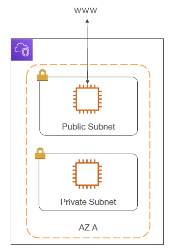

- **VPC -Virtual Private Cloud:** private network to deploy your resources (regional resource)
- **Subnets** allow you to partition your network inside your VPC (Availability Zone resource)
- A **public subnet** is a subnet that is accessible from the internet
- A **private subnet** is a subnet that is not accessible from the internet
- To define access to the internet and between subnets, we use **Route Tables**.

## VPC Diagram

  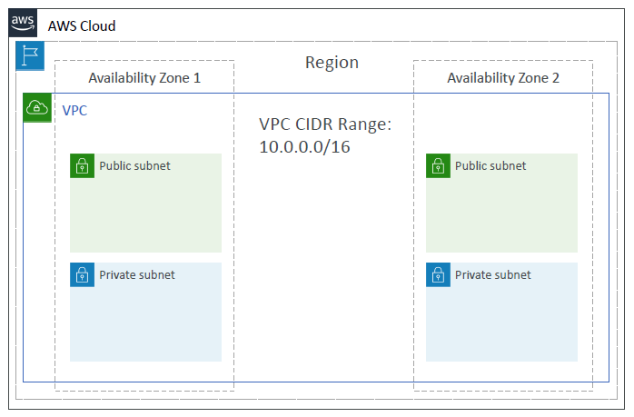

## Internet Gateway (IGW) and NAT Gateways

  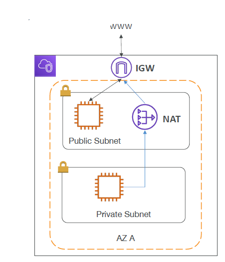

- **Internet Gateways** helps our VPC instances connect with the internet
- Public Subnets have a route to the internet gateway.
- **NAT Gateways** (AWS-managed) & **NAT Instances** (self-managed) allow your instances in your **Private Subnets** to access the internet while remaining private

## Network ACL & Security Groups

  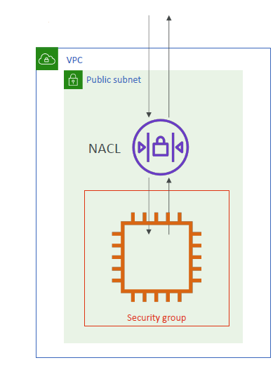

- **NACL (Network ACL)**
  - A firewall which controls traffic from and to subnet
  - Can have ALLOW and DENY rules
  - Are attached at the **Subnet** level
  - Rules only include IP addresses
- **Security Groups**
  - A firewall that controls traffic to and from an ENI / **an EC2 Instance**
  - Can have only ALLOW rules
  - Rules include IP addresses and other security groups

### Network ACLs vs Security Groups

| Security Group | Network ACL |
| -------------- | ----------- |
| Operates at the instance level | Operates at the subnet level |
| Supports allow rules only | Supports allow rules and deny rules |
| Is stateful: Return traffic is automatically allowed, regardless of any rules | Is stateless: Return traffic must be explicitly allowed by rules |
| We evaluate all rules before deciding whether to allow traffic | We process rules in number order when deciding whether to allow traffic |
| Applies to an instance only if someone specifies the security group when launching the instance, or associates the security group with the instance later on | Automatically applies to all instances in the subnets it's associated with (therefore, you don't have to rely on users to specify the security group) |

<https://docs.aws.amazon.com/vpc/latest/userguide/VPC_Security.html>

## VPC Flow Logs

- Capture information about IP traffic going into your interfaces:
  - **VPC** Flow Logs
  - **Subnet** Flow Logs
  - **Elastic Network Interface** Flow Logs
- Helps to monitor & troubleshoot connectivity issues. Example:
  - Subnets to internet
  - Subnets to subnets
  - Internet to subnets
- Captures network information from AWS managed interfaces too: Elastic Load Balancers, ElastiCache, RDS, Aurora, etc...
- VPC Flow logs data can go to S3, CloudWatch Logs, and Amazon Data Firehose

## VPC Peering

  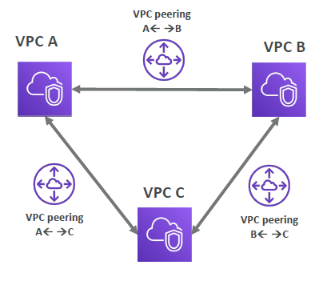

- Connect two VPC, privately using AWS’ network
- Make them behave as if they were in the same network
- Must not have overlapping CIDR (IP address range)
- VPC Peering connection is **not transitive** (must be established for each VPC that need to communicate with one another)

## VPC Endpoints

  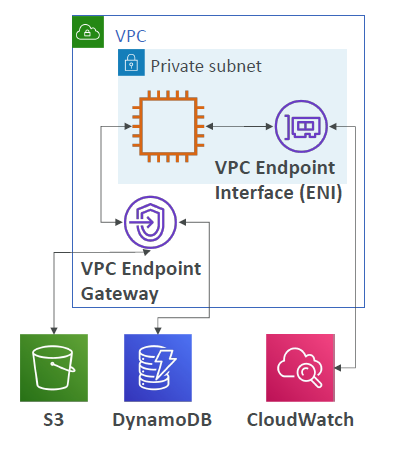

- Endpoints allow you to connect to AWS Services using a private network instead of the public www network
- This gives you enhanced security and lower latency to access AWS services
- VPC Endpoint Gateway: S3 & DynamoDB
- VPC Endpoint Interface: most services (including S3 & DynamoDB)

## AWS PrivateLink (VPC Endpoint Services)

  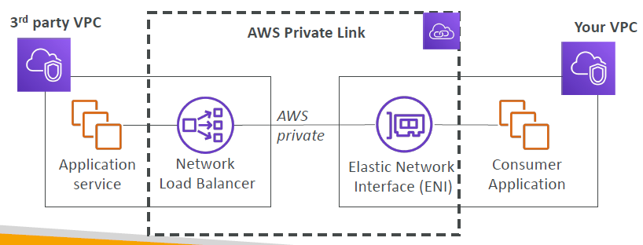

- Most secure & scalable way to expose a service to 1000s of VPCs
- Does not require VPC peering, internet gateway, NAT, route tables...
- Requires a network load balancer (Service VPC) and ENI (Customer VPC)

## Site to Site VPN & Direct Connect

  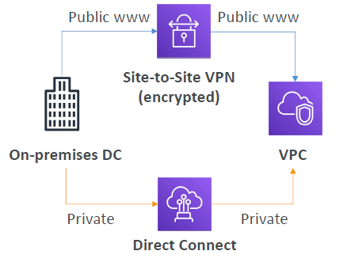

- **Site to Site VPN**
  - Connect an on-premises VPN to AWS
  - The connection is automatically encrypted
  - Goes over the public internet
- **Direct Connect (DX)**
  - Establish a physical connection between on-premises and AWS
  - The connection is private, secure and fast
  - Goes over a private network
  - Takes at least a month to establish

## Site to Site VPN

  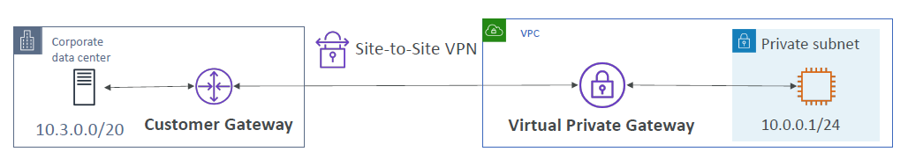

- On-premises: must use a Customer Gateway (CGW)
- AWS: must use a Virtual Private Gateway (VGW)

## AWS Client VPN

  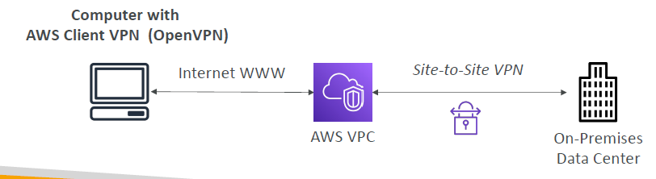

- Connect from your computer using OpenVPN to your private network in AWS and on-premises
- Allow you to connect to your EC2 instances over a private IP (just as if you were in the private VPC network)
- Goes over **public Internet**

## Network topologies can become complicated

  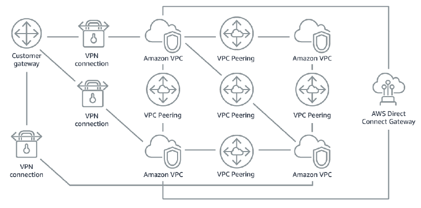

## Transit Gateway

  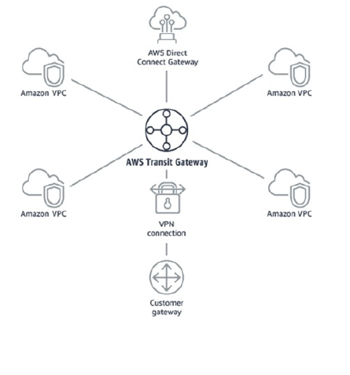

- **For having transitive peering between thousands of VPC and on-premises, hub-and-spoke (star) connection**
- One single Gateway to provide this functionality
- Works with Direct Connect Gateway, VPN connections

## VPC Summary

- **VPC** – Virtual Private Cloud
- **Subnets** – Tied to an AZ, network partition of the VPC
- **Internet Gateway** – at the VPC level, provide Internet Access
- **NAT Gateway / Instances** – give internet access to private subnets
- **NACL** – Stateless, subnet rules for inbound and outbound
- **Security Groups** – Stateful, operate at the EC2 instance level or ENI
- **VPC Peering** – Connect two VPC with non overlapping IP ranges, nontransitive
- **Elastic IP** –fixed public IPv4, ongoing cost if not in-use VPC Endpoints – Provide private access to AWS Services within VPC
- **PrivateLink** – Privately connect to a service in a 3rd party VPC
- **VPC Flow Logs** – network traffic logs
- **Site to Site VPN** – VPN over public internet between on-premises DC and AWS
- **Client VPN** – OpenVPN connection from your computer into your VPC
- **Direct Connect** – direct private connection to AWS
- **Transit Gateway** – Connect thousands of VPC and on-premises networks together
